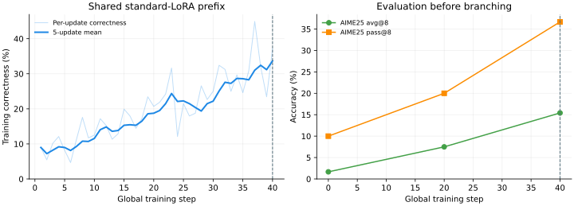

# Shared step-40 boundary · ordinary and gradient-guided ReLoRA

## Question and design

Can a fresh rank-one ReLoRA cycle retain standard LoRA learning performance
while accumulating meaningful update rank? A stable run with stable rank near
one does not meet this objective.

All three branches resume the **same native, unmerged global-step-40 checkpoint**
from `qwen3-4b-base-grpo-shared-prefix-r1-20261005-01`. They stop at global step
100: **60 additional updates**, rather than 100 additional updates. Historical
step-100 checkpoints are not substituted for this origin.

| Branch | Adapter at boundaries 40 and 80 | Adam history |
|---|---|---|
| Standard | Keep learned A and B | Keep all moments/counters |
| Ordinary ReLoRA | Merge the active update; fresh seeded Kaiming A, zero B | Clear moments/counters |
| Gradient-guided ReLoRA | Same merge; choose a fresh A direction from a training-gradient sketch, zero B | Same clearing as ordinary ReLoRA |

The reset executes before updates 41 and 81. All branches perform one extra
calibration backward on the complete fresh training batch at each boundary,
discard those parameter gradients, restore RNG, and replay the same batch for
exactly one native optimizer update. Calibration performs no optimizer or
scheduler step. Standard ignores the sketch; guided uses it for direction
selection. Rollout count and number of optimizer updates match; extra
direction-selection work is not identical to the standard branch.

The common recipe is Qwen3-4B-Base, all-linear rank-one LoRA, alpha 32, dropout
zero, native AdamW with constant LR 1.5e-5, no warmup or weight decay, GRPO
without group-standard-deviation scaling or KL, token-mean loss, 32 prompts
and eight rollouts per prompt, response budget 8,192. All eight GPUs are used.
AIME25 avg@8/pass@8 is evaluated every 20 steps. GPU memory is sampled every
10 seconds; worker allocator peaks cover calibration, training and resets.

## Shared prefix results

The shared prefix finished all 40 updates with exit status zero. Checkpoint
Adam and scheduler counters are 40 on every rank; no prior merges are present.

| Global step | AIME25 avg@8 | AIME25 pass@8 |
|---:|---:|---:|
| 0 | 1.67% | 10.00% |
| 20 | 7.50% | 20.00% |
| 40 | 15.42% | 36.67% |

Mean training correctness by ten-update window is 10.27%, 17.03%, 22.23%,
and 31.13%. The single step-40 batch is 37.11%; it is not a window average.



## Read-only merge check

[Machine-readable precision report](../data/qwen3-4b-base-grpo-shared-prefix-r1-20261005-01-local-merge-precision-step40.json)

All **399 frozen tensors** were reconstructed from the eight native CPU
shards and verified against the original backbone. All **504 adapter tensors**
match the saved PEFT export exactly. The tied output head is verified against
the embedding tensor. Every rank has 504 populated Adam states at step 40.

A separate single-GPU BF16 forward replica compares eight distinct fixed
AIME question/response prefixes, totaling 1,024 response tokens. These texts
measure numerical drift only; they never select gradient directions.

| Measurement | Repeat without merge | Merge |
|---|---:|---:|
| Mean response-distribution KL | 0 | 0.00040544 |
| Mean absolute chosen-token log-probability change | 0 | 0.00675462 |
| Maximum chosen-token log-probability change | 0 | 0.36340725 |
| Highest-probability token flip fraction | 0 | 0.29297% |

FP32 merge error energy is 1.30e-9 against adapter-update energy 6.3274.
BF16 casting error energy is 2.0622: many small weight changes disappear under
BF16 rounding, even though the measured output KL is small on these prefixes.
This does not prove that rounding explains the historical reward drop or that
full generated trajectories remain equivalent.

The standalone eight-process FSDP audit timed out in a distributed collective
with both FlashAttention and SDPA. This check avoids that setup; it does not
claim to validate native FSDP or vLLM execution. The native one-update gate
additionally records pre/post-reset output drift on actual training prefixes
and verifies dense-backbone plus fresh-adapter inference synchronization.

## Gradient-guided reset

Thin QR and a small SVD recover the actual input/output spaces of the sum of
previous merged updates and the active update. This accounts for cancellation
between updates; concatenating factors alone would overestimate those spaces.
Eight random orthonormal input probes are projected outside the accumulated
input space. During calibration, checkpoint-compatible hooks accumulate:

```python
# x: token inputs; dy: gradient of the native loss with respect to layer output
gradient_sketch += dy.T @ (x @ probes)
# Sum normalized microbatches, then average across data-parallel workers.
normal_sketch = gradient_sketch - output_space @ (output_space.T @ gradient_sketch)
_, singular_values, vh = torch.linalg.svd(normal_sketch, full_matrices=False)
new_a = (probes @ vh[0]).reshape_as(old_a)
new_a *= seeded_kaiming_a.norm() / new_a.norm()
new_b.zero_()
```

Only A's direction differs from the ordinary reset; its norm matches the same
seeded Kaiming initialization. No dense weight-gradient matrix is stored.
An effectively zero normal sketch produces an explicitly recorded random
fallback, not a claimed successful guided direction.

The top singular direction is a rank-one Frobenius approximation of the
projected gradient **within the random probe span**. Adam's coordinatewise
normalization is different from that approximation. The first B gradient
remains native rather than forcibly output-projected, so neither B
orthogonality, useful rank growth nor reward improvement is guaranteed.
Accumulated singular spectra, stable rank and energy outside the leading
direction must be measured after learning, rather than inferred from A's
initial orthogonality.

## Validation and run order

The implementation passes 22 focused tests, including dense-gradient sketch
agreement, cancelled-history spaces, explicit zero-signal fallback,
checkpointed backward collection, exact standard-factor/Adam preservation,
and merge/reset state semantics with real PEFT factors and Adam.
All three production recipes pass SkyRL configuration validation and Ruff.

The sequence driver first runs only native update 41 in the guided branch,
with evaluation and checkpoints disabled. It verifies a nonzero finite
post-reset gradient, cleared Adam with scheduler still at 40, collected
gradient directions, memory records on all eight ranks, and backbone/adapter
synchronization at step 41. Only a successful gate launches standard,
ordinary reset, then guided reset to global step 100. Any failure stops the
sequence for diagnosis; there is no fallback checkpoint or automatic deletion.

**Training branch results are pending.** This page describes the controlled
design and completed numerical check, not a demonstrated performance gain.
