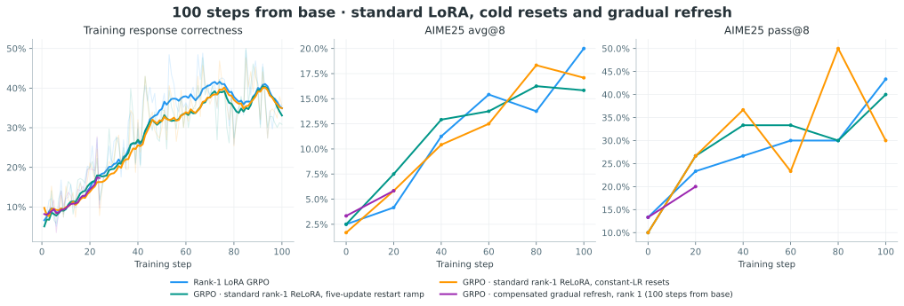
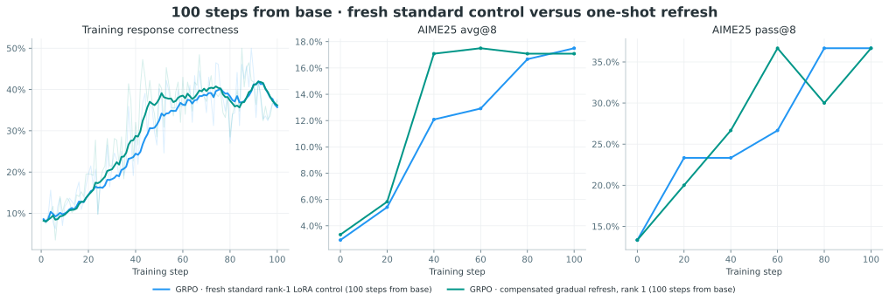
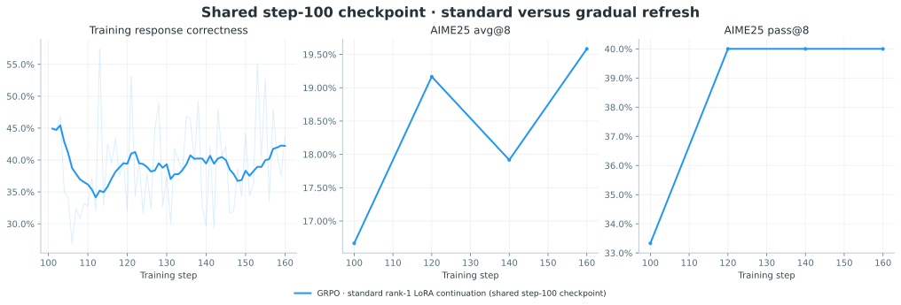
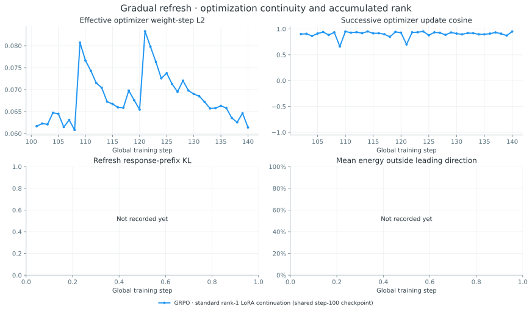

# UNORL

**Resource-efficient, on-policy reinforcement learning.** This book connects each experiment to its configuration, measured learning curves, and evaluation results. It builds from small versioned data snapshots; weights and generated solution text stay outside the repository.

The present evidence supports learning with rank-1 LoRA and single-rollout REINFORCE using AdamW. At step 100, batch-normalized REINFORCE reaches AIME25 avg@8 **17.9%** and pass@8 **30.0%**, versus vanilla's **14.6% / 26.7%** and rank-1 GRPO's **20.0% / 43.3%**. These are single-run observations on 30 questions, not a reliable ranking of small differences. Earlier SGD trials are explicitly separated because they do not isolate algorithm choice.

## Main comparison

GRPO uses 32 prompts × 8 responses; REINFORCE uses 256 prompts × 1 response. Both generate 256 responses per update. The full-parameter reference uses different optimizer settings; all records expose their settings below.

```{figure} figures/comparison-primary.svg
:alt: Google Material palette. Evaluation points are unsmoothed; training curves use a trailing 10-update mean with raw values faintly shown.

Google Material palette. Evaluation points are unsmoothed; training curves use a trailing 10-update mean with raw values faintly shown.
```

## Full-parameter and LoRA comparisons

All rows use Qwen3-4B-Base and eight rollouts per prompt. Full-parameter GRPO is a historical reference: LR, warmup, advantage normalization, clipping and importance correction differ from the later LoRA recipe. The LoRA-FA run completes at 17.5% avg@8 and 33.3% pass@8; its step-80 advantage does not persist at step 100. Single runs on 30 questions cannot establish a reliable ranking of small differences.

| Method | Step-80 avg@8 | Step-100 avg@8 | Step-100 pass@8 |
|---|---:|---:|---:|
| [Full-parameter GRPO](experiments/qwen3-4b-base-grpo-20260916-01.md) | 16.7% | 17.9% | 36.7% |
| [Rank-1 LoRA GRPO](experiments/qwen3-4b-base-grpo-lora-r1-blog-20260923-01.md) | 13.8% | 20.0% | 43.3% |
| [GRPO · rank-1 NoRA-init](experiments/qwen3-4b-base-grpo-lora-r1-nora-init-20260928-01.md) | 15.4% | 17.9% | 36.7% |
| [GRPO · full-layer rank-1 LoRA-FA](experiments/qwen3-4b-base-grpo-lorafa-r1-20260930-01.md) | 17.9% | 17.5% | 33.3% |
| [GRPO · rank-1 LoRA in the final 18 layers](experiments/qwen3-4b-base-grpo-lora-r1-last18-20260928-01.md) | 15.0% | 17.9% | 33.3% |
| [GRPO · rank-1 NoRA-init in the final 18 layers](experiments/qwen3-4b-base-grpo-lora-r1-nora-init-last18-20260929-01.md) | 16.2% | 15.8% | 30.0% |
| [GRPO · full NoRA-init with merge/reset](experiments/qwen3-4b-base-grpo-nora-merge-r1-20260930-01.md) | 20.0% | 15.0% | 30.0% |
| [GRPO · full-layer rank-1 LoFT-simple](experiments/qwen3-4b-base-grpo-loft-simple-r1-20261001-01.md) | 2.1% | 3.3% | 20.0% |
| [GRPO · ReLoRA restart ramp, failed probe attempt](experiments/qwen3-4b-base-grpo-relora-r1-warmup5-20261001-01.md) | — | — | — |
| [GRPO · standard rank-1 ReLoRA, five-update restart ramp](experiments/qwen3-4b-base-grpo-relora-r1-warmup5-20261002-01.md) | 16.2% | 15.8% | 40.0% |
| [GRPO · standard rank-1 ReLoRA, constant-LR resets](experiments/qwen3-4b-base-grpo-relora-r1-warmup0-20261002-01.md) | 18.3% | 17.1% | 30.0% |

```{figure} figures/comparison-lora.svg
:alt: Google Material palette. Full-parameter GRPO remains visible as a historical reference with different settings.

Google Material palette. Full-parameter GRPO remains visible as a historical reference with different settings.
```

## NoRA-init: faster early learning

The completed [NoRA-init trial](experiments/qwen3-4b-base-grpo-lora-r1-nora-init-20260928-01.md) reaches **33.8%** mean training correctness in steps 21–40, versus **23.7%** with standard rank-1 LoRA. Step-20 AIME25 avg@8 is **9.2% versus 4.2%**. Later training correctness plateaus near 38–39%; final avg@8 / pass@8 is **17.9% / 36.7%**, versus **20.0% / 43.3%**. Initialization and alpha differ together. The early acceleration motivates testing merge/reset; the cause of the plateau and benefit of merging remain unproven.

```{figure} figures/comparison-nora.svg
:alt: Full-layer and final-half NoRA-init, compared with standard full-layer rank-1 LoRA GRPO.

Full-layer and final-half NoRA-init, compared with standard full-layer rank-1 LoRA GRPO.
```

## All retained experiment results

Final columns use the last recorded AIME25 evaluation, whose step is shown separately from the last training step. A dash means missing evidence, not zero accuracy. Smoke tests are excluded.

### Matched continuation from the standard-LoRA step-100 checkpoint

| Experiment | Last train step | Last eval step | Avg@8 | Pass@8 | Optimizer |
|---|---:|---:|---:|---:|---|
| [GRPO · standard rank-1 LoRA continuation (shared step-100 checkpoint)](experiments/qwen3-4b-base-grpo-standard-r1-continue-20261003-01.md) | 200 | 200 | 17.1% | 33.3% | AdamW (SkyRL default) |
| [GRPO · gradual A refresh with warm B (shared step-100 checkpoint)](experiments/qwen3-4b-base-grpo-relora-refresh-r1-continue-20261003-01.md) | 134 | 120 | 17.1% | 40.0% | AdamW (SkyRL default) |

### Controlled follow-up experiments

| Experiment | Last train step | Last eval step | Avg@8 | Pass@8 | Optimizer |
|---|---:|---:|---:|---:|---|
| [GRPO · prepared-history rank-aware ReLoRA, rank 1](experiments/qwen3-4b-base-grpo-prepared-r1-20261004-01.md) | 20 | 20 | 7.9% | 26.7% | AdamW (SkyRL default) |
| [GRPO · ten-increment compensated refresh, rank 1](experiments/qwen3-4b-base-grpo-gradual-refresh-r1-20261004-01.md) | 100 | 100 | 15.4% | 26.7% | AdamW (SkyRL default) |
| [GRPO · fresh standard rank-1 LoRA control (100 steps from base)](experiments/qwen3-4b-base-grpo-standard-r1-refresh-control-20261003-01.md) | 100 | 100 | 17.5% | 36.7% | AdamW (SkyRL default) |
| [GRPO · compensated gradual refresh, rank 1 (100 steps from base)](experiments/qwen3-4b-base-grpo-relora-refresh-r1-20261003-01.md) | 100 | 100 | 17.1% | 36.7% | AdamW (SkyRL default) |
| [GRPO · standard rank-1 ReLoRA, constant-LR resets](experiments/qwen3-4b-base-grpo-relora-r1-warmup0-20261002-01.md) | 100 | 100 | 17.1% | 30.0% | AdamW (SkyRL default) |
| [GRPO · standard rank-1 ReLoRA, five-update restart ramp](experiments/qwen3-4b-base-grpo-relora-r1-warmup5-20261002-01.md) | 100 | 100 | 15.8% | 40.0% | AdamW (SkyRL default) |
| [GRPO · ReLoRA restart ramp, failed probe attempt](experiments/qwen3-4b-base-grpo-relora-r1-warmup5-20261001-01.md) | 39 | 20 | 6.2% | 26.7% | AdamW (SkyRL default) |
| [GRPO · full-layer rank-1 LoFT-simple](experiments/qwen3-4b-base-grpo-loft-simple-r1-20261001-01.md) | 100 | 100 | 3.3% | 20.0% | LoFTSimpleAdamW (Adam-family) |
| [GRPO · full NoRA-init with merge/reset](experiments/qwen3-4b-base-grpo-nora-merge-r1-20260930-01.md) | 100 | 100 | 15.0% | 30.0% | AdamW (SkyRL default) |
| [GRPO · full-layer rank-1 LoRA-FA](experiments/qwen3-4b-base-grpo-lorafa-r1-20260930-01.md) | 100 | 100 | 17.5% | 33.3% | AdamW (SkyRL default) |
| [GRPO · rank-1 NoRA-init in the final 18 layers](experiments/qwen3-4b-base-grpo-lora-r1-nora-init-last18-20260929-01.md) | 100 | 100 | 15.8% | 30.0% | AdamW (SkyRL default) |
| [GRPO · rank-1 NoRA-init](experiments/qwen3-4b-base-grpo-lora-r1-nora-init-20260928-01.md) | 100 | 100 | 17.9% | 36.7% | AdamW (SkyRL default) |
| [GRPO · rank-1 LoRA in the final 18 layers](experiments/qwen3-4b-base-grpo-lora-r1-last18-20260928-01.md) | 100 | 100 | 17.9% | 33.3% | AdamW (SkyRL default) |
| [Retain truncated failures · AdamW](experiments/unorl-batchnorm-retain-truncated-20260926-01.md) | 100 | 100 | 14.6% | 30.0% | AdamW (SkyRL default) |

### Current algorithm comparison

| Experiment | Last train step | Last eval step | Avg@8 | Pass@8 | Optimizer |
|---|---:|---:|---:|---:|---|
| [Rank-1 LoRA GRPO](experiments/qwen3-4b-base-grpo-lora-r1-blog-20260923-01.md) | 100 | 100 | 20.0% | 43.3% | AdamW (SkyRL default) |
| [Vanilla REINFORCE · AdamW](experiments/qwen3-4b-base-reinforce-adamw-r1-b256-20260925-01.md) | 100 | 100 | 14.6% | 26.7% | AdamW (SkyRL default) |
| [Batch-normalized REINFORCE · AdamW](experiments/qwen3-4b-base-reinforce-batchnorm-adamw-r1-b256-20260925-01.md) | 100 | 100 | 17.9% | 30.0% | AdamW (SkyRL default) |

### Full-parameter reference

| Experiment | Last train step | Last eval step | Avg@8 | Pass@8 | Optimizer |
|---|---:|---:|---:|---:|---|
| [Full-parameter GRPO](experiments/qwen3-4b-base-grpo-20260916-01.md) | 100 | 100 | 17.9% | 36.7% | AdamW (SkyRL default) |

### Earlier research

| Experiment | Last train step | Last eval step | Avg@8 | Pass@8 | Optimizer |
|---|---:|---:|---:|---:|---|
| [Archived · conditional online SFT](experiments/qwen3-4b-base-conditional-20260916-01.md) | 300 | 300 | 0.0% | 0.0% | AdamW (SkyRL default) |
| [Archived · positive-only online SFT](experiments/qwen3-4b-base-positive-only-20260918-01.md) | 300 | 300 | 15.4% | 30.0% | AdamW (SkyRL default) |
| [PPO · value-model warmup](experiments/qwen3-4b-base-ppo-lora-r1-valuewarmup-20260924-01.md) | 38 | 25 | 1.2% | 10.0% | AdamW (SkyRL default) |
| [Archived · Instruct GRPO pilot](experiments/qwen3-4b-instruct-grpo-20260915-01.md) | 12 | 0 | 45.0% | 66.7% | AdamW (SkyRL default) |

### Optimizer and loss confounds

| Experiment | Last train step | Last eval step | Avg@8 | Pass@8 | Optimizer |
|---|---:|---:|---:|---:|---|
| [Batch-normalized REINFORCE · SGD](experiments/qwen3-4b-base-reinforce-batchnorm-r1-b256-20260925-02.md) | 100 | 100 | 2.1% | 6.7% | SGD |
| [Mean-centered REINFORCE · SGD](experiments/qwen3-4b-base-reinforce-batchmean-b256-20260924-01.md) | 22 | 20 | 1.7% | 13.3% | SGD |
| [Token-mean REINFORCE · SGD](experiments/qwen3-4b-base-reinforce-tokenmean-b256-20260924-01.md) | 73 | 60 | 2.9% | 13.3% | SGD |
| [Early REINFORCE · loss-scale issue](experiments/qwen3-4b-base-reinforce-lora-r1-blog-20260923-03.md) | 100 | 100 | 2.5% | 16.7% | SGD |
| [Single-GPU ReLoRA exploration](experiments/qwen3-4b-base-reinforce-relora-gpu0-b16-m100-300-20260922-01.md) | 295 | 200 | 1.7% | 6.7% | SGD |

### Incomplete launch records

| Experiment | Last train step | Last eval step | Avg@8 | Pass@8 | Optimizer |
|---|---:|---:|---:|---:|---|
| [Single-GPU LoRA launch record](experiments/qwen3-4b-base-grpo-lora-r1-gpu0-20260923-01.md) | — | — | — | — | AdamW (SkyRL default) |
| [Interrupted batch-normalized launch](experiments/qwen3-4b-base-reinforce-batchnorm-r1-b256-20260925-01.md) | — | — | — | — | SGD |

```{figure} figures/comparison-history.svg
:alt: Earlier research used different objectives, model variants, and response budgets. These curves provide context, not a controlled ranking.

Earlier research used different objectives, model variants, and response budgets. These curves provide context, not a controlled ranking.
```
```{figure} figures/comparison-confounded.svg
:alt: Earlier single-rollout trials used stateless SGD and sometimes a different loss reduction. Their failures do not establish that REINFORCE fails with AdamW.

Earlier single-rollout trials used stateless SGD and sometimes a different loss reduction. Their failures do not establish that REINFORCE fails with AdamW.
```

## ReLoRA restart comparison: completed

Both 100-step runs completed successfully. Five-update restart ramp / constant-LR resets / standard LoRA reached final AIME25 avg@8 **15.8% / 17.1% / 20.0%**, and pass@8 **40.0% / 30.0% / 43.3%**. Final 20-step training correctness was **36.3% / 37.0% / 37.5%**. The ramp showed no clear benefit in this pair. Mean accumulated stable rank at step 100 was **1.89 / 2.16** for ramp / constant-LR resets: useful rank growth occurred, but did not translate into better learning. Both boundary KL probes averaged about **0.00055**, with no immediate post-merge reward collapse. These are one run per setting and 30 evaluation questions. Full Adam history was cleared in both runs; partial moment pruning remains untested.



**Retention issue:** automatic cleanup mistakenly removed raw evaluation response dumps together with model exports. Aggregate evaluations, training metrics, logs, memory traces and rank diagnostics remain. The cleanup rule now preserves benchmark dump directories and has a filesystem regression test.


### Where merging falls behind

The [boundary analysis](notes/lora-training-2025-2026.md#where-the-merge-curves-diverge-from-standard-lora) finds the main deficit at **steps 46–60**: both merge runs average **32.5%** training correctness versus **36.8%** for standard LoRA. The gap largely closes by steps 81–90. Response-length growth lags and entropy remains higher; gradient norms do not collapse. This is consistent with a temporary optimization delay after the first restart, not proof of a specific cause.


## Ten-increment refresh: current trial

[Detailed experiment and paired analyses](experiments/qwen3-4b-base-grpo-gradual-refresh-r1-20261004-01.md). This 100-step trial replaces each abrupt 20-degree rotation with ten 2-degree increments separated by training updates. Existing standard LoRA runs are reused; no extra control is launched. Intermediate values do not establish the final result.

```{figure} figures/comparison-gradual-refresh.svg
:alt: Historical and fresh standard rank-one LoRA, one-shot refresh, and the ten-increment trial; absent endpoints remain absent.

Historical and fresh standard rank-one LoRA, one-shot refresh, and the ten-increment trial; absent endpoints remain absent.
```

## Compensated gradual refresh: completed 100-step trial

The [first-principles design](notes/lora-training-2025-2026.md#first-principles-design-gradual-a-refresh-with-warm-b) keeps B warm, rotates A by 20 degrees, compensates the frozen weight, and retains Adam counters without an LR restart. B moment handling is approximate. The trial from base completed all 100 updates with refreshes at 40/80. Final AIME25 avg@8 / pass@8 was **17.08% / 36.67%**, versus historical standard LoRA's **20.00% / 43.33%**. Final-window training correctness was higher (**38.63% versus 37.48%**), but additional effective rank was modest. Performance parity remains unproven; see the [final analysis](notes/lora-training-2025-2026.md#final-result-gradual-refresh-preserves-learning-but-does-not-establish-parity).

The earlier shared-step-100 continuation candidate was manually stopped after 134 global updates. It does not answer the original base-model budget comparison and is retained separately as a diagnostic.

### Fresh standard-LoRA control

The fresh control snapshot contains **100/100 updates**. It uses the same runtime, optimizer, batch, rollout and response settings; refresh is disabled. Completed raw evaluations and successful-exit protocol audits are retained. Both sampled starting evaluations are reported, and question-level uncertainty does not establish equivalence.



Latest shared checkpoint: **step 100**. Standard LoRA reaches avg@8 / pass@8 **17.50% / 36.67%**; one-shot refresh reaches **17.08% / 36.67%**. See both experiment pages for complete training windows and paired-question uncertainty. The proposed multi-update rotation is a separate method and has no result here.





Effective weight-step norms and cosines exclude the compensating base correction. Boundary KL probes only the recorded response prefix; rank energy describes the accumulated update and is not a performance score. Missing measurements are labeled explicitly.

[Download matched windows and question-level uncertainty](data/refresh-comparison-analysis.json). Bootstrap intervals resample whole questions with their eight responses. They do not measure training-seed uncertainty or prove equivalence.

| Global step | AIME25 metric | Candidate − control (percentage points) | Question-bootstrap 95% interval |
|---:|---|---:|---|
| 100 | avg@8 | +2.08 | [-3.33, +7.08] |
| 100 | pass@8 | +10.00 | [-3.33, +26.67] |
| 120 | avg@8 | -2.08 | [-5.42, +1.25] |
| 120 | pass@8 | +0.00 | [-13.33, +13.33] |

Step 100 precedes intervention; its difference reflects sampled starting evaluations.


## Prepared-history ReLoRA

The [prepared-history trial](experiments/qwen3-4b-base-grpo-prepared-r1-20261004-01.md) uses the same 100-update budget and reuses the historical standard LoRA reference. Its local descent constraint is not an accuracy guarantee. Missing evaluation points are not extrapolated; useful rank growth and performance parity remain unproven.

```{figure} figures/comparison-prepared.svg
:alt: Google Material palette; observed training correctness and sampled AIME25 evaluations.

Google Material palette; observed training correctness and sampled AIME25 evaluations.
```
```{figure} figures/prepared-update-geometry.svg
:alt: Optimizer weight steps, boundary policy drift and measured accumulated rank; missing measurements remain explicit.

Optimizer weight steps, boundary policy drift and measured accumulated rank; missing measurements remain explicit.
```

## Post-step-60 diagnosis

The [truncation analysis](notes/batchnorm-after60.md) examines the loss of question coverage and specifies a controlled follow-up trial.

## Research directions and next questions

The [2025–2026 LoRA training investigation](notes/lora-training-2025-2026.md) compares LoRA-FA, LoFT, recent optimizer-state research, and merge/reset designs. It separates published evidence from proposed UNORL experiments.

1. Final-layer LoRA: the last-half trial completed; measure actual activation/peak memory savings and investigate fewer layers.
2. [NoRA initialization](notes/nora.md): the trial completed with promising early acceleration. The full-layer merge/reset trial completed without sustained improvement after resets. LoFT-simple completed without meaningful reward improvement in this setting. The main line is now ReLoRA: the matched restart-ramp versus constant-LR merge/reset comparison completed. Both accumulated updates beyond rank one, but neither improved final avg@8 over standard LoRA.
3. Test QLoRA separately; this direction remains untested.

The current scope is on-policy learning; small batches and single-rollout use remain central.

[Measurement conventions](methods.md) · [Build and publish](publishing.md) · [Download comparison data](data/comparison.csv)
