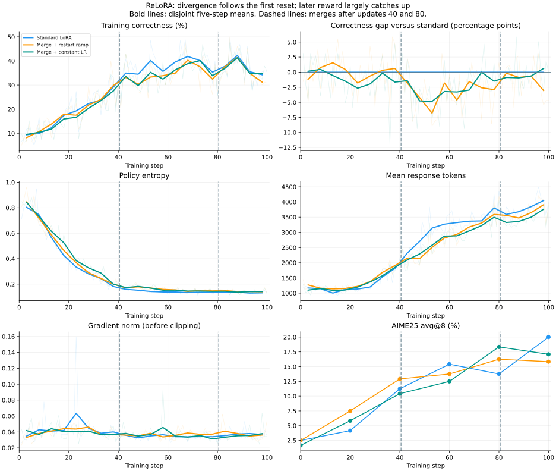

# LoRA training: 2025–2026 investigation

Reviewed **2026-09-29**. Scope: work first released in 2025–2026, plus the
2026 revision of LoRA-FA. This is a selected review of methods relevant to
UNORL, not an exhaustive bibliography. Versioned papers and inspected upstream
code are distinguished from our own deductions and proposed experiments.

## Recommendation

**LoRA-FA is the first candidate for reducing adapter activation memory;
LoFT is the stronger candidate for studying optimizer continuity.** Both
correct low-rank updates, but they solve different parts of our problem.
Neither currently establishes stable rank-one, long-sequence, on-policy RL
on a phone. Test them separately before combining them with merge/reset.

Our two questions remain:

1. Can successive adapters learn useful new directions after merging?
2. Can we change adapter coordinates without losing useful Adam history?

The existing [NoRA investigation](nora.md) and completed experiment pages
provide local evidence. The current last-half NoRA-init run is a separate
experiment; this literature review changes no training configuration.

## Map of the methods

| Method / reviewed version | Main mechanism | Potential memory benefit | Merge/reset continuity | Rank-one relevance |
|---|---|---|---|---|
| LoRA-FA, May 2026 revision; originated 2023 | Freeze A, correct B gradient | Remove wide inputs saved specifically for A gradients | Fixed A avoids moving coordinates within a cycle; reset still needs a rule | Fixed input direction is a strong restriction |
| LoFT, March 2026 revision; originated 2025, ICLR 2026 | Alternate factors; calibrate gradients and Adam moments | Small persistent state at low rank; dense temporary buffers can increase peak | Explicit moment calibration for evolving factors | Paper includes rank-one supervised results |
| NoRA, August 2026 | Normalize A columns, continuously or at initialization | No inherent activation reduction | Does not specify an Adam reset solution | Initialization becomes random signs; already tested locally |
| PoLAR, June 2025 | Separate orthogonal directions and scale | No demonstrated saving for our workload | No established merge/reset protocol | Most capacity-utilization motivation concerns rank above one |
| LoRA-Pre, February 2026 | Factorize optimizer momentum | Save state for large trainable weight matrices | Useful optimizer-design reference | Different from a rank-one adapter |
| SLAO / Merge before Forget, December 2025 | Reuse and asymmetrically merge one adapter across tasks | Bounded adapter storage across tasks | Parameter reuse, not verified Adam-state transport | Retained adapter still has its chosen rank |
| No Subspace to Track, July 2026 | Diagnose basis noise; transport optimizer state | Analysis of compressed optimizers | Direct warning against blindly carrying moments | Does not evaluate our rank-one RL setting |

Each row is expanded and sourced below. Memory benefits refer to a particular
allocation, not automatically to total process peak memory.

## LoRA-FA: activation saving through a fixed projection

The [2026 paper revision](https://arxiv.org/html/2308.03303v3) freezes the
input projection A and trains B. B backward needs the narrow projected
activation; A backward would need the wide input. It additionally corrects
B's gradient using an inverse Gram matrix, minimizing the discrepancy from
the full gradient within the available subspace. Simply freezing A is an
ablation, not the full corrected method. Its reported supervised benchmarks
do not demonstrate rank-one RL. This method originated in August 2023;
April/May 2026 revisions are the reason it appears in this review.

### Our interpretation and implementation implications

Use the PEFT orientation consistently:

```python
# A: [rank, in_features], B: [out_features, rank]
scale = lora_alpha / rank
adapter_output = scale * (x @ A.T) @ B.T
A.requires_grad_(False)
```

Freezing A does **not** mean detaching `x @ A.T`: upstream trainable layers
still require its input gradient. Attention, nonlinearities, checkpoint
boundaries and other branches can retain the same wide input. Therefore the
paper's single-linear-layer saving is not a whole-transformer memory estimate.
Our existing checkpointing can also reduce the additional saving.

The corrected gradient in this orientation is:

```python
# Conceptual FP32 calculation, not a complete optimizer.
gram = A.float() @ A.float().T
corrected_grad_B = (B.grad.float() @ torch.linalg.pinv(gram)) / scale**2
```

The [PEFT implementation inspected at commit b8674c8](https://github.com/huggingface/peft/blob/b8674c86183a5dee38d0c3ede392e189593025e5/src/peft/optimizers/lorafa.py)
freezes A, regularizes the Gram inverse, corrects the gradient before updating
Adam moments, and exposes `create_lorafa_optimizer`. SkyRL integration must
preserve paired A/B access under FSDP; having a PEFT helper does not establish
compatibility with sharded parameter shapes.

**Important rank-one deduction:** the Gram matrix is a single scalar. With a
fixed A, its correction is a constant positive multiplier on each module's
B gradient. Adam largely cancels a constant multiplier between its first
moment and square-root second moment, except for epsilon, clipping, numerical
precision and other implementation effects. Do not expect the correction
alone to unlock new directions. A fixed rank-one A also restricts each row
of the weight update to that input direction; it cannot represent arbitrary
rank-one updates with another input direction. Broad expressivity claims
should not be read as such a guarantee.

## LoFT: gradient geometry plus optimizer geometry

[LoFT v2](https://arxiv.org/html/2505.21289v2), initially May 2025 and accepted
at ICLR 2026, alternates A/B updates, rescales gradients, calibrates first
and second moments, and aligns clipping with projected full-weight updates.
Alternation removes the simultaneous-factor cross term. Calibration adjusts
history as the opposite factor changes. Its full-rank equivalence to AdamW
and matrix-factorization analysis are conditional mathematical results, not
rank-one RL guarantees. It includes supervised rank-one experiments.

Appendix E.2 reports LLaMA-7B memory of 28.50 GB for rank-16 LoRA versus
35.81 GB for LoFT. “LoFT (simple)” omits second-moment calibration: 30.02 GB
with about 0.1 percentage-point accuracy loss in that comparison. These
measurements are not predictions for UNORL.

### What the reference code actually allocates

Inspected [optimizer](https://github.com/tnurbek/loft/blob/148998d98f901cd7744db7baa5b2b4868fa16bf0/loft_optim/optimizer.py)
and [helpers](https://github.com/tnurbek/loft/blob/148998d98f901cd7744db7baa5b2b4868fa16bf0/loft_optim/optim_helper.py)
at commit `148998d`:

- Persistent second-moment cross terms use arrays shaped `[width, r, r]`.
- Previous factors are retained for moment transport.
- Full calibration reconstructs a dense weight-shaped update and denominator
  before projecting back. Small persistent state does not imply small peak.
- The simpler branch avoids that dense reconstruction in the optimizer;
  clipping and the complete execution path still need a memory audit.

For illustration, a Qwen3-4B MLP matrix `[9728, 2560]` has about 24.9 million
entries. **One FP32 dense temporary is about 95 MiB**, independently of rank.
Several simultaneous buffers or FSDP parameter gathering can add more. This
is an allocation estimate, not a measured training peak.

LoFT's moving-coordinate treatment is relevant to merge/reset, but its
published algorithm does not automatically define a function-preserving
reset with both new B=0 and transported states. That boundary needs its own
algorithm and validation. Alternating factors also does not automatically
save A-gradient activations: skipping an optimizer update after backward
leaves the backward storage requirement intact.

## Are LoFT and LoRA-FA similar?

**Yes: they share inverse-Gram correction of the induced weight update.**
For a fixed A, plain gradient descent on B produces a weight update filtered
through `A.T @ A`. The following comparison is our chain-rule derivation:

```python
# G is the conceptual full-weight gradient; never materialize it in training.
grad_B = scale * G @ A.T
plain_weight_step = -lr * scale * grad_B @ A

corrected_grad_B = grad_B @ torch.linalg.pinv(A @ A.T) / scale**2
corrected_weight_step = -lr * scale * corrected_grad_B @ A
# corrected_weight_step = -lr * G @ P
# P projects onto A's row space.
```

Projection corrects geometry **inside the available subspace**. It does not
restore gradient components outside it, and this plain-gradient calculation
is not an exact description of an elementwise Adam step.

The practical difference is that FA keeps that subspace fixed to save
activations. LoFT lets both factors evolve and handles the resulting
optimizer-history mismatch. Consequently, a future combined approach might
freeze A during each cycle and transport history when refreshing it. This
is a research hypothesis, not an already validated combination.

## Other recent work worth learning from

### NoRA: conditioning at initialization

[NoRA, August 2026](https://arxiv.org/html/2608.31036v1) normalizes A columns.
NoRA-init performs this once, then trains ordinary adapters. At rank one,
initialization gives random signs; continuously enforcing unit norm instead
makes each scalar a sign with zero derivative away from zero. That latter
observation is our differentiation argument, not an RL result from the paper.
We use initialization-only NoRA. See the [local method and trial record](nora.md).
It addresses update conditioning, not accumulated rank or reset history.

### PoLAR: measure useful rank rather than nominal rank

[PoLAR, June 2025](https://arxiv.org/html/2506.03133v1) separates two orthogonal
direction factors from a scale matrix. It targets the observation that a
nominally high-rank LoRA update can have low stable rank, with conditional
matrix-factorization theory and supervised benchmark evidence. Its reported
speed of convergence is not a general RL rate guarantee.

Our implication: after multiple merges, measure the singular-value spectrum
of the **accumulated** update. Rank-one adapters individually have stable
rank one when nonzero; the interesting question is whether their sum develops
several substantial singular values. Enforcing new A orthogonality alone
cannot guarantee this if the learned B directions collapse together.

### LoRA-Pre: compressed optimizer state is a different target

[LoRA-Pre, February 2026](https://arxiv.org/html/2602.24283v1) interprets
momentum through online regression and factorizes the momentum matrix.
Experiments include language-model pretraining and supervised math adaptation.
It saves optimizer state for large trainable matrices; it is not equivalent
to freezing a backbone and training tiny adapters.

For UNORL, optimizer-state compression has lower priority: rank-one Adam
state is already small relative to weights and long-sequence activations.
Audit full-gradient buffers before adopting this family for a phone.

### Merge before Forget: bounded storage, not unbounded accumulated rank

[SLAO, December 2025](https://arxiv.org/html/2512.23017v1) reuses one LoRA
across sequential tasks, extracts an orthogonal row basis for A, reuses B,
and asymmetrically merges B with time-aware scaling. Its analysis concerns
continual learning and uses assumptions on SGD dynamics. Orthogonal rows
within A are not a guarantee of orthogonality to every historical adapter.
The retained product remains rank at most r; this is different from merging
successive low-rank products into a full base matrix. It does not specify
preservation of Adam moments. Learn from its parameter reuse, but do not
claim it solves our two problems together.

### No Subspace to Track: stale moments are a concrete failure mode

[July 2026 preprint](https://arxiv.org/html/2607.05872v1) studies refreshed
low-rank gradient optimizers. Much observed basis rotation can reflect
minibatch noise rather than a stable changing signal. Transporting state
helps; lowering beta2 can help in tested recipes, with explicit recipe and
training-length caveats. This is evidence from compressed full-weight
optimizers, not our adapter RL. The earlier
[LDAdam paper](https://arxiv.org/html/2410.16103v3) is relevant background
outside the review window: projection-aware transport and error feedback.

Our implication: use factor overlap and optimizer diagnostics, rather than
blindly copying moment tensors into unrelated adapter coordinates. A smaller
beta2 is a separate controlled ablation, not a substitute for transport.

## Rank growth and continuity: what can be preserved?

This section is our proposed analysis, not a published combined method.
Merging `scale * B @ A` into W and replacing the adapter with B=0 can preserve
the model function, up to arithmetic precision. It does **not** preserve the
optimizer's coordinate system or its next update.

For a normalized fixed rank-one A, the part of old B momentum representable
in a new A direction has a simple projection:

```python
# q_old, q_new: unit input-space vectors; m_B_old: output-space vector.
overlap = torch.dot(q_new, q_old)
m_B_new = overlap * m_B_old
```

This transports the old **represented** weight-space momentum, not a full
historical gradient that we never stored. If the directions are strictly
orthogonal, `overlap == 0`: none survives in that new one-dimensional input
space. Projecting a stored second moment needs care about cross terms and
unseen directions; copying it unchanged has no general justification.

Two possible compromises:

- **Gradual refresh:** mix the old direction with a new orthogonal component,
  normalize, and transport the representable history. This trades immediate
  direction novelty for overlap; it is not a guarantee of useful rank growth.
- **Overlapping adapters:** add a zero-output new adapter while retaining the
  old adapter and its Adam state for a transition. Later freeze and merge the
  old one. The new adapter keeps its own history, at temporary extra memory
  cost. This preserves function at introduction, but does not preserve all
  retired history forever.

A scheduler that reduces LR to zero near a reset remains a simple control.
It masks a discontinuous update boundary rather than restoring lost history.

## Proposed experiments, one change at a time

LoRA-FA and the fresh-state NoRA merge/reset trial have completed; LoFT-simple
is running as of 2026-10-01. Other comparison arms below remain plans.
Keep the selected GRPO recipe,
model, dataset, eight rollouts, response budget, evaluation and Adam-family
settings fixed except for method-required changes. Record every change;
matched numeric LR need not mean matched effective weight-space steps.

1. **LoRA-FA:** compare trainable A/B, frozen A with ordinary AdamW, and frozen
   A with the corrected optimizer. Match A initialization and alpha within
   this comparison. Audit FSDP pairing and initial logits first. Measure both
   learning and memory; rank-one success is not assumed.
2. **LoFT (simple), then full LoFT if justified:** separate optimizer geometry
   from factor freezing. Record effective scale, alternation, epsilon,
   clipping and moment settings. Match rollout compute, not just update count.
3. **Merge/reset comparison:** only after a reliable non-merging reference,
   compare fresh state, gradual refresh with transport, and an overlap
   transition. Do not simultaneously change layer placement or RL algorithm.

Required observations: training correctness, AIME25 avg@8/pass@8, entropy,
response length, clipping fraction, gradient norm, actual merged-weight
update norm, A/B norms, factor overlap, and moment norms around boundaries.
For rank growth, record accumulated-update stable rank and retained spectral
energy using a low-rank factor representation where practical, avoiding a
permanent dense copy of each layer's update.

Keep the existing **10-second external VRAM sampler**, and add training-phase
allocator high-water marks when implementing a method. External samples can
miss short optimizer workspace peaks. Separate persistent state bytes,
activation storage and transient buffers; include inference residency in
end-to-end peak reporting. NVIDIA measurements evaluate this implementation,
not iPhone feasibility. Phone validation must eventually account for unified
memory and the actual supported numerical kernels.

## Implemented LoRA-FA comparison: 2026-09-30

Profile: `configs/qwen3-4b-base-grpo-lorafa-r1.json`. All layers, rank one,
Kaiming A, zero B, alpha 32, native AdamW LR 1.5e-5, constant schedule without
warmup, 32 prompts × eight rollouts, 8K response cap, 100 steps, eight A100s,
and AIME25 avg@8/pass@8 every 20 steps. The reference is the standard full-layer
rank-one GRPO recipe. `lora.init_method=lorafa` selects the custom worker but
is translated to Kaiming before PEFT initialization; it does not introduce
NoRA initialization or another scaling change.

`unorl/lorafa.py` freezes A before sharding. `unorl/lorafa_worker.py` retains
SkyRL's native FSDP2 strategy and AdamW. After initialization, each A is
materialized once to compute its FP32 squared norm. The cached correction is
`1 / (scale**2 * (A.square().sum() + 1e-8))`. It multiplies accumulated B
DTensor gradients locally before native gradient clipping, AdamW and scheduler
stepping. Checkpoint loading rebuilds the cache from restored A. This
rank-one specialization needs no dense weight-shaped correction tensor.

This is the paper's gradient correction with the **reference's native AdamW
implementation and defaults** retained. It does not reproduce every numerical
default or epsilon convention of PEFT's separate optimizer. The recorded
`policy/grad_norm` is measured after correction and before clipping, so its
magnitude is not directly comparable with the reference's uncorrected norm.
The initialization audit records correction factors and optimizer settings.

Expected trainable B count for this architecture: **1,105,920 parameters**;
A's 958,464 parameters remain stored but frozen. All backbone parameters stay
frozen. A/B export and vLLM synchronization use native PEFT paths.

The worker records per-rank CUDA allocator peak allocated/reserved bytes from
policy forward/backward through the optimizer step. These include the resident
policy allocations in that process; weight backloading before forward/backward
is outside the reset window. The external 10-second NVML sampler additionally
covers device residency across rollout, evaluation and training. No matched
full-layer reference allocator measurement exists yet, so measured peaks alone
cannot establish the size of the saving against that old run.

Correctness checks cover projected-gradient geometry, unchanged initial
logits, frozen A/backbone, B-only Adam state, activation storage in an isolated
adapter branch, and native adapter reload/merge. A distributed tiny-model check
uses the actual SkyRL strategy on the intended GPU count and verifies
checkpoint/resume. Smoke artifacts are excluded from published experiment
results. Learning and end-to-end memory benefits remain experimental questions.


## LoFT-simple implementation and launch: 2026-10-01

Run: `qwen3-4b-base-grpo-loft-simple-r1-20261001-01`.
[Experiment page](../experiments/qwen3-4b-base-grpo-loft-simple-r1-20261001-01.md).
Profile: `configs/qwen3-4b-base-grpo-loft-simple-r1.json`.

`unorl/loft.py` specializes the pinned authors' LoFT-simple implementation to
rank one. It uses ordinary Kaiming A / zero B, **alpha=1**, epsilon **1e-4**,
betas 0.9/0.999 and zero weight decay. Keep LR 1.5e-5, 100 updates, all
36 layers, 32 prompts × eight responses, an 8192-token cap, all eight A100s,
and AIME25 avg@8/pass@8 every 20 steps. Relative to standard LoRA, alpha and
epsilon change with the optimizer method; this is not an isolated optimizer
ablation with identical numerical scaling. No NoRA initialization, frozen A,
merge/reset, SGD or additional warmup is introduced.

The active factor alternates B, A, B, A. Both factors' first and second
moments update every step; first moments are transported using the overlap
with the saved previous opposite factor. Second moments stay elementwise and
are not transported. Regularization is 1e-6 for A's opposite-factor Gram and
1e-8 for B's. Clipping follows the authors' **simple** branch: compute the
norm of active calibrated factor gradients, then scale all raw gradients.
It does not use the full variant's dense projected-weight norm. Recorded
`policy/grad_norm` therefore differs in meaning from the standard LoRA norm.

For FSDP2, gather only small rank-one factors/gradients for scalar calibration
and update local shards in place. No dense weight-shaped calibration buffer
is constructed. Previous opposite factors are saved inside optimizer state,
and the alternating update phase is included in `state_dict`; this repairs
the reference optimizer's otherwise unsaved auxiliary history for our resume
contract. Native PEFT adapter synchronization and export remain in use.
A/B still participate in backward, so this does not claim LoRA-FA's activation
saving. Training allocator peaks and ten-second NVML readings are recorded.

Validation: 77 tests passed. `scripts/check_loft_reference.py` compared eight
CPU updates against the pinned authors' implementation including clipping;
maximum parameter difference was 1.49e-8. `scripts/check_loft_fsdp.py` verified
actual eight-GPU FSDP2 updates, a frozen backbone, native A/B export and exact
next-update reproduction after checkpoint reload. The tiny model's calibrated
A norms exceeded 100 before clipping, which is permitted by the algorithm;
validation checks finite gradients and resume correctness rather than applying
a bound copied from ordinary LoRA. Learning benefit remains unmeasured.


## Main research line: make ReLoRA sustain RL learning (2026-10-01)

The project priority is repeated rank-one merge/restart training. Standalone
LoFT and quantization are secondary until this mechanism is understood. The
success criterion is better sustained learning than a matched non-merging
rank-one reference, while keeping only one active adapter and bounded memory.

Our completed NoRA merge trial tested constant LR plus complete Adam-history
removal. It did not reproduce the stabilization components of the original
[ReLoRA paper](https://arxiv.org/html/2307.05695v2): partial moment reset and a
restart LR schedule with warmup. The paper describes pruning 99% of small
state entries. The current [official repository](https://github.com/Guitaricet/relora)
at `176f37633fe02019835387258ddabcf6d91e328d` offers several reset modes;
its README recommends 90% magnitude pruning or its nearly complete reset
mode. These settings must be distinguished rather than called one recipe.
The repository prunes moment tensors in place rather than deleting all state
and resetting Adam's bias-correction counters as our earlier worker did.

The earlier run does not prove an immediate reset-induced collapse. Training
correctness averaged 37.0% at steps 31–40, 39.2% at 41–50, 38.7% at 71–80,
41.0% at 81–90, then 33.4% at 91–100. Boundary discontinuity, insufficient
useful rank growth and unrelated late training dynamics remain separate
hypotheses. The four-token logit probe is inadequate to establish an RL
impact; validate log-probability/KL changes on actual math trajectories.

Controlled restart comparison (2026-10-01): implementation and validation completed; the five-update ramp runs first, followed by the constant-LR control on successful completion. Both use native AdamW with full state clearing, merges at 40 and 80, and the unchanged standard-LoRA GRPO settings. Actual eight-GPU FSDP2 checks cover merging, restart scheduling, response-prefix probes, checkpoint loading and dense export. CPU checks cover the fixed-A preserved-history control and low-rank spectra. Each boundary probes up to 128 real response tokens per rank and reports token-weighted KL/log-probability changes across all ranks. Per-layer accumulated-update singular values are saved at steps 40, 80 and 100. Training allocator peaks and ten-second NVML samples are recorded. Full Adam reset is held constant to isolate the ramp; this pair is not the complete published ReLoRA recipe.

Follow-up sequence:

1. Establish merge/sync correctness on fixed math trajectories and measure
   accumulated-update singular values from stored low-rank factors. A fixed-A,
   B-only, no-decay control with preserved Adam history checks the expected
   reparameterization equivalence before introducing new directions.
2. Use the working standard-LoRA GRPO recipe as the reference: Kaiming A,
   alpha 32, rank one, AdamW, unchanged data/rollouts/batch/response budget.
   Add repeated merges and a brief post-reset LR ramp; compare with the same
   merge setup without the ramp. Initial training warmup stays unchanged.
3. Compare full history removal with partial moment pruning, keeping the
   schedule fixed. Retain Adam counters for pruning; log retained moment
   energy and effective weight-space step sizes. This tests the original
   stabilization idea, not exact optimizer-coordinate transport.
4. If useful rank still does not grow, test gradual A refresh with explicit
   representable-history transport. This is a later proposed extension,
   separated from the original-style restart recipe.

A longer matched non-merging control is needed before claiming improved
learning beyond a rank-one ceiling. Two merges in 100 steps are preliminary
evidence. Do not change initialization, adapter placement, RL algorithm,
precision or quantization together with restart behavior.


### October 2: diagnostic failure and restart

The first standard-LoRA restart-ramp attempt completed 39 updates and failed
while preparing the step-40 probe, before any merge. SkyRL left-pads complete
trajectories and right-aligns response indicators. For a shorter response, the
prompt can fall inside the common response slice. The diagnostic now aligns
response indicators to full sequence positions and extracts prompt tokens
using attention AND NOT response position. It also skips empty padded rows.
No reward, loss, optimizer or schedule setting changed.

A regression test uses native SkyRL preprocessing. Eight-GPU FSDP2 validation
now invokes the actual ReLoRA worker boundary method, checking collective
response-prefix diagnostics, accumulated rank, reset scheduling, checkpoint
loading with exact next-update reproduction, and dense export. All 85 tests
passed. The pair restarted from the base model under the `20261002-01` suffix;
no checkpoint before step 100 existed for the failed attempt. Its logs and
evaluation records are retained. Before merging, reward increased normally;
no conclusion about the benefit of ReLoRA follows from that attempt.


### October 3: controlled restart comparison completed

Both restarted runs finished 100 updates with successful merges at 40 and 80.
Final training correctness over steps 81–100: ramp 36.31%, constant resets
37.03%, standard LoRA 37.48%. Final AIME25 avg@8 / pass@8: ramp 15.83% /
40.0%, constant resets 17.08% / 30.0%, standard LoRA 20.0% / 43.33%.
There is no clear benefit from this five-update restart ramp. The initial
conditions and sampling already differ slightly across runs, so small
evaluation differences on 30 questions do not establish a reliable ranking.

Accumulated-update mean stable rank at step 100 was 1.887 for ramp and 2.160
for constant resets. Mean energy outside the leading direction was 46.48%
and 53.25%. Rank growth is happening, but it does not imply useful policy
improvement. Mean response-prefix KL at merge boundaries was 0.00054–0.00057,
with 1024 probed tokens per boundary. No immediate post-merge reward collapse
appeared. Both pairs and the non-merging reference fell in reward in the last
ten updates, so that late fall alone is not evidence of reset damage.

The next controlled candidate is partial moment pruning with Adam counters
retained, compared against the constant-LR full-state-clear recipe. Hold
initialization, rollout count, schedule, batch and merge interval fixed. This
is proposed, not launched. A longer matched non-merging control remains needed
to investigate rank-one ceilings.

Both runs' large weights and factor caches were cleaned up. The cleanup script
also mistakenly removed raw evaluation response dumps beneath exports. Aggregate
evaluation records, logs, metrics, memory traces and rank diagnostics are
retained; per-response regrading is unavailable. Cleanup now removes only
checkpoint/state files and numeric global-step policy/critic weight directories.
A filesystem regression test verifies evaluation and diagnostic retention.


### Where the merge curves diverge from standard LoRA



The plot uses disjoint five-step means; raw values are faint. Merge markers
are at 40.5/80.5 because step-40/80 training reward was sampled **before** that
step's optimizer update and merge. The step-40/80 evaluation is **after**
the update/merge. Step-41/81 reward is the first rollout under the merged
policy, before its first fresh-adapter optimizer update. Mixing these
conventions would make an apparent boundary drop misleading.

| Steps | Standard correctness | Merge + ramp | Merge + constant LR | Interpretation |
| --- | ---: | ---: | ---: | --- |
| 1–20 | 12.25% | 12.66% | 11.89% | Similar early learning; no merge yet |
| 21–40 | 23.65% | 23.28% | 22.05% | Small differences already exist before intervention |
| 41–45 | 35.00% | 33.20% | 33.59% | No sudden collapse immediately after merging |
| 46–60 | 36.80% | 32.53% | 32.53% | Main divergence: approximately 4.27 percentage points behind |
| 61–80 | 39.26% | 36.35% | 37.32% | Gap narrows, especially without ramp |
| 81–90 | 40.04% | 39.53% | 39.14% | Nearly catches up following second merge |
| 91–100 | 34.92% | 33.09% | 34.92% | Shared late decline; constant-LR merge matches standard |

**A temporary optimization delay is the strongest descriptive reading.**
This is not a persistent lower learning slope or a catastrophic reset.
Linear fits over steps 1–40 are 0.561/0.565/0.517 correctness percentage
points per update for standard/ramp/constant. Over 41–60 they are
0.223/0.163/0.105; over the broader 41–80 interval the merging runs catch up,
with slopes 0.134/0.171 versus standard's 0.100. These noisy local fits depend
on the chosen window and changing question difficulty; they are not causal
estimates or a law of learning. Stepwise reward correlation with standard is
0.957 for ramp and 0.961 for constant resets, consistent with shared batch
variation. Aggregate reward cannot distinguish question hardness from other
shared training dynamics.

Subtracting each run's own pre-merge gap over steps 21–40, the additional
reward deficit over 41–60 is 3.28 percentage points for ramp and 1.95 for
constant resets. This descriptive correction avoids counting the constant
run's existing 1.60-point deficit as a new merge effect; it is not a causal
estimate.

**The accompanying signals:**

| Steps 41–60 mean | Standard | Merge + ramp | Merge + constant LR |
| --- | ---: | ---: | ---: |
| Response tokens | 2,859 | 2,403 | 2,460 |
| Policy entropy | 0.1483 | 0.1696 | 0.1692 |
| Gradient norm before clipping | 0.0350 | 0.0359 | 0.0389 |

Response-length growth falls behind by approximately 399–456 tokens, while
entropy stays higher. This accompanies lower reward; it does not prove that
longer responses would fix accuracy. Gradient norms remain similar or slightly
higher, without an obvious explosion or disappearance. Reported norm is in
adapter coordinates; it does not measure useful weight-space learning.
Rollout/training chosen-token log-probability differences remain near
0.0066–0.0070 in this interval, with no large synchronization mismatch spike.
That does not establish exact merged-policy equivalence.

**The ramp does not explain the whole gap.** The identical constant-LR reset
trial also has the 46–60 deficit. The ramp has a normalized total LR budget
of 95 base-LR update units versus 100 for constant LR: it sacrifices 2.5
units at each restart. This arithmetic is not an equivalence in Adam update
size, but shows that the ramp does consume some optimization budget. It
failed to yield a clear stabilization advantage here.

**Rank is genuinely growing.** Using accumulated singular-value energies
and each cycle's update norm, the inferred global Frobenius cosine between
cycle-1 and cycle-2 updates is about +0.000065 for ramp and −0.000104 for
constant resets. This estimate uses the polarization identity on float32
diagnostics and is approximate. The directions are nearly orthogonal in
aggregate; they are not simply re-adding the same rank-one update. New
directions are not necessarily good task directions.

**The final weight-change magnitude is also comparable.** The saved standard
LoRA step-100 adapter gives global delta L2 3.405 (computed without dense
matrices, as scale times norm(A) times norm(B) per rank-one projection).
Accumulated-factor diagnostics give 3.407 for ramp and 3.607 for constant
resets, excluding tiny FP32 merge-rounding corrections. The merging runs are
not simply ending with a much smaller total weight change. Norms alone cannot
tell whether those changes point in useful directions. The reference's
adapter-file hash and extraction method are saved in
[the portable norm audit](../data/standard-lora-final-update.json).

**What remains unseparated:** each boundary simultaneously merges into the
BF16 forward backbone, freezes the old accumulated update, replaces A with
a fresh Kaiming direction, zeros B, and clears all Adam moments/counters.
Fresh B=0 also starts A's gradient signal at zero. The small but nonzero
response-prefix KL (~0.00055) leaves some policy drift possible; first-128-token
probes cannot exclude long-response effects. Saved scalar metrics do not
identify which mechanism produces the temporary delay. Effective per-update
weight changes and gradient-direction alignment were not logged, and deleted
weights cannot be used to recover them.

**Fairness checks:** both merge profiles preserve the algorithm, model
selection, optimizer LR, rollout count, batch and response budget. The
training-data audit hashes and SkyRL commit match the reference. Absolute
asset paths, project/environment names changed during the repository rename;
the archived and current `score_answer` and `symbolic_score` function ASTs
are identical, and the baseline system-message serialization is unchanged.
Sampling nevertheless produces differences before the first merge. One run
per setting cannot precisely attribute the entire 4.27-point deficit.

The strongest causal comparison would branch the non-merging and merging
policies from the same checkpoint immediately before a boundary, restoring
identical optimizer state, data position and RNG state. Current independent
runs do not share an identical learned policy at step 40. Log effective
weight-space update norms/direction changes through the first 10–20 fresh
adapter updates; scalar adapter gradient norm alone cannot explain the lag.

The next diagnostic should target continuity of useful updates after reset,
not add more warmup or assume that higher rank alone will improve reward.
Partial moment pruning is a controlled candidate, but fresh A changes
optimizer coordinates, so preserving moments is not automatically correct
transport. It remains proposed and untested. A fixed-A/B-only preserved-history
control already passes tiny-model next-update parity; a live version could
isolate merge numerics, but it would be a diagnostic rather than the
full trainable-A method. No new training was launched for this analysis.

Reproduce the numeric windows and plots with
`python scripts/research/analyze_relora.py` after the portable snapshots have
been generated. [Download numerical analysis](../data/relora-boundary-analysis.json).


## First-principles design: gradual A refresh with warm B

### Evidence motivating this trial

The cold-reset runs grow rank but temporarily lose reward progress at steps
46–60; gradient norms do not disappear, and final weight-change norms are
comparable to standard LoRA. A five-update LR ramp does not fix the gap.
The local optimization geometry is a more specific hypothesis than simply
asking for more rank. This is our proposed extension, not a claim that a
published method guarantees success in RL.

[LoRA-Pro](https://arxiv.org/abs/2407.18242) connects the adapter gradients
to the induced low-rank weight update. [ReLoRA](https://arxiv.org/abs/2307.05695)
uses repeated merge/reinitialization with optimizer/schedule stabilization.
Our derivation below targets the discontinuity caused by a cold rank-one
reset, rather than implementing either paper's complete method.

### 1. Why function preservation is insufficient

For a projection matrix, let `G` be the gradient of its effective weight.
For ordinary LoRA with no dropout/DoRA/weight decay:

```python
W_effective = W + scale * B @ A
grad_A = scale * B.T @ G
grad_B = scale * G @ A.T
delta_W_first_order = scale * (delta_B @ A + B @ delta_A)
```

`W += scale * B @ A; B.zero_(); A = fresh_random_A` can preserve the
current effective weight in exact arithmetic, while changing both terms
of its next update. The A gradient becomes zero because B is zero; the B
gradient samples a new input direction. Clearing all Adam state also removes
its previous first/second moments and resets bias correction. Holding the
policy close at the boundary does not preserve its optimization path.

As a diagnostic, for plain SGD with equal factor LR (not our AdamW optimizer),
the first-order induced weight step is:

```python
delta_W = -lr * scale**2 * (G @ A.T @ A + B @ B.T @ G)
```

The cold reset removes the second term and replaces the first projector.
The formula is a local first-order calculation, not a description of Adam.

### 2. Compensated gradual refresh

Keep B nonzero and rotate A by a fixed angle toward a random row direction
orthogonal to the current A. Preserve A's row norm and the existing scale.
The initial trial uses **20 degrees**, chosen before observing its results;
`cos(angle)=0.93969`, `sin(angle)=0.34202`.

```python
# q is orthogonal to A_old and has the same row norm.
A_new = cos(angle) * A_old + sin(angle) * q
W_new = W_old + scale * B_old @ (A_old - A_new)
B_new = B_old
# Therefore, in exact arithmetic:
W_new + scale * B_new @ A_new == W_old + scale * B_old @ A_old
```

This can also be viewed as merging the old adapter, initializing a warm
new adapter, then subtracting that new adapter from the frozen base to
compensate its nonzero initialization. It is a partial merge, not a full
merge followed by zero B. Each correction is rank one, and only one active
rank-one adapter is trainable. No dense optimizer moments or extra learned
modules are added. The native base remains FP32 in storage, BF16 in forward
computation, exactly as in the working recipe.

On the same trajectory in exact arithmetic, `G` is unchanged and B is
unchanged, so `grad_A` is unchanged. B's gradient becomes:

```python
grad_B_new = cos(angle) * grad_B_old + sin(angle) * scale * G @ q.T
```

For normalized rank-one rows, the spectral norm of the input-projector
change is `norm(A)**2 * sin(angle)`. Thus the first-order SGD weight-step
change is bounded by `lr * scale**2 * norm(G) * norm(A)**2 * sin(angle)`.
The B-related output projector is unchanged. This gives a tunable local
discontinuity rather than removing a whole update term. It is not an Adam
convergence theorem or a guarantee of RL reward improvement.

### 3. Adam history: exact parts and approximation

Keep all Adam bias-correction counters. Keep A's first/second moments and
B's second moments. Project B's first moment by the retained row component:

```python
m_A_new = m_A_old
v_A_new = v_A_old
m_B_new = cos(angle) * m_B_old
v_B_new = v_B_old
step_new = step_old
```

A's current gradient continuity is exact in real arithmetic, but the complete
B gradient history along q was never measured. Its mean, variance and cross
terms cannot be reconstructed from old diagonal Adam state. Keeping B's
variance avoids artificially shrinking it by `cos(angle)**2`; it is a
heuristic, not an upper bound on the unknown variance. The first-moment
projection also omits unseen-direction history. We explicitly do **not**
claim exact optimizer transport. Angle zero reduces to the original method
with identical next-update behavior in our control test.

### 4. What rank growth means here

The total effective weight is unchanged immediately at refresh, so its
accumulated update does not instantly gain rank. The frozen compensation
and the newly trained active adapter can acquire different B directions
after subsequent learning, creating higher-rank accumulated updates. If B
directions remain collinear, rank may remain one. We measure the full
compensation history plus the current adapter, not only base-matrix rank.

### 5. Validation completed before launching

- Float64 gradient checks verify exact compensation, unchanged A gradient,
  the rotated B-gradient relation, row norm and rotation angle.
- A warm tiny-model test checks unchanged B, Parameter identities, frozen
  effective weights, preserved Adam counters/variances and projected B moments.
- Continued tiny-model learning creates nonzero update energy outside rank one.
- A zero-angle control reproduces the standard optimizer's next update exactly.
- A factor-only telemetry test agrees with dense weight-update norm and dot
  product without constructing a dense training gradient.
- Actual eight-GPU FSDP2 tests exercise compensation and collective probes,
  native Adam continuation, factor-history checkpointing, exact next-update
  replay after reload, base-only sampler extraction, and dense final export.

Mixed-precision probes remain necessary: exact matrix identities do not
ensure identical BF16 logits. The tiny-model proof is an implementation
check, not evidence of language-model training success.

[Portable validation results](../data/relora-refresh-validation.json) record
94 passing tests and the eight-GPU fixture's exact checkpoint next-update
replay, preserved native Adam history and measured boundary drift.

### 6. Predeclared matched experiment

The old step-40 checkpoint was never retained; the standard-LoRA step-100
checkpoint is available with all eight model, Adam and RNG shards plus
dataloader/trainer state. Both branches start from **that same checkpoint**
and train 100 new updates, global steps **101–200**. The control performs
standard LoRA throughout. The candidate refreshes after **101, 141, 181**.
The first update supplies a real rollout for boundary probes; the initial
evaluation at step 100 occurs before any intervention. Branch sampling
can differ due to nondeterministic kernels/request scheduling, and historical
vLLM sampler RNG is not restored; matching configuration and a common
policy checkpoint do not imply bitwise rollout identity.

Both use full-layer rank one, alpha 32, native AdamW LR 1.5e-5, no initial or
restart warmup, eight rollouts, 32 prompts per update, 8192 response tokens,
no KL, the existing GRPO recipe, all eight A100s, and AIME25 sampled avg@8
and pass@8 every 20 global steps. Resume audits require all Adam counters
to equal the saved scheduler step. Save resumable checkpoints every 20
steps (newest retained) and keep the shared source checkpoint untouched.

Both record effective optimizer weight-step norms and successive-step
cosines, excluding the compensation itself; boundary KL; accumulated spectra;
allocator peaks and ten-second NVML samples. Telemetry uses optional constant
CPU factor buffers, not dense GPU matrices; it can be disabled outside this
research comparison. Compensation factors and previous-update telemetry are
saved in the checkpoint client state, avoiding stale diagnostics after
rollback/resume.

A detached watcher verifies each launcher via `/proc` and records a health
snapshot at startup, hourly, and at terminal state. It records gradient norm,
entropy, response length and recent correctness, and updates each experiment's
book page/plots. Successful exit requires the actual target step; the queued
candidate starts only after the control completes successfully. Failed runs
retain checkpoints for diagnosis. Completion cleans up only weights/state,
preserving evaluation dumps, logs and diagnostic records. Debugging or
method selection still requires this active research agent; the watcher
does not pretend to autonomously reason about and fix arbitrary errors.

**Decision criteria:** an actual nonzero refresh must occur; subsequent
accumulated updates must show useful energy beyond the leading direction;
reward after the intervention should track or improve the matched standard
control, without a persistent AIME25 loss. A single pair on 30 evaluation
questions gives preliminary evidence only. A successful advanced-policy
continuation must be followed by a matched from-base test and replication
before declaring general equivalence or superiority. The goal remains
active until empirical evidence supports the requested performance.

### 7. Predeclared analysis and uncertainty

Compare global-update windows 101–120, 121–140, 141–160, 161–180 and
181–200. Partial windows must show their actual paired-update count and
remain labeled incomplete. The analysis rejects recipe differences beyond
the declared refresh settings and run-specific output paths. Training rewards
use changing on-policy batches, so their window differences are descriptive;
we do not assign independent-sample confidence intervals to serial rewards.

For each shared AIME25 evaluation, pair the two branches by question, retaining
all eight scoring records. Compare per-question correct-response fractions
for avg@8 and the per-question any-correct indicator for pass@8. A deterministic
10,000-draw bootstrap resamples whole questions and reports the 2.5/97.5
percentiles of the mean candidate-minus-control difference. This is a
question-bootstrap interval, not training-seed uncertainty or a guarantee of
equivalence. Shared questions do not imply paired generated trajectories.

Also report each branch's improvement relative to its new step-100 evaluation,
and the difference of those improvements. This descriptive adjustment includes
noise from both starting evaluations; it is not automatically a stronger
causal estimate than the final-score difference. Missing branch/evaluation
records remain missing, and non-eight-sample or mismatched-question records
cannot produce a paired result.

Only hashed prompt identifiers, sample counts and correctness counts enter
the portable continuation snapshots; generated response text stays local.
`scripts/research/analyze_refresh.py` reproduces the analysis from those
snapshots, and hourly book generation updates it automatically. The current
analysis can remain pending until the candidate has actually started.

### 8. Continuation control: first twenty updates (2026-10-03)

The standard-LoRA continuation completed update 120 and its AIME25 evaluation
at 06:02 UTC. The refresh candidate has not started; these are control-only
observations, not evidence that the proposed intervention works.

| Global step | AIME25 avg@8 | AIME25 pass@8 | Correct responses | Questions with a correct response |
| --- | ---: | ---: | ---: | ---: |
| 100, fresh starting evaluation | 16.67% | 33.33% | 40 / 240 | 10 / 30 |
| 120 | 19.17% | 40.00% | 46 / 240 | 12 / 30 |

Raw response records verify thirty questions with eight samples each in both
evaluations. The observed gains are 2.50 percentage points in avg@8 and 6.67
points in pass@8; thirty questions and stochastic decoding are insufficient
to establish a stable improvement. Historical step-100 evaluation scores
are not substituted for this continuation's newly sampled starting scores.

Across updates 101–120, mean training correctness is 37.79%, mean gradient
norm is 0.04219, and mean cosine between successive effective weight updates
is 0.90199 over nineteen measured pairs. This provides a measured control
trajectory for the refresh experiment; it does not identify which part of a
cold reset caused the earlier deficit. The step-120 checkpoint contains all
eight model, optimizer and extra-state shards plus trainer and data state.
The shared historical source checkpoint remains retained.

### 9. Continuation control: step-140 evaluation (2026-10-03)

The control completed update 140 and evaluation at 07:32 UTC. AIME25 avg@8
is 17.92% (43 correct responses / 240), and pass@8 is 40.00% (12 / 30
questions). Raw records verify eight samples for each of thirty questions.
Compared with step 120, avg@8 falls 1.25 percentage points, while pass@8
is unchanged. Compared with the fresh step-100 starting evaluation, the
scores remain 1.25 and 6.67 points higher respectively. These small sampled
changes do not establish sustained improvement or deterioration.

At update 140, gradient norm is 0.02861, entropy is 0.10828, and recent
ten-update training correctness is 39.45%. The native step-140 checkpoint
contains all eight model, optimizer and extra-state shards. The proposed
refresh candidate remains queued; no intervention comparison is available.

### 10. Continuation control: step-160 evaluation (2026-10-03)

The control completed update 160 and its evaluation before training resumed
at 09:00 UTC. AIME25 avg@8 is 19.58% (47 correct responses / 240), and
pass@8 is 40.00% (12 / 30 questions). Saved response records verify thirty
distinct prompts with exactly eight samples each. Compared with step 140,
avg@8 increases 1.67 percentage points, while pass@8 remains unchanged.
Compared with the fresh step-100 starting evaluation, the gains are 2.92
and 6.67 points respectively. These fluctuations on thirty questions do
not establish sustained improvement.

The step-160 gradient norm is 0.04839. Its native checkpoint contains all
eight model, optimizer and extra-state shards plus trainer and data state.
Raw evaluation responses remain retained. The refresh candidate has not
started, so these measurements still describe only the standard-LoRA
control; they do not demonstrate that compensated refresh works.

### 11. Continuation control: step-180 evaluation (2026-10-03)

Evaluation completed before training resumed at 10:28:57 UTC. Saved records
verify thirty questions with eight samples each: 36 / 240 responses are
correct, giving 15.00% avg@8; 8 / 30 questions have a correct response,
giving 26.67% pass@8. Compared with step 160, these scores fall 4.58 and
13.33 percentage points respectively. This is an observed evaluation
decline, but one stochastic evaluation on thirty questions cannot establish
its persistence or attribute it to an optimizer mechanism.

There is an accompanying length signal. Responses stopped at the length cap
increase from 81 / 240 (33.75%) at step 160 to 116 / 240 (48.33%) at step
180. Mean evaluation length increases from 5,370 to 5,718 tokens. This is
consistent with more difficulty finishing solutions within the fixed 8,192
token budget; it does not prove that extending the cap would recover
accuracy. The matched trial's response budget remains unchanged.

Meanwhile, mean training correctness rises slightly from 40.27% over updates
141–160 to 40.96% over 161–180. Mean response length rises from 4,078 to
4,269 tokens, entropy changes from 0.1194 to 0.1176, and gradient norm from
0.03828 to 0.04188. The evaluation decline therefore does not coincide with
vanishing gradients or a decrease in this training-window correctness.
The step-180 native checkpoint contains all 26 state files. Automatic
checkpoint retention has removed the prior step-160 checkpoint; its raw
evaluation responses are preserved. The shared source checkpoint remains
retained. The refresh candidate has not started, so no method comparison
can yet be made.


### 12. Completed continuation control and refresh launch (2026-10-03)

The standard rank-one control reached global step 200 and exited with status
zero. The final evaluation completed at approximately 12:01 UTC. All 100
new updates, numbered 101–200, are present. This is a continuation from the
shared historical step-100 checkpoint, not a new run from the base model.

| Global evaluation step | Correct responses / 240 | AIME25 avg@8 | Solved questions / 30 | Pass@8 |
| --- | ---: | ---: | ---: | ---: |
| 100, fresh starting evaluation | 40 | 16.67% | 10 | 33.33% |
| 120 | 46 | 19.17% | 12 | 40.00% |
| 140 | 43 | 17.92% | 12 | 40.00% |
| 160 | 47 | 19.58% | 12 | 40.00% |
| 180 | 36 | 15.00% | 8 | 26.67% |
| 200 | 41 | 17.08% | 10 | 33.33% |

The final dump contains exactly thirty distinct questions with eight
responses each. Relative to its fresh starting evaluation, final avg@8
increases only 0.42 percentage points and pass@8 is unchanged. The observed
step-160 peak is not the endpoint: selecting it would overstate sustained
improvement. One stochastic evaluation per checkpoint on thirty questions
cannot establish a precise learning trend or statistical equivalence.

| Update window | Training correctness | Entropy | Gradient norm | Response tokens | Effective update L2 | Successive-update cosine |
| --- | ---: | ---: | ---: | ---: | ---: | ---: |
| 101–120 | 37.79% | 0.1261 | 0.04219 | 4,036 | 0.06714 | 0.9020 |
| 121–140 | 39.39% | 0.1207 | 0.04452 | 4,249 | 0.06944 | 0.9043 |
| 141–160 | 40.27% | 0.1194 | 0.03828 | 4,078 | 0.06035 | 0.9020 |
| 161–180 | 40.96% | 0.1176 | 0.04188 | 4,269 | 0.06362 | 0.8951 |
| 181–200 | 39.61% | 0.1105 | 0.04382 | 4,466 | 0.06713 | 0.9016 |

Each window has twenty updates. The first cosine mean has nineteen pairs
because the historical previous-update diagnostic was unavailable at the
resume boundary. Training batches change over time; these means are
descriptive and are not repeated measurements of fixed questions.

Training correctness rises modestly and then retreats, while response
length grows and entropy falls. Weight-space update norms remain nonzero
and successive updates remain strongly aligned. These signals argue against
vanishing updates as an explanation for the control's weak final evaluation
gain. They do not establish that accumulated updates improve held-out math.
At step 200, 115 / 240 evaluation responses (47.92%) stop at the length cap,
compared with 116 at step 180 and 81 at step 160. Persistent truncation is
an accompanying signal; changing the response budget would invalidate this
matched comparison and is deferred.

The control reports zero merge cycles and mean accumulated stable rank
approximately one. The largest recorded trainer allocator peaks across all
eight ranks and all new updates are **17.955 GiB allocated** (rank 6,
step 162) and **18.828 GiB reserved** (rank 7, step 131). These cover policy
forward/backward and optimizer work, not total device memory during rollout.
Ten-second NVML records include vLLM's resident cache and all device
processes, so they answer a different memory question.

On successful completion, the queue removed the completed control's native
checkpoints (17,760,116,591 bytes) and dense policy export
(17,657,172,362 bytes). Metrics, logs, rank and memory diagnostics, and all
raw evaluation response dumps remain available. The original shared
step-100 checkpoint is retained for the candidate. Cleanup accounting is
saved in the run's `checkpoint-cleanup.json`.

The queue then launched `qwen3-4b-base-grpo-relora-refresh-r1-continue-20261003-01`.
Its launcher PID 1529014 was verified live at 12:02 UTC. Launch does not
prove successful resume or refresh: the native optimizer audit and actual
step-101 boundary diagnostics must be checked when produced. No candidate
reward or evaluation result exists yet, so there is still no evidence that
the proposed refresh matches or exceeds standard LoRA. The fixed comparison
uses the endpoint and aligned windows above; the control's plateau does not
lower the requirement to demonstrate useful candidate learning and repeat
any promising result from the base model.


### 13. First actual compensated refresh: step 101 (2026-10-03)

The candidate restored the exact shared native policy checkpoint with AdamW,
all Adam counters at 100, scheduler counter 100 and constant LR 1.5e-5.
Its fresh starting evaluation contains thirty questions with eight responses
each: 45 / 240 correct responses (18.75% avg@8), and 13 / 30 questions
solved at least once (43.33% pass@8). The control's fresh starting evaluation
was 16.67% / 33.33%. Neither policy had received a new update or refresh at
these evaluations. The difference is sampling variation, not a method gain;
paired-question analyses must retain both starting evaluations.

Step 101 completed and refreshed all 252 LoRA projections. The rollout
correctness was 50.00%, entropy 0.1261, gradient norm 0.03747 and mean
response length 3,476 tokens. These responses were sampled **before** the
optimizer update and refresh. They do not measure the intervention's effect.
The actual optimizer weight-space update L2 was 0.05901, excluding the
compensation itself. The first update has no successive-update cosine
because the source checkpoint did not contain this diagnostic history.

| Actual first-boundary diagnostic | Value |
| --- | ---: |
| A rotation | 20 degrees |
| B first-moment projection multiplier | 0.9396926 |
| Optimizer state entries retained | 903 |
| Base compensation L2 | 1.18603 |
| Relative FP32 storage-rounding L2 | 0.00003044 |
| Real response-prefix probe tokens | 1,024 |
| Mean response-prefix KL | 0.00042585 |
| Mean absolute chosen-token log-probability change | 0.006893 |
| Maximum absolute chosen-token log-probability change | 0.249574 |
| Argmax flip fraction | 0.1953% |
| Mean accumulated stable rank | approximately 1 |

The probe covers the first 128 response tokens on each of eight ranks.
Measured KL is small but nonzero, and the maximum token difference is not
negligible. This is not exact numerical policy preservation and does not
exclude larger effects later in a long response. CPU algebraic tests and
BF16 fixture checks are separate evidence from this real-model measurement.

The rank-one result immediately after refresh is expected. With B held
fixed, the compensation plus active update sum to the original `scale * B @ A`
in real arithmetic. Rotating A creates an opportunity for subsequent B
updates to introduce independent directions; it cannot instantly increase
the effective rank without changing the function. Rank growth and useful
reward progress therefore require later updates. State-entry count confirms
states were not wholesale cleared, but by itself does not prove correct
moment transport; that behavior is covered by the implementation and state
identity tests, while the native resume audit independently verifies counters.

The trial resumed rollout for step 102 after this boundary. At this point,
the evidence supports successful execution of the proposed refresh, not
successful learning or parity with standard LoRA. The first aligned reward
window and held-out comparison are still pending at step 120.


### 14. First matched learning window: updates 101–120 (2026-10-03)

The candidate completed evaluation before resuming training at 13:34:22 UTC.
The saved response dump verifies thirty questions with eight samples each:
41 / 240 responses are correct (17.08% avg@8), and 12 / 30 questions have
at least one correct sample (40.00% pass@8). Eighty-eight responses (36.67%)
stop at the length cap. The native step-120 checkpoint contains all 26
model, optimizer, extra-state, trainer and data files.

| Measurement | Standard continuation | Compensated refresh | Refresh minus standard |
| --- | ---: | ---: | ---: |
| Step-100 avg@8, before new training | 16.67% | 18.75% | +2.08 points |
| Step-120 avg@8 | 19.17% | 17.08% | −2.08 points |
| Step-100 pass@8, before new training | 33.33% | 43.33% | +10.00 points |
| Step-120 pass@8 | 40.00% | 40.00% | 0.00 points |
| Mean training correctness, 101–120 | 37.79% | 37.32% | −0.47 points |
| Mean entropy, 101–120 | 0.12611 | 0.12603 | −0.00008 |
| Mean gradient norm, 101–120 | 0.04219 | 0.04326 | +0.00107 |
| Mean response tokens, 101–120 | 4,036 | 4,099 | +63 |
| Mean effective update L2, 101–120 | 0.06714 | 0.06446 | −0.00268 |
| Mean successive-update cosine, 101–120 | 0.90199 | 0.88692 | −0.01507 |

Each training window contains twenty updates; cosine means contain nineteen
pairs. The optimizer-update diagnostic excludes compensation. Training
correctness closely tracks the control, entropy and response length are
similar, and effective update magnitude is only about 4% smaller. There is
no immediate collapse in update magnitude or training correctness in this
window. These diagnostics cannot determine whether updates are useful for
held-out math, and this single window cannot exclude a later delayed deficit.

The evaluation does **not** show improvement over the control. A paired
question bootstrap with 10,000 resamples and seed 42 gives a step-120 avg@8
difference of −2.08 percentage points, with a 95% interval of [−5.42, +1.25].
The pass@8 difference is zero, with interval [−13.33, +13.33]. Whole questions
are the sampling units, retaining their eight-response groups. These
intervals cover question sampling uncertainty, not training-seed uncertainty;
including zero does not prove equivalence.

The candidate also started with higher stochastic scores before any refresh.
Its observed avg@8 change is −1.67 points, versus +2.50 for the control;
the difference in changes is −4.17 points, with descriptive paired-question
interval [−11.25, +2.93]. Pass@8 changes are −3.33 and +6.67 points, giving
−10.00 points with interval [−26.67, +6.67]. This starting-score adjustment
is not a causal estimate and does not remove decode noise. Both raw endpoint
and starting evaluations remain visible in the comparison.

Only the first-boundary spectrum has been logged so far, where accumulated
rank was approximately one as expected from compensation. This evaluation
does not establish subsequent rank growth; the next boundary at step 141
will supply another accumulated-spectrum measurement. The next checks are
whether the training curves continue to track standard over updates 121–140,
whether the held-out result recovers, and whether rank growth accompanies
useful updates. No recipe is changed mid-run, and parity or superiority
remains unproven.


### 15. Second hourly refresh check: step 126 (2026-10-03)

At 14:03:43 UTC, the hourly watcher verified the original launcher PID
1529014 with its recorded process start time, still running with 126
completed updates. Both the snapshot export and research-page/figure build
completed successfully. No restart was needed. The latest ten updates have
39.26% training correctness; step 126 has entropy 0.12097, gradient norm
0.03664 and mean response length 4,530 tokens. These changing-batch values
are descriptive, not a new held-out result. Evaluation remains at step
120; the next evaluation is scheduled for 140 and the next refresh for 141.

Through update 123, all eight ranks contributed 184 trainer-memory records.
The observed maximum was 17.864 GiB allocated and 18.730 GiB reserved, both
at update 110 on rank 5. The completed control's corresponding maxima over
all 100 new updates were 17.955 and 18.828 GiB. These observation windows
are unequal: the candidate's interim peak does not establish memory saving.
This measurement covers training allocator memory, not total GPU usage
with the rollout engine. Final comparisons must use the full candidate run.

No new evidence yet establishes performance parity or improvement. Keep
the matched recipe and evaluate the subsequent complete windows and
held-out dumps before deciding whether to refine or replicate this method.


### 16. Main comparison scope: 100 updates from the base model

The user clarified that the established comparison budget is 100 updates
from Qwen3-4B-Base. The currently running 100-to-200 continuation is an
additional boundary diagnostic: it branches the same learned policy and
native Adam state, but cannot substitute for a base-model learning-curve
comparison. Its results must remain in the separate continuation figure.
The extra diagnostic was chosen without explaining this distinction clearly
before launch. It is not a change to the main success criterion.

Prepared profiles `configs/qwen3-4b-base-grpo-relora-refresh-r1.json` and
`configs/qwen3-4b-base-grpo-standard-r1-refresh-control.json` start from the
base model, with no resume path, and stop after 100 actual updates. Both
retain the full-layer rank-one, alpha-32, AdamW 1.5e-5 constant-LR GRPO
recipe, eight rollouts per prompt, 32 prompts per update, all eight GPUs,
8,192 response tokens, and AIME25 evaluation every twenty updates. The
candidate performs compensated 20-degree refreshes after updates 40 and 80;
the matched control disables refresh. Only those two method keys differ.
Checkpoints every twenty updates allow recovery; dense export is at 100.
No new experiment has been launched for these prepared profiles. Current
continuation evidence should inform the design before committing more GPU
compute. Historical rank-one LoRA remains the main comparison reference;
a fresh control with the same instrumentation would additionally check
implementation and sampling variation.


The user subsequently rejected the continuation as the experiment direction.
It was manually stopped at 14:38:51 UTC on 2026-10-03; the queue and
launcher descendants were terminated, and logs and measurements preserved.
It must be reported as an interrupted diagnostic, not a completed method
comparison. No replacement run was launched. The next substantive task is
reviewing the proposed algorithm against the observed first-merge learning
gap, then using the established base-model 100-update comparison.


### 17. Corrected algorithm experiment: from the base model, 100 updates

Before launch, the causal hypothesis remains specific: cold B=0 removes
`scale * B.T @ G` from A's gradient, random A changes B's gradient direction,
and clearing Adam discards accumulated optimization history. Gradual refresh
keeps B nonzero and the effective weight unchanged in real arithmetic;
therefore the same-trajectory A gradient remains unchanged. Rotating A by
20 degrees retains about 94% of its old component, introduces a new input
direction, and keeps the SGD first-order projector change bounded as derived
above. This motivates a bounded exploration of new directions while keeping
useful updates active. It is not an Adam or RL convergence guarantee.

The 20-degree angle is retained from the predeclared proposal rather than
selected using the interrupted diagnostic. The remaining approximation is
B's Adam history: unknown gradients along the new direction cannot be
reconstructed. Preserve counters and variances; multiply its first moment
by the retained cosine component. Actual optimizer update norms/alignment,
response-prefix KL and accumulated spectra will be recorded to test whether
this approximation creates an optimization delay of its own.

The main candidate is `qwen3-4b-base-grpo-relora-refresh-r1-20261003-01`.
Use the historical standard rank-one LoRA 0-100 trial as the established
reference. The candidate has the same initial Kaiming-A/zero-B LoRA, data,
GRPO recipe, optimizer, LR, eight rollouts, prompt batch and response budget.
Only its later refresh algorithm differs; checkpoint frequency is twenty
updates for recoverability. The prepared fresh standard-control profile can
check instrumentation if any pre-refresh mismatch appears; it is not being
launched as an additional experiment now.

Predeclared assessment: examine the full reward curve, especially the old
46-60 deficit; compare evaluation at 0/20/40/60/80/100 and the final endpoint,
not the best observed checkpoint; measure useful update continuity through
both boundaries and actual accumulated rank after subsequent learning.
Standard LoRA's historical final AIME25 avg@8/pass@8 is 20.0%/43.33%.
One sampled run on thirty questions cannot establish precise equivalence.
A promising result requires replication before claiming sustained parity.
Hourly process checks, ten-second NVML samples and actual training allocator
peaks remain enabled. The interrupted continuation stays in its own figure
and will not be counted as a completed main-budget trial.


The corrected candidate launched at approximately 14:43 UTC on 2026-10-03
from source commit `5c9e7bb`, launcher PID 1547444. Its resolved configuration
has no resume path and a target of 100 updates. The hourly watcher and
10-second VRAM sampler are running; the startup book snapshot generated
28 experiment pages. Initialization was still in progress at 14:45 UTC,
so launch is not evidence of successful training or algorithm performance.
The main ReLoRA figure now includes this base-model trial alongside the
standard reference and cold-reset variants; missing metrics remain missing.


### 18. Corrected trial: verified initialization and step-0 evaluation

The runtime audit confirms rank one, alpha 32, Kaiming initialization,
native AdamW with betas 0.9/0.999 and epsilon 1e-8, 2,064,384 trainable
parameters, and first refresh at step 40. The cleaned training-data hash
matches the reference. Step-0 evaluation completed before training began
at 14:49:40 UTC: thirty distinct AIME25 questions, eight responses each,
eight correct responses out of 240 (3.33% avg@8), and four solved questions
out of thirty (13.33% pass@8). Historical standard LoRA's starting scores
were 2.50% avg@8 and 13.33% pass@8. Neither run has received a refresh at
this point; the small sampled starting difference is not a method effect.

A reporting bug initially made this valid response dump appear incomplete:
Python string `splitlines()` splits Unicode separators inside generated
JSON strings. Splitting JSONL on literal newline bytes preserves those
characters. The snapshot parser was corrected and regression tests check
both Unicode-containing responses and rejection of genuinely partial JSON.
All 240 saved records now parse and the aggregate scores agree with the
training logger. No training or reward code was changed.


### 19. Corrected trial: step-20 pre-refresh comparison

The step-20 evaluation completed at approximately 15:33 UTC and training
resumed. Saved responses verify thirty distinct questions with eight
samples each: fourteen correct responses / 240, giving **5.83% avg@8**,
and six solved questions / thirty, giving **20.00% pass@8**. Historical
standard LoRA at step 20 scored 4.17% avg@8 and 23.33% pass@8. These small
sampled differences do not establish a performance advantage. Neither
policy has received a refresh in this window.

| First twenty updates, mean | Standard LoRA | Refresh candidate before intervention |
| --- | ---: | ---: |
| Training correctness | 12.25% | 12.07% |
| Policy entropy | 0.6352 | 0.6649 |
| Gradient norm | 0.04018 | 0.03966 |
| Response tokens | 1,110 | 1,109 |

Each mean covers twenty actual updates. Correctness differs by -0.18
percentage points, and response lengths and gradient norms are close.
This supports a comparable pre-intervention learning trajectory; stochastic
sampling prevents exact equality. The runtime has retained a complete
26-file native checkpoint at step 20. The next evaluation follows the
first refresh at step 40. The crucial learning-gap comparison remains the
subsequent 46-60 window and the final 100-step endpoint.


### 20. First hourly check of the corrected trial (2026-10-03)

At 15:44:19 UTC, the hourly watcher verified the original launcher PID
1547444 and its process start time, with 24 completed updates. Recent ten
updates averaged 17.30% training correctness. Latest entropy was 0.38849,
gradient norm 0.03142 and response length 1,150 tokens. The snapshot export
completed and the page/figure refresh was underway. No training failure
or restart occurred. AIME25 remains at the verified step-20 result; the
first algorithm intervention is still scheduled after update 40. Rising
pre-refresh training correctness is ordinary LoRA learning and cannot be
attributed to the proposed refresh. Ten-second NVML sampling remains live.


### 21. Corrected trial: first refresh and step-40 evaluation

At step 40, all 252 adapter projections received the compensated 20-degree
A refresh. B stayed warm; 903 optimizer-state entries were retained,
B first moments were multiplied by 0.9396926208, and the next-update
learning rate remained 1.5e-5. The compensation norm was 0.85285, with
relative rounding error 4.2335e-5. On 1,024 real trajectory-prefix tokens,
mean before/after KL was 0.00047572; chosen-token absolute log-probability
change averaged 0.008416 (maximum 0.38813). Argmax changed on 0.1953%
of probe tokens. This verifies a small, nonzero numerical boundary shift;
it does not guarantee identical long-response sampling.

The rank record's `committed_merge=false` does **not** mean the refresh
was skipped: the refresh worker separately appends the compensation
factors and then measures rank without appending the active adapter.
An interim status message misinterpreted this flag; the authoritative
step-40 metrics show one completed cycle and 252 refreshed projections.

Saved AIME25 responses verify 41 correct / 240 samples and eight solved
questions / thirty (eight samples per question): **17.08% avg@8 and
26.67% pass@8**, versus historical standard LoRA's 11.25% and 26.67%.
This evaluation follows compensation but precedes learning in the fresh
direction. Its higher avg@8 cannot establish a refresh advantage: policies
already differ through stochastic pre-boundary training, and boundary
rounding can also change sampled outputs. Recent ten-update training
correctness was 28.75%; those rollouts were generated before the refresh.

The step-40 effective optimizer update, measured before compensation,
had norm 0.07345 and cosine 0.95350 with the previous update. Accumulated
stable rank remained approximately one immediately after compensation,
as expected from retaining B and preserving the effective weight. Rank
growth requires subsequent B updates. The decisive comparisons remain
the 46-60 learning window and the final step-100 evaluation.


### 22. Second hourly check: early post-refresh learning

At 16:45:03 UTC, the hourly watcher verified the original launcher PID
1547444 and its start time, with 44 completed updates. Recent ten-update
training correctness was 33.87%; latest entropy was 0.15467, gradient norm
0.03239 and response length 2,854 tokens. The hourly snapshot/page refresh
completed successfully. Both memory and hourly monitoring remained live.

The first post-refresh update (41) had effective update norm 0.06705
versus 0.07345 immediately before the boundary, and cosine 0.89861 with
the preceding update. Update 42 had norm 0.06651 and cosine 0.93898.
This supports continuity of the first optimizer updates rather than an
immediate collapse. Four post-refresh updates do not resolve whether the
method closes the earlier 46-60 reward gap or matches the final standard
LoRA endpoint. The recent ten-update reward average mixes pre-refresh
and post-refresh batches and is not an isolated treatment effect.


### 23. Step 60: the earlier cold-reset gap is absent so far

The step-60 AIME25 dump contains thirty questions with eight samples
each: 42 correct responses / 240, and eleven solved questions / thirty.
This gives **17.50% avg@8 and 36.67% pass@8**, versus historical standard
rank-1 LoRA's 15.42% and 30.00%. The small thirty-question evaluation is
preliminary; the final endpoint and replication remain necessary.

| Training window | Standard LoRA | Cold reset, warmup 5 | Cold reset, constant LR | Gradual refresh |
| --- | ---: | ---: | ---: | ---: |
| 21-40, before intervention | 23.65% | 23.28% | 22.05% | 24.71% |
| 41-45 | 35.00% | 33.20% | 33.59% | 38.91% |
| 46-60 | 36.80% | 32.53% | 32.53% | 37.86% |

Each cell averages actual per-update training correctness over the stated
window. The new method's 46-60 reward is 1.07 percentage points above
standard LoRA, while both cold-reset trials were 4.27 points below.
However, its pre-refresh 21-40 advantage was already 1.05 points. The
post-window minus pre-window relative difference is only about +0.014
points. Thus this run is consistent with maintaining its existing lead
through the boundary, rather than demonstrating a new causal gain.
It avoids the earlier delayed deficit in this trial; parity across seeds
and the final 100-step endpoint are not yet established.

For updates 46-60, gradual refresh / standard LoRA averaged entropy
0.14719 / 0.14447, gradient norm 0.03293 / 0.03476, and response length
3,352 / 3,038 tokens. These are closer to standard LoRA than the shorter
cold-reset responses (2,487 and 2,582 tokens) and their higher entropy
(0.16922 and 0.16793). Response length was already higher before refresh
(1,797 versus 1,421 tokens in 21-40), so its later excess is also not
sufficient evidence of a treatment effect.

No optimizer or learning-rate restart occurred. The trial remains at its
original 100-step budget; the second refresh is scheduled at update 80.
The next decision uses final reward, held-out performance, update
continuity, accumulated rank and measured peak training memory together.


### 24. Fourth hourly check: the lead is not sustained in every window

At 18:46:28 UTC, the hourly watcher verified launcher PID 1547444 and its
original start time, with 76 completed updates. Recent ten-update training
correctness was 40.23%; latest entropy was 0.13014, gradient norm 0.03623,
and response length 4,133 tokens. The run is live and retains its 100-step
budget. The second refresh has not occurred yet.

For the fixed training window 61-70, gradual refresh averaged 39.61%
correctness versus standard rank-1 LoRA's 40.74%, a deficit of 1.13
percentage points. Mean entropy was 0.14063 versus 0.13629, gradient norm
0.03103 versus 0.03398, and response length 3,597 versus 3,346 tokens.
These values come from ten actual per-update records for each run.

The earlier 46-60 advantage therefore does not establish sustained
superiority. This later window has no obvious gradient-norm collapse,
but similar scalar gradient norms cannot prove equal learning directions.
The next evidence is refresh-80 continuity and the final 81-100 reward
window, held-out evaluation, accumulated rank and peak training memory.
Do not change hyperparameters mid-run or extend the budget to 200 steps.


### 25. Step 80: second refresh preserves continuity, rank growth is modest

Step 80 completed its second 20-degree refresh on all 252 projections.
All 903 optimizer-state entries remain; learning rate stays 1.5e-5 and
restart multiplier stays one. Compensation update norm was 1.10861 with
relative rounding error 3.2569e-5. The 1,024-token response-prefix probe
measured mean KL 0.00032672, mean chosen-logprob absolute difference
0.005274, maximum difference 0.39003, and argmax flips 0.09766%.
These measurements support a small boundary perturbation on the probe;
they do not guarantee identical long rollouts.

The step-80 effective optimizer update, measured before compensation,
had norm 0.05612 and cosine 0.90487 with the preceding update. Mean
accumulated stable rank was 1.01442, with 1.4194% of update energy outside
the leading direction. The first refreshed direction therefore produced
some rank growth, but most accumulated update energy still occupies one
direction. This is much less rank growth than cold reset; it is not yet
evidence that the added directions improve learning.

The raw AIME25 dump verifies 240 responses, thirty questions and eight
responses per question: 41 correct responses and nine solved questions.
Results are **17.08% avg@8 and 30.00% pass@8**, compared with historical
standard LoRA's step-80 13.75% and 30.00%. Evaluation follows the second
refresh and precedes learning with that newly refreshed direction. The
thirty-question sample remains preliminary.

Over training updates 61-80, mean correctness was 38.457% for gradual
refresh versus 39.258% for standard LoRA, a deficit of 0.801 percentage
points. Step-80 rollout correctness alone was 28.516%, generated before
the second refresh; it cannot be attributed to that refresh. Recent
response lengths increased to 4,720 tokens. The final 81-100 window and
step-100 held-out evaluation remain necessary before deciding parity.


### 26. Fifth hourly check: reward recovers after the second refresh

At 19:47:12 UTC, the hourly watcher verified launcher PID 1547444 and its
original start time with 91 completed updates. Recent ten-update
correctness was 41.33%, latest entropy 0.13731, gradient norm 0.03368,
and response length 3,782 tokens. Training remains live with target 100.

The fixed 81-90 window averages 41.094% correctness for gradual refresh
versus 40.039% for historical standard rank-1 LoRA, a lead of 1.055
percentage points. Mean entropy is 0.13658 versus 0.13639, gradient norm
0.03313 versus 0.03643, and response length 3,830 versus 3,636 tokens.
Thus the low rolling reward around step 82 did not persist throughout
this window. The decline was already present in pre-refresh batches:
steps 77-80 scored 34.375%, 33.203%, 38.281%, and 28.516%.

The first post-refresh effective update (81) had norm 0.05256 versus
0.05612 before compensation at step 80, with cosine 0.84898 against the
preceding update. Step 82 had norm 0.05354 and cosine 0.88691. All 903
optimizer-state entries remained. These observations support immediate
update continuity; neither scalar gradient norms nor this one window
establish causal improvement or final parity. Finish the original
100-step trial and inspect the final evaluation before choosing a new
method or replication.

## 27. Question-level uncertainty for the original 100-step comparison

At 20:18 UTC on October 3, the gradual-refresh trial had completed 98 of its
100 updates and remained live. The final evaluation was still pending.
Research snapshots now retain hashed question identities, eight-response counts
and raw evaluation-file hashes for all available experiments. The reproducible
comparison command is:

```bash
.venv-docs/bin/python scripts/research/snapshot.py
.venv-docs/bin/python -m scripts.research.analyze_refresh_base
```

The output, `research/data/refresh-base-comparison-analysis.json`, records actual
common-update counts, incomplete windows, all configuration differences, paired
question uncertainty, and differences in improvement from each run's step-zero
evaluation. Missing historical evaluation dumps remain missing; the script does
not reconstruct them from aggregate scores. The reference is historical, not a
fresh training-seed replication. Configuration differences include the project
and environment rename, checkpoint frequency, run paths and refresh settings;
these are exposed rather than labelled an exactly matched runtime comparison.

At step 80, candidate-minus-standard AIME25 avg@8 is **+3.33 percentage points**,
with a descriptive 10,000-draw paired-question bootstrap interval of
**[−1.25, +7.92] points**. The difference in improvement from step zero is
**+2.50 points**, with interval **[−1.67, +7.08] points**. Pass@8 is tied, with
an endpoint difference interval of **[−10, +10] points**. Questions, not individual
responses, are the resampling units. These intervals describe question-level
uncertainty on this small benchmark; they do not establish equivalence,
superiority or uncertainty across independent training runs.

This analysis is prepared before the final result to avoid deciding the
comparison rule after observing step 100. The final assessment still requires
successful process exit, complete eight-response evaluation groups, the full
81–100 training window, accumulated rank and measured training memory.

## 28. Final result: gradual refresh preserves learning, but does not establish parity

The 100-update trial finished with exit status **0** at approximately 20:28 UTC
on October 3. Update 100 and the dense model export completed before the final
AIME evaluation. The saved evaluation contains **240 responses, 30 questions,
and exactly eight responses per question**. Both refreshes completed; there was
no initial warmup or learning-rate restart.

### Learning and held-out evaluation

| Window | Standard rank-1 LoRA correctness | Gradual refresh correctness |
|---|---:|---:|
| 1–20 | 12.25% | 12.07% |
| 21–40 | 23.65% | 24.71% |
| 41–45 | 35.00% | 38.91% |
| 46–60 | 36.80% | 37.86% |
| 61–80 | 39.26% | 38.46% |
| 81–90 | 40.04% | 41.09% |
| 91–100 | 34.92% | 36.17% |
| 81–100 | 37.48% | 38.63% |

| AIME25 step | Standard avg@8 / pass@8 | Gradual refresh avg@8 / pass@8 |
|---|---:|---:|
| 0 | 2.50% / 13.33% | 3.33% / 13.33% |
| 20 | 4.17% / 23.33% | 5.83% / 20.00% |
| 40 | 11.25% / 26.67% | 17.08% / 26.67% |
| 60 | 15.42% / 30.00% | 17.50% / 36.67% |
| 80 | 13.75% / 30.00% | 17.08% / 30.00% |
| 100 | 20.00% / 43.33% | 17.08% / 36.67% |

The endpoint is lower by **2.92 points avg@8** and **6.67 points pass@8**.
The descriptive paired-question 95% intervals are **[−7.50, +1.25] points**
and **[−23.33, +10.00] points**, respectively. Accounting for the different
sampled initial evaluations gives an avg@8 difference in improvement of
**−3.75 points**, interval **[−9.17, +1.25] points**. All intervals resample
whole questions, with 10,000 draws and seed 42. They neither prove equivalence
nor measure variation across training seeds. The research goal is **not met**.

Training reward does not show the same endpoint deficit: refresh leads by
**1.15 points** over the final twenty updates. Entropy is nearly equal
(**0.13337 versus 0.13360**), gradient norm is lower
(**0.03340 versus 0.03693**), and responses are longer
(**4001 versus 3792 tokens**). Both runs dip in the last ten updates.
Consequently, neither an entropy collapse nor a refresh-specific late reward
collapse explains the held-out result. Higher on-policy training correctness
is not sufficient evidence of better generalization.

### Continuity, rank and memory

Both boundaries retained all **903 optimizer-state entries** and refreshed
all **252 adapted projections**. Response-prefix KL was **0.000476** at 40
and **0.000327** at 80, on 1024 sampled prefix tokens each. Actual subsequent
weight-update norms remained nonzero; update 81 had norm **0.05256**, versus
**0.05612** immediately before the second refresh. These are direct checks of
boundary continuity, not a guarantee for every long response.

At 100, mean accumulated stable rank is **1.02375**, with **2.315%** mean
energy outside the first direction. Total accumulated update L2 is
**3.37918**, versus the standard adapter's **3.40452**. Thus the conservative
rotation preserves learning while introducing only modest additional effective
rank. The cold-reset alternatives achieved much more rank growth (mean stable
rank 1.887/2.160), yet also failed to beat the reference. Increasing rank alone
is therefore not the success criterion.

All eight ranks recorded all 100 training-memory windows. The largest measured
training peaks are **18.002 GiB allocated / 18.947 GiB reserved**, including
forward/backward, optimizer and scheduled refresh diagnostics. This is CUDA
allocator memory, not total device usage including vLLM. The historical
standard run lacks matched allocator measurements; no memory-saving claim is
made. Measurements are preserved in `research/data/refresh-base-final-audit.json`.

### What the result changes about the next experiment

The first-principles compensation and warm-B design removes the cold-start
mechanism: B stays nonzero, A's gradient path remains active, and Adam counters
are retained. The earlier 46–60 cold-reset deficit is absent here. However,
the pre-refresh training lead is already about one point, so retaining that
lead does not establish a causal improvement from refreshing.

There are two distinct unresolved questions: whether this method reliably
matches standard LoRA, and whether stronger direction exploration improves
its capacity. The next useful control is a **fresh 100-step standard LoRA run
from base using the same refresh worker with refresh disabled and angle zero**.
At angle zero, the compensation is zero and the mathematical update reduces
to ordinary LoRA. The prepared control profile differs from the candidate in
only the enable flag and angle. It also supplies the missing matched memory
measurement. This is a control for the original budget, not a 200-step extension
or a new unanalysed algorithm. A stronger rotation should only be selected after
that comparison, because approximate B moment transport remains a confound.

### Retention and cleanup

After verifying successful exit and complete evaluation, removed only completed
checkpoint/model weights and the factor cache: **35,450,884,601 bytes**. All
**twelve** benchmark evaluation JSONL files were hash-checked unchanged before
and after cleanup. Logs, curves, metrics, evaluation outputs, rank diagnostics
and memory traces remain. The shared standard-LoRA step-100 checkpoint was
preserved. `research/data/refresh-base-cleanup.json` records the scoped removal.

## 29. Fresh standard-LoRA control: rationale and launch criteria

The next run uses `configs/qwen3-4b-base-grpo-standard-r1-refresh-control.json`
and the same worker as the completed gradual-refresh candidate. It starts from
the same Qwen3-4B-Base and initial rank-one adapter for **100 updates**, with
all eight GPUs. The GPU devices were verified idle before launch. There is no
resume, no merge, no learning-rate restart and no change to batch size, rollout
count, response budget, optimizer, evaluation or checkpoint cadence.

This control follows directly from the compensated-refresh equations: disabling
refresh leaves `W` fixed and trains the original `scale * B @ A` adapter; zero
angle also gives `A_new == A_old` and zero compensation. It therefore tests
ordinary LoRA under the same runtime and diagnostic overhead. The profile pair
has exactly two differences: `trainer.relora_enable_merge` and
`trainer.relora_refresh_angle_degrees`. The existing profile validation checks
100 updates, no resume, historical training settings and zero scheduled merges
for this branch. Native optimizer defaults and effective model/data identity
must also be verified in the startup audit.

Why spend this run: the historical reference is insufficient to distinguish a
method effect from run-to-run sampling or runtime differences. The completed
candidate's advantage in training reward and deficit on AIME point in different
directions. A fresh control supplies matched actual-update telemetry and memory
measurements without adding another algorithmic variable. This is one additional
control, not proof of training-seed robustness. If the candidate still trails,
the next algorithm change must address direction exploration and approximate
moment transport, rather than simply extending training.

Monitoring remains hourly, with ten-second NVML sampling and per-update allocator
high-water records. Final assessment requires complete 30-question/eight-response
evaluations, successful process exit, all 100 updates and a detailed report.

Launch recorded at approximately **20:35 UTC, October 3** as
`qwen3-4b-base-grpo-standard-r1-refresh-control-20261003-01`, launcher PID
**1573646**, source commit **4cb4b2a**. The process identity was verified live
with start ticks **4997680419**. NVML monitor PID **1574240** samples every
10 seconds; watcher PID **1574241** checks hourly and updates book snapshots.
The first watcher check at 20:36:03 verified the launcher; initialization was
still in progress and no training metrics were yet available. Its initial book
update exported and rendered 29 experiments successfully. Startup model and
optimizer audit verification remains pending, rather than assumed from launch.

At **20:40 UTC**, the startup audit verified rank one, alpha 32, Kaiming
initialization, **2,064,384 trainable parameters**, native AdamW with betas
0.9/0.999 and epsilon 1e-8. The saved configuration verifies no resume, refresh
disabled and angle zero. The audit's generic text “standard LoRA continuation”
does not imply a resumed checkpoint; likewise the listed compensation/moment
transport formulas are inactive when refresh is disabled. The dataset audit
records the same 7,492 rows and SHA256
`f6f0b8c36f79b642249d524e910811f891013340120cff355802e59c369d8249`.
Model revision is `906bfd4b4dc7f14ee4320094d8b41684abff8539`.
Step-zero evaluation began at **20:39:53 UTC** after successful weight sync.

The same question-level analysis can now target the fresh control explicitly,
while retaining the historical comparison separately:

```bash
.venv-docs/bin/python -m scripts.research.analyze_refresh_base \
  --control-run qwen3-4b-base-grpo-standard-r1-refresh-control-20261003-01 \
  --output refresh-base-fresh-control-analysis.json
```

Until completed updates and evaluations exist in both branches, this artifact
records zero common-update counts and no paired evaluation result. It never
fills missing control results from the historical run.

## 30. First-principles check: function continuity is not update-space continuity

While the fresh control runs, a small CPU calculation checks a remaining
mechanism in the gradual-refresh design. This is **synthetic geometry**, not
another model-training experiment or evidence that the mechanism caused the
AIME deficit. Reproduce it with:

```bash
../SciBuddy/.venv-skyrl/bin/python scripts/research/diagnose_refresh_tangent.py
```

The output is `research/data/refresh-tangent-analysis.json`. The float64 example
checks angles 0, 20, 45 and 90 degrees, exact function compensation, and
orthogonality of the residual to every allowed first-order adapter update.

### What compensation preserves, and what it changes

After compensating the frozen backbone, `W + scale * B @ A` is unchanged.
However, once the backbone is frozen again, the available small training
updates are:

```python
D = scale * (B @ dA + dB @ A)
```

Rotating A changes that set of matrices even when B is retained. A component
of an old B update may no longer be representable. For an arbitrary target D,
absorb scale into D and project it onto the new update space:

```python
# b: [out, 1], a: [1, in], target: [out, in]
# Gauge choice: b.T @ db == 0
# Only for a small explanatory example; do not allocate dense model-sized D.
da = b.T @ target / b.square().sum()
db = (target @ a.T - b @ (da @ a.T)) / a.square().sum()
projected = b @ da + db @ a
residual = target - projected
```

The residual is orthogonal to both `b @ arbitrary_da` and
`arbitrary_db @ a`: `b.T @ residual == 0` and `residual @ a.T == 0`.
Therefore this is the closest available first-order update in Frobenius norm,
not merely a particular optimizer construction. No choice of Adam moments can
recover a component outside that space while keeping only this active adapter
and a frozen compensated backbone.

Take an old B-update component perpendicular to B. Rotating A by angle theta
loses `sin(theta)` of that component's **norm** from the new update space.
At 20 degrees this is **34.20% of the affected component**, or **11.70% of its
squared norm**. This is not a 34% loss of the whole model update. In the toy's
mixed A/B update, the relative residual is **19.83%**, a value determined by
its arbitrary synthetic factors and not transferable to the real training run.
The function difference remains below 6e-17 throughout.

This also explains why multiplying B's first moment by cosine is only a
projection approximation. It retains the old-direction contribution along the
new A, while omitting historical gradients in the new orthogonal direction.
Second-moment cross terms remain unknown. Native Adam's diagonal
preconditioner and finite-update `dB @ dA` term add further complications;
this calculation is not a theorem of exact Adam transport.

### Implications for a subsequent algorithm design

A small response-prefix KL verifies a different invariant from preservation of
future update directions. A useful next boundary diagnostic is the minimum
relative residual when projecting the actual recent weight-space update onto
the proposed new adapter's update space. Existing low-rank update factors can
support this calculation without allocating a dense gradient matrix.

One controlled refinement is an **adaptive rotation with an update-direction
loss budget**: choose the largest angle within a fixed cap for which that
projection residual remains below a prespecified fraction of the recent update.
This would replace the arbitrary 20-degree choice, not claim exact optimizer
continuity. A strict budget can make rotations too small to produce useful rank
growth, so retaining performance alone would not validate the capacity goal.
Another direction, already discussed above, is a short overlap transition that
keeps the old update space available while a new direction learns. That requires
a temporary second adapter and an explicit memory/compute accounting; it cannot
be presented as an unchanged rank-one recipe.

Neither refinement is launched here. The ongoing fresh 100-step control first
checks whether the completed trial's apparent endpoint deficit persists under
the same runtime. Any subsequent trial must state its update-space criterion,
optimizer approximation, rank-growth target and full 100-step comparison before
launch. Extending to 200 steps is not a substitute for that design.

### Low-rank diagnostic implementation and validation

`unorl/refresh_geometry.py` implements `update_space_residual(a, b, factors)`
for the existing `(row, column)` update-factor representation. It projects each
column perpendicular to B and each row perpendicular to A, then evaluates the
residual Frobenius norm through factor inner products. No full output-by-input
matrix is formed. Zero A/B factors and zero target updates have defined behavior.
This diagnostic is prepared for a future boundary study; it is **not inserted
into the currently running control** and makes no optimizer changes.

Two CPU tests pass: parity with an independently formed dense projection for
small matrices (including degenerate adapters), and a 6144-by-8192 example that
rejects any attempted dense weight-sized matrix multiplication before allocation.
The large test reproduces the 20-degree sine law. A dense float64 matrix of that
shape alone would occupy 384 MiB. This check establishes the diagnostic's
allocation behavior, not an end-to-end training-memory saving. Ruff passes.

## 31. Fresh control at step 20: similar learning before any refresh

The control completed update 20 at **21:24:43 UTC**; AIME evaluation finished
by **21:26:35 UTC** on October 3. Raw scoring records verify all **240 responses,
30 questions and eight samples per question**. Correct responses / solved
questions are **13/240 and 7/30**, giving **5.417% avg@8 / 23.333% pass@8**.
The control started with 7/240 and 4/30 (**2.917% / 13.333%**).

| Steps 1–20 mean | Fresh standard control | Gradual-refresh trial |
|---|---:|---:|
| Training correctness | 12.207% | 12.070% |
| Entropy | 0.63654 | 0.66488 |
| Gradient norm | 0.05161 | 0.03966 |
| Actual optimizer weight-update L2 | 0.11981 | 0.12319 |
| Response tokens | 1132 | 1109 |

The mean gradient norm is higher in the control, but actual update magnitudes
are close. The step-7 gradient spike (0.22846) did not produce an update spike:
weight-step L2 was 0.12393 versus 0.12387 at step 6, and the next gradient norm
returned to 0.04334. No optimizer or learning-rate changes were made.

At step 20, refresh's avg@8 is **5.833%**, a difference of **+0.417 points**
versus this control. Its descriptive question-bootstrap interval is
**[−3.333, +3.750] points**. Both runs gain **2.500 points avg@8** from their
own step-zero evaluations; the difference in gains is zero, with interval
**[−5.833, +5.417] points**. Pass@8 is **20.000% versus 23.333%**, one solved
question lower in the candidate; the difference interval is
**[−16.667, +10.000] points**. These intervals use 10,000 whole-question
resamples with seed 42 and do not capture training-seed uncertainty.

This milestone precedes the first refresh at 40. Therefore it provides a check
of early learning and sampling variation, not a causal test of merging. The
first informative post-refresh window remains 41–60. The control continues to
100 with unchanged settings, hourly monitoring and complete eight-rank memory
records. The main page now plots the fresh control separately against the
completed candidate and explicitly labels its curve as partial.

## 32. Fresh control: first hourly check verified

The scheduled watcher checked the control at **21:36:47.240747 UTC on October
3**, verified launcher PID **1573646** with start ticks **4997680419**, and
recorded **24/100 completed updates**. Its snapshot and plot updates both
completed successfully for all **29 experiments**. Training subsequently
reached step 25; no restart or recipe change was needed.

At the scheduled check, latest entropy / gradient norm / response tokens were
**0.38620 / 0.04031 / 1102.4**. Over its last ten completed updates (15–24),
training correctness was **16.211%**, versus **17.305%** for the completed
refresh trial on the same update indices. Their mean entropies are almost
identical (**0.44445 / 0.44469**), with mean actual optimizer weight-step L2
**0.08164 / 0.08800** and response lengths **1118 / 1132 tokens**. This
approximately one-point reward difference occurs **before any refresh**, so
later analyses must account for pre-intervention variation. It does not show
a benefit from merging. The latest held-out evaluation remains step 20,
reported in section 31; no new evaluation is inferred from training rewards.

The fresh-control comparison artifact now includes 24 common update indices
where available, and explicitly marks the 21–40 window incomplete. Hourly
monitoring remains active. The next check is due roughly one hour after this
book update finishes; step-40 evaluation and the 41–60 window are the next
relevant milestones for the merge comparison.

## 33. Candidate refinement: spread the rotation over a transition window

The fresh control remained healthy at **step 29** at 21:46 UTC on October 3.
No training setting changed. Before selecting another trial, the update-space
calculation in section 30 suggests a more direct continuity intervention than
reducing the total rotation toward zero: spread the same rotation over time.

### Proposed isolated comparison

Keep the current candidate's model, data, rank one, alpha 32, AdamW, constant
learning rate, batches, eight rollouts and **100-update budget**. Replace each
single 20-degree refresh with ten incremental rotations of at most two degrees,
after updates **40–49** and **80–89**. Preserve B and compensate W at every
increment. No LR ramp, optimizer reset, extra trainable adapter or extension to
200 steps. The control must finish before deciding whether to launch this trial.

For each projection, choose an orthonormal plane at the start of the transition:
`e1` is the normalized starting A; `e2` is a seeded orthogonal direction. Apply
the small rotation in that fixed plane to the current A, without constructing an
input-by-input rotation matrix:

```python
# Explanatory update; e1/e2 are fixed unit rows for the transition.
c1 = (A * e1).sum()
c2 = (A * e2).sum()
new_c1 = cos(delta) * c1 - sin(delta) * c2
new_c2 = sin(delta) * c1 + cos(delta) * c2
A_new = A + (new_c1 - c1) * e1 + (new_c2 - c2) * e2
W += scale * B @ (A - A_new)
A.copy_(A_new)
```

This orthogonal operator preserves A's norm, leaves its component outside the
plane unchanged, and gives a per-step angular displacement no larger than two
degrees. Without intervening learning, ten such rotations equal one 20-degree
rotation. With learning, the resulting A need not match the one-shot trial:
interleaving optimization and rotation is precisely the intended intervention.

### Expected benefit and limits

For the old B-update component perpendicular to B, the local unavailable
fraction is at most `sin(2 degrees) == 0.03490`, compared with
`sin(20 degrees) == 0.34202` for a single boundary. This is a bound on the
**affected component at an individual boundary**, not a tenfold reduction in
the whole-model learning error. At the end, the update space still differs
from the original one; spreading rotation does not remove that final difference.

Adam observes new gradients between increments. With beta1 0.9, the original
first-moment contribution has weight **0.34868** after ten updates; with beta2
0.999, the original second-moment contribution still has weight **0.99004**.
Thus first-moment adaptation is plausible, while stale variance remains a
specific concern. Multiplying the B first moment by the local overlap remains
approximate: repeated local projections are not an exact transport of the
historical dense gradient. A's moments and all counters would remain intact.
The appropriate tests are actual update-space residuals, weight-step norm and
alignment, variance/first-moment diagnostics, and held-out learning—not only
small output KL.

There are additional tradeoffs. More dense backbone corrections and weight
synchronizations increase runtime. The correction rows remain in the chosen
two-dimensional plane, so their accumulated history can be represented with
two low-rank terms per transition rather than ten uncompressed terms. Even so,
the accumulated update's rank ceiling can differ from the one-shot method;
that capacity difference must be reported rather than claimed identical. Only
one adapter is active, and persistent optimizer state remains bounded by its
parameter count, but actual peak memory must be measured.

This is a **design proposal**, not validated training behavior. Before launch,
CPU and distributed checks must verify norm/function continuity, transition
state across checkpoint resume, consistent rollout synchronization, memory
accounting and the original 100-step comparison. The fresh control's final
result determines whether this refinement is the most informative next trial.

The CPU composition check is now included in
`scripts/research/diagnose_refresh_tangent.py`. Ten fixed-plane two-degree
increments preserve norms and compensated effective weights, reproduce a single
20-degree final row to L2 error **3.95e-16**, and give maximum local affected-
component residual **0.0348995**. The example deliberately has no intervening
training updates. It verifies the geometry, not Adam adaptation, distributed
execution or a learning benefit; those launch gates remain outstanding.

## 34. Real-checkpoint geometry supports testing a smaller local transition

The fresh control's step-20 checkpoint saves the most recent **actual optimizer
weight update** as two low-rank factor terms per projection in rank-zero extra
state. This allows a CPU-only analysis without loading model weights or changing
the live process. Source extra-state size is **33,333,989 bytes**; its SHA256 is
retained in the output artifact. The scheduler step is verified as 20, all
**252 adapted projections** are present, and reconstructed global update L2
**0.08290147** matches the recorded training metric.

Reproduce while this checkpoint is retained:

```bash
PYTHONPATH=.:.deps:../SciBuddy/third_party/SkyRL \
  ../SciBuddy/.venv-skyrl/bin/python \
  scripts/research/analyze_checkpoint_refresh_geometry.py \
  --run-id qwen3-4b-base-grpo-standard-r1-refresh-control-20261003-01 \
  --step 20
```

The portable scalar results are in
`research/data/qwen3-4b-base-grpo-standard-r1-refresh-control-20261003-01-refresh-geometry-step20.json`.
No adapter weights, responses or full gradient matrices are published.

| Hypothetical rotation | Global norm fraction outside the new update space |
|---|---:|
| 0 degrees | 0.0655% |
| 2 degrees | 2.8835% |
| 20 degrees | 28.2528% |
| 45 degrees | 58.4111% |
| 60 degrees | 71.5387% |

For each layer, the saved factor representation reconstructs the current A/B
rows and columns; the existing seeded refresh rotation is applied hypothetically
and the closest first-order update residual is evaluated through low-rank inner
products. The global ratio uses sums of layer energies, not an unweighted mean
of per-layer percentages. The zero-angle residual is small but nonzero because
an actual finite update need not lie exactly in its **post-update** tangent
space; finite factor updates contain a cross term.

This real-update result shows that the synthetic example's geometric issue is
not merely an artificial construction. In this particular warm adapter state,
a one-shot 20-degree rotation cannot represent a substantial fraction of the
preceding actual update direction. It strengthens the case for comparing local
transition size in section 33. However, step 20 is **not an actual refresh
boundary**, and this diagnostic does not observe the next gradient or Adam
transport. It does not prove that the lost direction caused any learning or
AIME deficit. Equivalent measurements near 40/80 and matched learning outcomes
remain necessary. The live control continues with no refresh enabled.


## 35. Fresh control step 40: pre-refresh divergence and boundary geometry

Verified at 2026-10-03 22:17 UTC. The fresh standard control completed update
40 and AIME25 evaluation; the process remains live and continues toward 100.
Raw evaluation has exactly 30 questions with eight responses each: 29/240
correct responses and 7/30 questions solved. Therefore avg@8 is **12.0833%**
and pass@8 is **23.3333%**. The refresh candidate at 40 had 41/240 correct
responses and 8/30 solved, or **17.0833% / 26.6667%**.

The full pre-refresh training window 21–40 is **21.3672%** correctness for
the fresh control versus **24.7070%** for the candidate: a **3.3398 percentage
point advantage already exists before the refresh can affect a subsequent
training update**. Update 40 is computed before rotation; evaluation 40 is
after the candidate's compensated rotation. Consequently the AIME gap at 40
cannot be interpreted as evidence that refresh improves learning. Subsequent
windows must be interpreted alongside this pre-existing divergence, and a
shared-prefix intervention would be needed for stronger causal attribution.

The paired whole-question bootstrap (10,000 draws, seed 42) also leaves the
step-40 difference uncertain: candidate-minus-control avg@8 is +5.00 points
with a 95% interval of **[-1.25, +12.50] points**; pass@8 is +3.33 points
with **[-6.67, +16.67] points**. Adjusting for the initial score difference
gives an avg@8 improvement difference of +4.58 points with
**[-2.08, +12.50] points**. These intervals describe evaluation-question
uncertainty for this single run pair, not training-seed variability, and do
not establish either superiority or equivalence.

The real control checkpoint at the planned first boundary was analyzed on CPU,
without modifying training or loading dense weights. Saved update factors for
all 252 projections reconstruct the actual logged weight-update norm; the
source hash and per-layer scalar diagnostics are retained in
`../data/qwen3-4b-base-grpo-standard-r1-refresh-control-20261003-01-refresh-geometry-step40.json`.

| Hypothetical rotation | Global norm fraction outside the new update space |
|---|---:|
| 0 degrees | 0.0743% |
| 2 degrees | 3.1229% |
| 20 degrees | 30.5967% |
| 45 degrees | 63.2569% |
| 60 degrees | 77.4735% |

This confirms a substantial discontinuity in available update directions at a
real planned refresh boundary, despite compensation preserving effective
weights in exact arithmetic. It supports testing smaller local rotations;
it does not establish that the previous update is the desired next update,
that Adam transport is exact, or that gradual refresh will improve accuracy.
No new variant is launched. The fair comparison remains 100 steps from base.


## 36. Second hourly control check: 47 completed updates

The scheduled watcher checked the live control at **2026-10-03 22:37:33 UTC**:
launcher PID 1573646 matched its recorded process start identity and was alive;
47/100 updates were complete, with no exit status. Last-ten-update correctness
was **30.5859%**, latest entropy **0.156713**, gradient norm **0.0338213**,
and average response length **2537.52 tokens**. The watcher successfully
exported 29 auditable snapshots and rebuilt the experiment pages and figures.
The ten-second VRAM monitor was also verified live during this monitoring turn.

The completed first post-refresh window, updates 41–45, has mean correctness
**31.4063%** for the fresh standard control versus **38.9063%** for the refresh
candidate. The candidate-control gap is +7.50 points, compared with +3.3398
points during the pre-refresh 21–40 window. This shows no immediate reward
collapse in the warm refresh candidate. It remains a short, correlated window
from independently diverged runs; the change in gap does not identify a causal
merge benefit. The longer 46–60 window and step-60 AIME evaluation are pending.
The control's latest completed AIME evaluation remains step 40, and no new
refresh variant has been launched.


## 37. Fresh control step 60: the early reward lead narrows

Verified at **2026-10-03 23:24 UTC**. The control finished update 60 and
its AIME25 evaluation and remains live toward 100. Each raw evaluation has
exactly 30 questions with eight scored responses per question.

| AIME25 at step 60 | Fresh standard control | Warm refresh |
|---|---:|---:|
| Correct responses / 240 | 31 | 42 |
| Questions solved / 30 | 8 | 11 |
| avg@8 | 12.9167% | 17.5000% |
| pass@8 | 26.6667% | 36.6667% |

Whole-question bootstrap (10,000 draws, seed 42) gives candidate-minus-control
avg@8 **+4.5833 points**, 95% interval **[-0.4167, +10.4167] points**.
Pass@8 difference is **+10 points**, interval **[0, +20] points**. Adjusting
for step-zero scores gives avg@8 improvement difference **+4.1667 points**,
interval **[0, +8.75]**, and pass@8 improvement difference **+10 points**,
interval **[-3.3333, +23.3333]**. These are question-level intervals from one
training pair and several repeated evaluation checkpoints, not evidence of
training-seed robustness or a causal refresh benefit.

| Mean training correctness window | Fresh standard control | Warm refresh | Refresh minus control |
|---|---:|---:|---:|
| 21–40, before refresh affects training | 21.3672% | 24.7070% | +3.3398 points |
| 41–45 | 31.4063% | 38.9063% | +7.5000 points |
| 46–60 | 35.4427% | 37.8646% | +2.4219 points |
| 41–60 | 34.4336% | 38.1250% | +3.6914 points |

The candidate shows no cold-reset-style reward collapse, but the larger
five-update lead does not persist: in 46–60 the gap is smaller than before
refresh. The aggregate 41–60 gap is only 0.3516 points wider than the
pre-refresh 21–40 gap. Neither calculation identifies a causal effect;
rollouts and responses had already diverged before update 40. They do argue
against treating the first five post-refresh updates as a reliable sustained
improvement in learning rate.

For 46–60, control/candidate mean entropy is **0.149305 / 0.147187**,
gradient norm **0.0398784 / 0.0329327**, response length
**2836.10 / 3351.92 tokens**, and actual weight-update norm
**0.0619404 / 0.0567733**. The candidate is generating longer responses with
similar entropy and smaller actual updates, not gaining through an obvious
larger-step burst. These are descriptive associations, not explanations of
the held-out score difference.

The control had a gradient spike at update 52 (0.0858645 versus 0.0355271 at
51), but actual update norm rose only from 0.0592536 to 0.0655276 (about
10.59%). Gradient norm returned to 0.0367354 at 53, and training continued.
No restart or recipe change was justified. The method decision remains
pending final 100-step results; the gradual-rotation proposal has not launched.


## 38. Third hourly control check: 64 completed updates

The scheduled watcher verified the control at **2026-10-03 23:38:20 UTC**.
The launcher identity was live, 64/100 updates were complete, and no exit
status was recorded. Last-ten-update correctness was **36.6016%**, latest
entropy **0.160100**, gradient norm **0.0327450**, and average response length
**3017.98 tokens**. The watcher exported 29 auditable snapshots and completed
the experiment-page and comparison-figure rebuild. The latest full held-out
evaluation remains step 60 (12.9167% avg@8, 26.6667% pass@8); no step-80
score is available. The 61–80 training window remains incomplete and is
reported with actual observation counts in the comparison artifact. No
training restart, recipe change, or new refresh trial has been performed.


## 39. Exact Adam-history transport is underdetermined

A float64 CPU counterexample now complements the update-space projection
analysis in `../../scripts/research/diagnose_refresh_tangent.py`. Choose a
unit column `c` orthogonal to B and a unit row `q` orthogonal to A. The
hypothetical dense gradient `G = c @ q` gives zero old adapter gradients:
`B.T @ G = 0` and `G @ A.T = 0`. After rotating A toward q by 20 degrees,
`G @ A_new.T = sin(20 degrees) * c`, which is nonzero. The executable example
verified old gradient norms below 1.2e-16 and new B-gradient norm 0.342020.

Thus a zero dense-gradient history and this hidden-gradient history yield
identical old adapter first/second moments in exact arithmetic, but different
counterfactual moments in the new coordinates. Old adapter optimizer states
alone cannot reconstruct exact historical moments for a newly exposed
direction. This concerns replaying past dense gradients into new coordinates;
it does not claim that optimizer continuity requires that particular replay
rule. Keeping native Adam states is still a well-defined heuristic, and smaller
rotations may permit adaptation. They do not make the missing history known.
The synthetic check is not an experiment on model accuracy. Ruff passed and
all geometry assertions passed. The current training run was not modified.

Monitoring cadence was clarified by the user: status checks occur hourly and
at completed evaluation checkpoints (every 20 steps), rather than after each
update. The existing hourly watcher and ten-second VRAM recorder remain in
place. The fresh standard control is an additional implementation check using
the refresh worker with refresh disabled; the historical standard-LoRA run
remains a valid reference. Independently diverged runs do not isolate the
causal effect of refresh, and further baseline reruns are not automatically
required for each algorithm variant.


## 40. Gradual-refresh CPU primitives and checkpoint replay

A standalone prototype is available in `../../unorl/refresh_transition.py`.
`make_refresh_plane(A, seed)` creates two reproducible orthonormal rows once
per transition. `rotate_in_refresh_plane(A, plane, angle_degrees)` rotates
only the components in that saved plane, preserving the off-plane component
and total row norm even when ordinary learning changes A between increments.
It does not modify the running SkyRL worker or define an optimizer-transfer
rule, merge schedule, or training configuration.

Three CPU tests in `../../tests/test_refresh_transition.py` passed in 2.64
seconds; Ruff also passed. They verify ten 2-degree rotations compose to one
20-degree rotation without intervening updates; after an artificial learning
change, the off-plane component and norm remain invariant and the actual row
angle does not exceed 2 degrees; and ten AdamW updates interleaved with
compensated rotations reproduce exactly the same A, B, and base weights when
restarted from a serialized CPU checkpoint after the third increment. The
last test uses a small dense quadratic objective to exercise state mechanics,
not language-model or RL performance. It retains Adam states unchanged rather
than testing any particular approximate momentum-transfer policy.

The first replay attempt exposed an autograd graph retained through the plane
normalization. Plane construction is now explicitly under `torch.no_grad()`,
so its tensors can be saved independently of the training graph. The corrected
serialized-checkpoint replay passed. Production integration still needs the
saved plane and transition position in worker client state, deterministic
FSDP behavior, rollout synchronization, and actual peak-memory measurement.
No new training experiment has been launched; the standard baseline continues
under the already configured hourly and 20-step evaluation cadence.


## 41. SkyRL integration requirements for a multi-update transition

Read-only worker review identifies the following necessary changes before a
training trial. `RefreshPolicyWorker.save_checkpoint` currently serializes
only `relora_factor_history` and `relora_previous_delta` in client state.
A multi-update transition must also save its start step, fixed plane for each
projection, completed-increment count, and intended total angle. The plane
must not be recreated from the evolving A after resume. Loading must reject
inconsistent schedule state and validate layer names, shapes, and finite
values. The CPU replay test covers serialized mathematical state, not this
SkyRL distributed checkpoint path.

`ReLoRAPolicyWorker.forward_backward` captures a real trajectory prefix only
when `_should_merge(next_step)` is true. Consequently the new schedule must
identify every increment (40–49 and 80–89), so each compensation receives a
real-prefix continuity probe. `NoRAMergePolicyWorker.optim_step` already
invokes `_merge_with_probe` after the optimizer update and sets
`_pending_base_sync`; its synchronization path sends modified base weights
before the active adapter. That behavior must remain enabled after every
increment. An adapter-only synchronization would silently lose the base
compensation in rollout inference.

The existing completed-cycle metric counts scheduled one-shot merge
boundaries, so a new variant must separately report completed transitions and
completed increments. The rank-factor history currently appends one pair per
correction. In a fixed plane, each cycle's correction can be represented by
two accumulated output columns and the two fixed input rows; compression
should preserve diagnostics without retaining ten separate correction pairs.
Production validation needs resume inside a transition, identical planes on
all FSDP ranks, post-compensation rollout synchronization, and peak-memory
measurement. These are requirements for a future isolated worker, not changes
to the running baseline. No new experiment or configuration was launched.


## 42. Compressing gradual-refresh correction history

The CPU prototype now includes `accumulate_plane_correction`. During a
transition, each compensation has the form `scale * B_t @ (A_old - A_new)`.
The row difference lies in the saved two-dimensional plane even when ordinary
learning changes A and B between increments. Therefore the sum of all ten
corrections can be recorded exactly, up to floating-point rounding, as
`C1 @ e1 + C2 @ e2`: two accumulated output columns and the fixed input rows.
The implementation updates only these vectors and rejects corrections outside
the saved plane. It does not construct a dense correction matrix.

A fourth CPU test compares this compressed representation with a dense sum
across ten rotations, with new B values and learning changes to A at every
increment. Float64 agreement passed at absolute and relative tolerance
1e-12; an out-of-plane correction was rejected. All four transition tests
passed in 2.59 seconds, and Ruff passed. This validates diagnostic history
compression, not a language-model training result or an end-to-end peak-memory
reduction. Dense base weights still exist, and distributed integration remains
unimplemented.

Two factor pairs per transition prevent history storage from growing with
every small rotation. However, they also allow a different cumulative rank
ceiling from one-shot refresh, which records one pair per boundary. Any future
performance comparison must report this difference instead of attributing all
changes to smoother optimizer adaptation. The existing standard-LoRA baseline
remains the primary reference; another control run is not a prerequisite for
each new method.


## 43. Model-side fixed-plane increments and Adam continuation

`../../unorl/gradual_refresh.py` now implements `apply_plane_refresh` as an
isolated model-side operation. It accepts caller-owned saved planes, checks
that their names match all active adapters, and applies each compensated
rotation through the existing full-tensor and parameter-copy helpers. The
running worker does not import this module. The caller still must implement
the transition schedule, checkpoint client state, correction-history ownership,
and base-plus-adapter rollout synchronization.

After learning introduces an off-plane component in A, its actual angle change
can be smaller than the scheduled plane angle. The operation therefore uses
`dot(A_old, A_new) / (norm(A_old) * norm(A_new))`, clamped to [-1, 1], for B's
first-moment multiplier. A's moments, both second moments, B itself, Parameter
identities, and bias-correction counters remain unchanged. A zero-degree
increment explicitly uses multiplier one to avoid altering moments through
normalization roundoff. This remains a heuristic: actual-angle projection
does not recover the missing historical gradients identified in Section 39.

Three model-side CPU tests and the four rotation tests passed together in
5.77 seconds; Ruff passed. The model-side checks use a tiny PEFT Qwen3 model
and verify effective-weight/logit continuity, unchanged B and selected Adam
state, the exact implemented first-moment multiplier, and zero-increment
identity. A serialized checkpoint after three optimizer-plus-rotation updates
replays the remaining seven updates exactly, including every model tensor,
Adam state tensor, saved plane, and compressed correction history. A missing
layer mapping is rejected before parameter changes.

These tests cover unsharded CPU state mechanics, not FSDP checkpoint loading,
rollout-engine synchronization, training peak memory, or RL accuracy. The
next integration gate remains a distributed resume inside the transition with
the saved schedule and plane state restored. No new training trial was launched.


## 44. Isolated worker integration and transition checkpoint validation

`../../unorl/gradual_refresh_worker.py` implements a separate
`GradualRefreshPolicyWorker`; the running worker is unchanged. With the matched
profile and ten increments, it captures a real trajectory prefix and refreshes
after updates 40–49 and 80–89. It retains the existing optimizer-update
telemetry, continuity probes, rank diagnostics, and inherited base-then-adapter
synchronization. Completed transitions and increments are reported separately.
`../../unorl/gradual_refresh_config.py` rejects overlapping schedules and a
training budget that ends partway through a transition.

Checkpoint client state now includes a version, the exact configured schedule,
transition start, completed-increment count, fixed per-layer input planes,
compressed correction columns, and positions in diagnostic factor history.
Load validation compares the saved count and start against the scheduler step,
checks layer names, tensor shapes, orthonormality and finite values, and checks
that compressed columns agree with the saved history. Active transition planes
are retained on every rank; diagnostic columns and history belong to rank zero.
SkyRL's pinned `FSDPStrategy.save_checkpoint` writes each rank's client state
to its own `extra_state_world_size_<world_size>_rank_<rank>.pt`, and its loader
reads the matching file. This source inspection supports that storage design
but is not a distributed execution test.

After loading, the new worker explicitly sets `_pending_base_sync = True`.
This matters when restoring into a live worker that previously synchronized a
different accumulated base. Merely restoring the adapter would omit the base
compensation. The existing synchronization routine will consequently send the
base followed by the adapter on the next broadcast.

Ten targeted CPU tests passed in 11.65 seconds, including the restore
synchronization assertion; Ruff passed. The worker replay test uses the actual worker's
save/load methods with a CPU serialization strategy stub and mocked collective
reductions: save after the third increment, restore, and replay the remaining
seven increments. It verifies exact model, Adam state, and compressed-history
agreement. Corrupt counts, starts, schedule, layer mappings, and nonfinite
planes are rejected. This covers worker state mechanics without claiming that
native FSDP checkpoint restore or a vLLM broadcast has passed. Distributed
resume and inference synchronization remain required before a training trial.


## 45. Distributed smoke-check plan and launchable matched profile

The existing `../../scripts/check_relora_refresh_fsdp.py` now accepts
`--gradual`. This selects the separate worker, applies six increments after
updates 4–9, and saves the native checkpoint after update 8 while the transition
is still active. It checks that the saved planes have identical hashes on all
ranks, that rank-zero correction history contains only two factor pairs per
layer, and that the final increment can be replayed after restoring. Replay
assertions compare the full effective weights and every Adam state tensor in
addition to logits. The fixture also checks base-weight extraction and dense
export; it does not launch an inference engine or establish a measured VRAM
benefit. The default one-shot fixture remains available.

This distributed check is **prepared, not executed**: the current experiment
still owns the GPUs. The CLI help/import check and Ruff passed without GPU
initialization. Passing the eventual native distributed run is a prerequisite
for launching the proposed training trial.

`../../configs/qwen3-4b-base-grpo-gradual-refresh-r1.json` is a copy of the
one-shot base-model refresh profile with only
`trainer.relora_refresh_updates = 10` added. It retains the same 100-step
budget, base-model start, rank, alpha, native AdamW, constant learning rate,
eight rollouts, data, sequence lengths, evaluation, and checkpoint settings.
The launcher now exposes `--mode gradual-refresh`, routed to
`../../unorl/gradual_refresh_train.py`. A dry run verified the module, absence
of a resume checkpoint, 100-step budget, eight rollouts, and learning rate.
The worker configuration test compares the two complete profiles and checks
that only the increment-count field differs. No training process was launched;
the final fresh-control analysis and distributed validation are still pending.


## 46. Fourth hourly observation and pre-launch transport checks

At 2026-10-04 00:39:06 UTC, the hourly watcher verified the same live launcher
identity at step 79/100. Correctness over the last ten updates was 0.390625,
policy entropy 0.1438995, gradient norm 0.0307582, and mean response length
3202.0078 tokens. A separate process check confirmed the experiment and hourly
watcher were alive. No restart was needed. The step-80 evaluation was not yet
available at the observation; these values do not establish a new held-out
accuracy result. The watcher regenerated the experiment page and comparison
plots at the configured hourly cadence.

The gradual-refresh profile also passed native SkyRL `validate_cfg`, in
addition to UNORL's matched-recipe validation, without launching training.
The existing inherited synchronization test passed in 7.85 seconds: pending
base synchronization sends base then adapter, an ordinary subsequent broadcast
sends only the adapter, and a failed transport preserves the pending flag for
retry. Combined with the new worker's restore-flag assertion, this checks the
control-flow mechanism; it does not replace a native inference-engine test.
The distributed fixture was tightened to compare plane hashes before and
after restore on every rank, rather than only validating shape and saved count.
The distributed GPU fixture remains unexecuted.


## 47. Step-80 comparison: the standard run catches up

The fresh standard run's step-80 raw evaluation contains all 240 responses,
grouped into 30 questions with eight samples each. It has 40 correct responses
and 11 solved questions: avg@8 16.6667%, pass@8 36.6667%. The completed
one-shot refresh run at the same checkpoint has 41 correct responses and nine
solved questions: avg@8 17.0833%, pass@8 30.0000%. Nine questions were solved
by both; two were solved only by standard LoRA, and none only by refresh.

| Checkpoint | Standard avg@8 | Refresh avg@8 | Standard pass@8 | Refresh pass@8 |
| --- | ---: | ---: | ---: | ---: |
| 40 | 12.0833% | 17.0833% | 23.3333% | 26.6667% |
| 60 | 12.9167% | 17.5000% | 26.6667% | 36.6667% |
| 80 | 16.6667% | 17.0833% | 36.6667% | 30.0000% |

The avg@8 lead fell from 4.5833 percentage points at step 60 to 0.4167 at
step 80. That remaining difference equals the initial step-0 difference, so
the difference in improvement from initialization is zero. Paired-question
bootstrap with 10,000 draws and seed 42 gives a 95% interval of [-4.1667,
5.4167] percentage points for the step-80 avg@8 difference, and [-6.6667,
6.2500] for the difference in improvement. The pass@8 difference is -6.6667
points, with interval [-16.6667, 0]; improvement-adjusted interval [-20,
6.6667]. These are descriptive single-run-pair intervals over 30 questions,
not training-seed uncertainty, an equivalence test, or a causal merge estimate.

| Training window | Standard correctness | Refresh correctness |
| --- | ---: | ---: |
| 21–40 | 21.3672% | 24.7070% |
| 41–60 | 34.4336% | 38.1250% |
| 61–80 | 38.4375% | 38.4570% |

The refresh run already led by 3.3398 points before the first rotation affected
training. Its lead was 3.6914 points in updates 41–60, then only 0.0195 in
61–80. Across the latter two windows, standard correctness increased by
4.0039 points and refresh by 0.3320. The early advantage therefore did not
persist. Neither gradient magnitude nor entropy shows an obvious collapse:
in updates 61–80, mean entropy was 0.14006 versus 0.13815, gradient norm
0.03289 versus 0.03224, and effective-update L2 0.05327 versus 0.05503
(standard versus refresh). Refresh responses remained longer: 3762.82 versus
3328.47 tokens. These independently generated training trajectories do not
permit assigning the catch-up causally to rotation.

The step-80 standard checkpoint's actual previous-update factors were captured
before retention can remove the checkpoint. All 252 projections matched the
recorded update L2 0.05047304. In the hypothetical tangent-space diagnostic,
a 20-degree rotation makes 33.2028% of that previous finite update norm
unavailable in the new adapter tangent space; a 2-degree rotation makes
3.3882% unavailable. The zero-angle residual is 0.03723%, consistent with the
finite-update versus post-update-tangent distinction. The source extra-state
file is 33,333,989 bytes with SHA256
`b6466296b377b54f373d2c8f37ef7d393142916c1c2f177b2ff10f23670af641`.
Per-layer results and provenance are retained in the
[step-80 geometry artifact](../data/qwen3-4b-base-grpo-standard-r1-refresh-control-20261003-01-refresh-geometry-step80.json).

This supports the mechanism behind the proposed small increments: they cause
a much smaller local change in accessible weight-update directions. It does
not prove that gradual refresh improves accuracy, reconstructs Adam history,
or avoids the eventual total-angle change. Also, the step-80 evaluation cannot
measure learning after the second rotation at update 80; that requires the
remaining updates. The 100-step final comparison is still pending. The next
method keeps the matched recipe and tests adaptation between increments,
rather than extending the budget or claiming that this control proves parity.


## 48. A possible follow-up: record fixed-plane gradient moments

Section 39 proves that the old LoRA Adam states alone cannot determine the
history in an unobserved input direction. A possible follow-up is to record
the missing directional information ahead of time. This is a theoretical
design, not a change to the prepared ten-increment experiment, and no claim of
novelty or improved RL performance is made.

Select two orthonormal input rows `e1, e2` at initialization and keep this plane
fixed across boundaries. Let `G` denote a layer's historical dense gradient,
including the adapter scaling and the applied loss/gradient scaling. Split
the B gradient into three output vectors:

```python
c1 = (A * e1).sum()
c2 = (A * e2).sum()
A_off = A - c1 * e1 - c2 * e2
g1 = G @ e1.T
g2 = G @ e2.T
h0 = G @ A_off.T
hp = c1 * g1 + c2 * g2
hq = c1 * g2 - c2 * g1
gB = h0 + hp
```

The dense `G` is an oracle in the CPU proof, not a proposed production tensor.
In principle, `g1` and `g2` can be accumulated from upstream output gradients
and the two projected forward inputs, without forming a dense weight gradient.
Then `h0` can also be obtained as `gB - hp`. The production collector is unimplemented;
its precision, checkpoint recomputation, distributed reduction, activation
storage, and peak-memory costs require measurement.
Cross moments must be formed after gradient accumulation and distributed
reduction: averaging squared local vectors would not reproduce the square of
the global gradient. Probe vectors must also remain outside the optimizer's
parameter groups and global clipping norm; the actual clipping factor is
applied to them afterward.

Rotating A in this fixed plane rotates the last two gradient components:

```python
T = torch.tensor([
    [1, 0, 0],
    [0, cos_delta, sin_delta],
    [0, -sin_delta, cos_delta],
])
m = T @ m
C = torch.einsum("ij,jko,lk->ilo", T, C, T)
mB = m[0] + m[1]
vB = C[0, 0] + C[1, 1] + 2 * C[0, 1]
```

Here `m` contains the three beta1 exponential first moments. `C` contains
beta2 exponential raw cross moments of the three components, separately for
each output coordinate. These are raw second moments, not centered covariance.
Cross terms are necessary because Adam's second moment is the squared sum of
gradient components. Simply rotating two stored diagonal variances would lose
that information. Counters are unchanged by the transport.

The executable CPU proof in
`../../scripts/research/diagnose_refresh_moments.py` uses varying A, 40
synthetic dense-gradient observations, beta1 0.9, beta2 0.999, and two
20-degree boundaries. It compares transported statistics with a direct replay
of all historical projected B gradients after applying the same rotation to
their historical A rows. Across all updates, maximum absolute first/second
moment errors were 2.13e-14 / 3.41e-13. The simpler cosine-only first-moment
rule had relative errors 21.1% and 43.7% at the two toy boundaries; retaining
the old second moment gave 17.2% and 10.0% errors. These synthetic errors are
not measurements of the running RL model. All assertions and Ruff passed;
the [proof artifact](../data/refresh-moment-transport-analysis.json) records
the conditions and results.

Exactness is narrowly defined: historical dense gradients and their scaling
are held fixed, while historical A rows are counterfactually rotated in the
chosen plane. This does not reproduce alternative rollouts, alternative dense
gradients, or the global clipping factor of a different training trajectory.
It establishes an algebraic way to transfer that particular gradient history,
not that the resulting optimizer is optimal or will learn faster. The stored
plane must be chosen before collecting the history. Creating a new plane at
step 40 cannot recover the unrecorded first 39 steps, so this would require a
different plane-selection protocol from the current proposal.

The prototype stores three first-moment vectors and a full nine-entry second-
moment matrix per B output coordinate; symmetry could reduce the latter to six
vectors. Compared with native B Adam's two moment vectors, that is ten extra
vectors in the full representation, or seven with symmetric storage. It does
not require a dense optimizer state. Those counts assume native B moments are
derived from the component statistics instead of retained as duplicate arrays.
Keeping native AdamW's two arrays alongside the new statistics would add twelve
vectors, or nine with symmetric storage; transient derived arrays also affect
peak memory. It increases resource usage and needs a measured implementation
before being considered a low-memory method.
Reusing one fixed plane also limits rank growth. Every base compensation lies
in its two input directions, so the accumulated correction has rank at most
two. With an initially zero B and one active rank-one adapter, each layer's
total update from the base has rank at most three, even across many cycles.
This could still be useful compared with a rank-one baseline, but it does not
provide unrestricted ReLoRA rank growth. Moving into additional planes would
need additional recorded gradient information and cross moments, or another
approximation; neither requirement is solved by this proof.
The next planned trial remains gradual compensated rotation with its existing
approximate moment policy, pending the completed comparison and GPU validation.


## 49. Toy autograd collection without a dense base-gradient buffer

The moment diagnostic now includes an output-hook prototype on a frozen
11-by-13 CPU linear layer with rank-one trainable A and B. It records two
projected input values per token during forward execution and accumulates
`scale * grad_output.T @ projected_inputs` during backward. The hook retains
the projected inputs rather than another full input copy. Four microbatches
with 6, 10, 4, and 7 tokens cover variable two- and three-dimensional inputs,
including inputs that do and do not require gradients.

A separate tiny oracle enables the base-weight gradient to provide the dense
reference. In the actual frozen branch, `base.grad` remained `None`, and a
Torch dispatch guard rejected any matrix product with the dense base-gradient
shape. The guard's negative control confirmed it detects such a product. The
actual branch passed without forming that product. Native A/B gradients and
input gradients matched their independent references. Maximum absolute errors
were 3.55e-15 for collected projections, 1.11e-16 for A, 1.33e-15 for B, and
8.33e-17 for input gradients. All diagnostic assertions and Ruff passed.

This checks a practical algebraic mechanism for obtaining the missing gradient
directions without making the frozen base trainable. It does not yet measure
memory in a language model: native LoRA still retains its own activations,
gradient collection adds projected activations and statistics, and the toy
oracle explicitly allocates a dense reference gradient outside the actual
branch. PEFT/FSDP integration, mixed precision, checkpoint recomputation,
global gradient reduction/clipping, and actual peak-memory costs remain
untested. The updated proof artifact linked above records these limits.

The existing ten-increment trial and its configuration are unchanged. Its
native GPU validation was queued at 01:08 UTC to start after the fresh standard
run records all 100 updates, exits successfully, and releases all eight GPUs.
The queue was verified alive at 01:13 UTC, waiting for the source run; it reads
completion state without polling training steps. It launches the tiny
distributed fixture rather than the full training trial. No new RL run was
launched during this proof work.


## 50. Reproducible completed-run and training-memory audit

`../../scripts/research/audit_refresh_run.py` now verifies a completed from-base
run without reading or deleting weights. It requires a successful exit, the
matched GRPO/rank-one/constant-LR recipe, native AdamW startup metadata and
betas, all configured training steps, every per-rank training-memory record,
the exact refresh schedule, raw eight-response AIME25 groups at every evaluation,
agreement with logged avg@8/pass@8, unchanged evaluation questions, and a final
rank diagnostic. The output includes hashes of every inspected source file.
Four synthetic tests passed in 0.04 seconds, including rejection of a missing
rank-memory record, a changed raw score, and an SGD startup audit. Ruff passed.

The completed one-shot candidate passed the audit after its weight cleanup:
100 updates, 800 training-memory records, refreshes at 40/80, and six AIME25
evaluations. Its maximum allocation was 18.002179 GiB and reservation
18.947266 GiB, both at update 81 on rank 2. The final raw evaluation remains
41/240 correct responses and 11/30 solved questions. The
[completion audit](../data/qwen3-4b-base-grpo-relora-refresh-r1-20261003-01-completion-audit.json)
is linked from that experiment's page, which now renders allocator values and
their measurement scope automatically when an audit is available.

These are per-policy-process allocator peaks during the declared forward,
backward, optimizer, and scheduled merge/probe window. They exclude inference,
weight synchronization, export, other processes, and phone/unified-memory
overheads. The audit verifies the recorded experiment protocol, not model
superiority or independent reconstruction of startup parameter counts. The
fresh standard and future multi-update runs can use the same check once they
finish, before large-file cleanup. It cannot certify a still-running trial.


## 51. Completed fresh comparison and gradual-refresh launch decision

The fresh standard run finished all 100 updates with exit status zero at
02:00 UTC on October 4. Its [completion audit](../data/qwen3-4b-base-grpo-standard-r1-refresh-control-20261003-01-completion-audit.json)
verified 800 training-memory records and all six raw AIME25 evaluations.
Final correctness is 42/240 responses, with 11/30 questions solved. The
one-shot refresh has 41/240 and 11/30. Thus final avg@8 is 17.500% versus
17.083%, and both pass@8 values are 36.667%. The paired-question bootstrap
interval for refresh minus fresh standard is [-3.333,+2.500] percentage
points for avg@8 and [-16.667,+16.667] for pass@8. Improvement from step zero
is 0.833 points smaller for refresh, with interval [-5.000,+3.333]. These
wide intervals and one training pair do not establish equivalence.

Training correctness over updates 81-100 is 38.477% for fresh standard and
38.633% for refresh. Mean effective-update norms are 0.056265 and 0.056361;
mean adjacent-update cosines are 0.898692 and 0.894205. Entropies are 0.135994
and 0.133366. Mean responses contain 3797 and 4001 tokens. There is no clear
late gradient or entropy collapse. The early refresh lead existed before
the intervention and disappeared by updates 61-80, so it cannot establish
an advantage from merging. The historical standard still has the stronger
endpoint, 20.000% avg@8 and 43.333% pass@8. Matching that result remains the
goal; additional standard runs are not required for each candidate.

Fresh standard peak training allocation/reservation is 17.939/18.789 GiB,
versus 18.002/18.947 for one-shot refresh. These are policy-process allocator
measurements in the recorded training windows, not total GPU memory.
The [paired analysis](../data/refresh-base-fresh-control-analysis.json)
retains every checkpoint comparison and complete window. Raw evaluation
responses remain local.

The queued [native distributed validation](../data/gradual-refresh-fsdp-validation-20261004.json)
completed successfully on all eight GPUs at 02:02 UTC. It verified fixed-plane
identity across ranks, compressed correction history, constant LR, preserved
parameter identity and Adam history, an actual checkpoint inside a transition,
and exact reproduction of the next effective weights and every Adam state.
Base-weight extraction and dense export were verified; no inference engine
was launched in this fixture. The full trial must still exercise real rollout
synchronization during its transitions.

The next experiment is ten 2-degree increments rather than one 20-degree
rotation at each boundary. At update 80, the saved standard update loses
33.20% of its norm when projected into the hypothetical 20-degree refreshed
tangent, versus 3.39% at 2 degrees. This is evidence about available update
directions, not future gradients. Interleaving optimization gives Adam time
to adapt while preserving the forward function through base compensation.
At beta1=0.9, only 34.9% of pre-transition first-moment weight remains after
ten updates; beta2=0.999 retains 99.0%, so variance mismatch remains unresolved.
The method does not reconstruct missing gradient history or guarantee
performance. Its larger rank capacity (at most five versus three) is a
second changed property and must be disclosed when interpreting results.

The trial remains 100 steps from base with the same GRPO, rank, optimizer,
LR, model, data, batch and rollout count. Refreshes occur after updates
40-49 and 80-89; there is no LR warmup or optimizer reset. Reuse both completed
standard runs and the one-shot candidate for comparison. Record performance,
update direction, continuity probes, accumulated rank and peak allocator
memory; check health hourly and analyze completed 20-step evaluations.


The trial `qwen3-4b-base-grpo-gradual-refresh-r1-20261004-01` launched at
02:10 UTC on October 4 from source commit `02e45c3`, using all eight GPUs.
The launcher and detached hourly watcher and ten-second memory sampler were
verified live by their process identities. Initial Ray startup succeeded and
loaded the 7,492-question training dataset. This is startup evidence, not a
completed training update or an inference-sync validation. The original
100-step limit remains unchanged.

After its successful completion audit, the fresh standard's checkpoints,
optimizer states and numeric model exports were removed, reclaiming
35,417,287,802 bytes. All twelve raw evaluation JSONL files were hash-verified
unchanged, with logs, metrics, rank and memory diagnostics preserved. The
[cleanup manifest](../data/refresh-control-cleanup.json) records paths and
hashes. The historical standard step-100 checkpoint remains untouched.


## 52. Gradual-refresh starting evaluation and comparison protocol

At 02:15 UTC on October 4, the new trial completed its initial AIME25
evaluation. All 240 raw responses were checked as thirty groups of eight:
4 responses correct and 3 questions solved, hence 1.667% avg@8 and 10.000%
pass@8. This precedes optimization and every refresh. It is a sampled
starting score, not evidence that the transition method harms performance.
The historical standard starts at 2.500%/13.333%, the fresh standard at
2.917%/13.333%, and one-shot refresh at 3.333%/13.333%. Report both absolute
held-out values and paired-question improvement from step zero; adjustment
does not remove training-seed uncertainty.

Actual startup metadata confirms native AdamW (betas 0.9/0.999, epsilon
1e-8), Kaiming initialization, rank one, alpha 32, and 2,064,384 trainable
parameters. It records ten increments per cycle, no optimizer reset or LR
restart, and base-then-adapter synchronization after merge/resume. This is
runtime configuration evidence; successful real-engine synchronization at
updates 40-49 and 80-89 remains to be observed.

The experiment page now automatically compares each retained snapshot with
all three completed references, writes downloadable paired analyses, and
renders a four-run comparison plot. The analysis includes training windows
41-50 and 51-60 as well as 81-90 and 91-100. A refresh after update 40 first
affects training update 41, so these windows separate training during the
ten-increment transition from the following ten updates. Only complete
windows appear in the page table; partial counts remain in the JSON report.
Five analysis tests passed, including rejection of treating nine affected
updates as a completed ten-update window. Ruff passed. A direct-script import
error in the report generator was detected and fixed before publication;
the running training process was unaffected.


## 53. Compensation precision: stored FP32 versus hypothetical BF16 bases

A CPU-only [rounding diagnostic](../data/refresh-rounding-analysis.json)
uses the retained historical standard adapter at step 100 and two real base
projections: layer-0 query and layer-35 value. It holds B fixed and compares
one 20-degree compensated rotation with ten 2-degree rotations in one plane.
No optimizer updates, logits, reward or rollout are involved. This isolates
numerical storage error rather than reproducing the scheduled learning trial.

The runtime configuration prints `policy.inference_only_init: false`.
SkyRL's FSDP policy initialization passes that flag as `bf16` to its model
wrapper; false selects FP32 stored parameters. FSDP mixed-precision forward
computation and inference engines use BF16 separately. The stored dtype is
therefore essential when interpreting compensated merges.

| Projection | Stored base | One-shot relative correction error | Ten-increment relative correction error |
|---|---|---:|---:|
| Layer 0 query | FP32 | 0.00276% | 0.00879% |
| Layer 35 value | FP32 | 0.00285% | 0.00904% |
| Layer 0 query | BF16 counterfactual | 72.01% | 96.50% |
| Layer 35 value | BF16 counterfactual | 72.82% | 96.54% |

The denominator is the norm of the intended base correction, not the norm
of the whole weight, logits or task performance. In FP32, endpoint error
is approximately 3.2 times larger with ten increments, but remains below
one ten-thousandth of the intended correction for these examples. Casting
the final FP32 bases to BF16 gives one-shot versus ten-increment element
disagreement fractions of only 0.000477% and 0.000229%. Rotated A endpoints
agree within 1e-7 absolute tolerance. Neither fact proves model-output
continuity: separately executed low-rank matmuls and forward casts introduce
additional rounding, which actual response-prefix probes must measure.

If stored bases were changed to BF16, ten repeated small corrections would
lose much of their intended effect: approximately 97.8% and 97.7% of base
elements remain unchanged in these counterfactual simulations. This is not
the current trial's storage scheme, and does not explain its performance
before any merge. It warns against assuming gradual compensated rotation
will transfer unchanged to a lower-memory BF16-base implementation. A future
variant would need to account for accumulated rounding, perhaps through a
retained correction representation, and measure its real memory cost.
No such variant is implemented or launched here.

The diagnostic records the adapter, model-index and loaded base-tensor
hashes and includes an assertion that the two FP32 ten-increment endpoint
errors stay below 0.1% of their corrections. Ruff passed. This limited result
supports leaving the current FP32 trial unchanged while awaiting its actual
transition probes and held-out evaluations.


## 54. Small-step moment projection is still an approximation

A [scalar transport diagnostic](../data/refresh-local-moment-projection.json)
checks a fixed-plane example with no A learning or new gradients. Assume the
old hypothetical dense first moment has no component in the plane direction
orthogonal to the initial A. Its projection onto a row rotated by 20 degrees
is then the old projected moment multiplied by `cos(20 degrees)`, or 0.939693.
Ten local projections instead multiply by `cos(2 degrees) ** 10`, or 0.993925.
Thus the current local heuristic retains 5.771% more of this old-direction
component than the total-angle projection in that example.

For `n` equal increments, `cos(total_angle / n) ** n` tends to one as `n`
grows, whereas the actual total-angle projection stays at `cos(total_angle)`.
Shrinking increments alone therefore cannot make this heuristic exact. This
is a missing-direction/history issue rather than parameter compensation or
floating-point rounding. New gradients during real training can update the
state, but their effectiveness must be measured rather than assumed.

There are nine optimizer updates between the first and last rotation of
the actual ten-increment cycle (40 through 49). With beta1=0.9, 38.742% of
the initial first-moment contribution remains after those nine updates.
In the illustrative fixed-plane example, the excess contribution is then
2.101% of the initial moment. After ten updates, as at the end of the affected
training window through update 50, those numbers become 34.868% and 1.891%.
These are arithmetic consequences of the toy assumptions, not measured
adapter moments, gradient errors, or predicted accuracy changes.

This does not invalidate the planned experiment: its hypothesis is that
smaller changes plus interleaved gradients reduce disruption, not that local
cosine transport is exact. Preserve the current recipe, measure transition
update norms/cosines and held-out improvement, and avoid explaining a future
result solely by rank growth or claiming exact moment preservation. The
recorded directional-moment design in section 48 addresses a different,
stronger transport requirement and remains an unimplemented follow-up.


## 55. Gradual-refresh step 20: ordinary LoRA learning before intervention

The scheduled evaluation was available and audited at 03:05 UTC on October 4.
The raw dump contains exactly thirty questions with eight responses each:
14/240 correct responses and 6/30 solved questions, matching logged
5.833% avg@8 and 20.000% pass@8. The starting evaluation was 4/240 and 3/30,
so the sampled gains are 4.167 and 10.000 percentage points respectively.
No refresh has occurred: the first is scheduled after optimizer update 40.
Differences here must not be attributed to gradual rotation or merging.

| Run | Step-0 avg@8 | Step-20 avg@8 | Step-0 pass@8 | Step-20 pass@8 | Updates 1-20 training correctness |
|---|---:|---:|---:|---:|---:|
| Historical standard LoRA | 2.500% | 4.167% | 13.333% | 23.333% | 12.246% |
| Fresh standard LoRA | 2.917% | 5.417% | 13.333% | 23.333% | 12.207% |
| One-shot refresh | 3.333% | 5.833% | 13.333% | 20.000% | 12.070% |
| Ten-increment trial | 1.667% | 5.833% | 10.000% | 20.000% | 12.441% |

The new trial's avg@8 difference from historical standard is +1.667 points,
with paired-question bootstrap interval [-2.083,+6.667]; its pass@8 difference
is -3.333 points, with interval [-16.667,+10.000]. Against fresh standard,
avg@8 difference is +0.417 points, interval [-3.750,+4.583], and pass@8 is
-3.333 points, interval [-13.333,+6.667]. Both endpoint metrics equal the
one-shot trial at this checkpoint, but that alone does not establish
statistical or trajectory equivalence. The experiment page provides all
three paired analyses, including adjustment for sampled step-zero results.

Over updates 1-20, mean entropy is 0.646872, gradient norm 0.041868, response
length 1140 tokens, effective-update L2 0.120605, and adjacent-update cosine
0.864980 (nineteen adjacent pairs). Fresh standard has effective-update L2
0.119807 and cosine 0.862633; one-shot refresh has 0.123194 and 0.858449.
The new run's ordinary-LoRA phase shows comparable update scale and direction
continuity, with no evidence here of the gradient-collapse issue seen in
earlier algorithm/optimizer-confounded trials. These are serial on-policy
batch averages, not independent fixed-test measurements.

All 160 training-memory records through step 20 (twenty per rank) were
validated, with no merged updates. Peak allocation/reservation so far is
17.580/18.516 GiB, both at update 5 on rank 7. This is a partial training
allocator peak, not the eventual maximum and not total GPU or phone memory.
The [partial checkpoint audit](../data/gradual-refresh-step20-audit.json)
records the raw evaluation hashes and scope; it does not claim completed-run
protocol success. The launcher and both monitors remain live. Continue the
unchanged 100-step trial and inspect the actual transition at 40-49, its
following learning window, and final held-out results.


The first [hourly health observation](../data/gradual-refresh-hour24-health.json)
at 03:11:16 UTC verified the same live launcher identity and 24/100 completed
updates, with no exit status. Correctness over updates 15-24 averaged 18.086%.
The latest recorded entropy was 0.399097, gradient norm 0.030031 and mean
response length 1273 tokens. This overlaps the earlier twenty-update average
and uses different batches; it is descriptive evidence of continued ordinary
LoRA learning, not an independent estimate of a learning slope or a merge
effect. Both detached monitors were verified live. The book snapshot and
curves were refreshed by the hourly watcher; no restart or recipe change
was made. The first intervention remains after update 40.


## 56. Step 40 and the first gradual increment

At 03:56 UTC on October 4, the step-40 AIME25 evaluation was available with
all 240 responses in thirty groups of eight. There are 33 correct responses
and ten solved questions, matching logged 13.750% avg@8 and 33.333% pass@8.
Only the first 2-degree rotation has happened at this checkpoint. Updates
1-40 still use ordinary-LoRA update directions; training update 41 is the
first that learns in the refreshed direction. This evaluation cannot show
whether ten interleaved increments improve the subsequent learning rate.

| Run | Step-40 avg@8 | Step-40 pass@8 | Updates 21-40 training correctness |
|---|---:|---:|---:|
| Historical standard | 11.250% | 26.667% | 23.652% |
| Fresh standard | 12.083% | 23.333% | 21.367% |
| One-shot refresh | 17.083% | 26.667% | 24.707% |
| Ten-increment trial | 13.750% | 33.333% | 22.930% |

Against historical standard, avg@8 difference is +2.500 percentage points
with paired-question bootstrap interval [-1.667,+7.083]; pass@8 difference
is +6.667 points, interval [0,+16.667]. Against fresh standard, differences
are +1.667 points [-4.583,+7.500] and +10.000 points [-3.333,+23.333]. Against
one-shot refresh, avg@8 is lower by 3.333 points [-8.750,+1.250] while pass@8
is higher by 6.667 points [0,+16.667]. These single-run question intervals
do not include training-seed uncertainty. A lead already present before the
first affected training update cannot establish a benefit from the method.

For updates 21-40, mean entropy is 0.286373, gradient norm 0.039756, response
length 1529 tokens, effective-update L2 0.074853 and adjacent-update cosine
0.925130. Update scale lies between fresh standard (0.070549) and one-shot
refresh (0.081068). The last ordinary update has L2 0.069064 and cosine
0.937845; the first affected update at 41 has L2 0.066645 and cosine 0.949119.
This initial runtime validation shows no immediate physical-update collapse;
it is not a completed transition-window comparison. Wait for complete
updates 41-50 and 51-60 rather than fitting a slope to isolated batches.

### Actual transition, checkpoint and transport validation

The first increment refreshed all 252 adapted projections after update 40,
with correction L2 0.082935, FP32 rounding error relative to the correction
0.043524%, minimum actual-row cosine 0.999391, 903 optimizer dictionary entries,
and unchanged LR 1.5e-5. The response-prefix probe covers 1024 tokens across
eight ranks: mean KL 0.000569, chosen-logprob mean absolute difference
0.009077, maximum 0.367086, and argmax changes on 0.586% of tokens. This is
comparable in scale to the one-shot 20-degree first-boundary KL 0.000476.
Smaller input-space rotation has therefore not established better numerical
forward continuity in the observed first probes. The probes use different
trajectories, so this comparison does not isolate precision or angle as a
cause. FP32 master compensation, BF16 forward casts and separate low-rank
matmuls remain distinct issues; a smaller angle does not guarantee a
proportional KL reduction.

All eight actual full-model checkpoint extra-state files at step 40 were
read on CPU. They agree on the hash of 252 saved planes, scheduler update
40, transition start 40 and one completed increment. Every plane is finite,
unit-normalized and orthogonal within tolerance. Rank zero retains exactly
two compressed correction pairs per layer. Successful awaited backbone and
adapter transfers are recorded at steps 40 and 41, and the new evaluation
completed with the real inference engines. The transfer audit records call
completion rather than independent bitwise equality of server weights.
The native tiny distributed fixture separately proved exact resume; this
inspection does not claim that the full-model checkpoint was resumed.

The [partial checkpoint audit](../data/gradual-refresh-step40-audit.json)
retains checkpoint hashes, state checks and all 320 per-rank memory records
through update 40. Only update 40 is marked merged in this prefix. Peak
training allocation/reservation remains 17.580/18.516 GiB at step 5 on rank 7;
this is not a completed-run maximum. Accumulated stable rank at the first
instant is essentially one, as expected from forward-preserving compensation
before further optimizer updates change B's direction.

### Geometry of the real saved update

The geometry script now accepts `--saved-gradual-plane` to use the actual
checkpointed plane rather than generate a new hypothetical direction. It
reconstructs the adapter just after the optimizer update, before its refresh,
from the saved finite-update factors. On the real step-40 update, the norm
outside the available first-order update space is 0.0651% at zero rotation,
3.1434% at the actual 2-degree increment, and 30.7989% at a hypothetical
20-degree rotation in the same plane. Target L2 0.06906431851263364 agrees
with the recorded physical optimizer update. The small zero-angle residual
is the finite-update cross term rather than a discontinuity.

The [reproducible geometry artifact](../data/qwen3-4b-base-grpo-gradual-refresh-r1-20261004-01-refresh-geometry-step40.json)
contains every layer and the source checkpoint hash. It supports the local
update-space rationale, not exact Adam history transport, future gradients,
causal superiority, or the final goal. Keep the trial unchanged and evaluate
learning after the whole transition, accumulated rank growth, numerical
continuity and final held-out scores before selecting another method.


The next [hourly observation](../data/gradual-refresh-hour45-health.json)
at 04:12:04 UTC confirms 45/100 updates with the same live launcher identity.
All six scheduled increments at 40-45 and their awaited base-then-adapter
transfers are recorded; four increments remain in the first cycle. Latest-ten
training correctness is 32.461%, latest entropy 0.188723, gradient norm
0.033627 and response length 2586 tokens. The latest physical update has
L2 0.065498 and adjacent-update cosine 0.928384. These partial, changing
on-policy batches are not a completed transition-window comparison or a
fixed-test learning slope.

Across those six response-prefix probes, mean KL is 0.000470 and maximum
0.000569; mean chosen-logprob absolute difference is 0.008207, with maximum
of those per-probe means 0.009436. Mean relative FP32 correction rounding
error is 0.042296%. No new transfer failure or immediate update collapse
is recorded. Accumulated stable rank at 45 is only 1.000135, with 0.013463%
mean energy outside the leading direction; meaningful rank growth remains
unproven. Continue the unchanged trial, compare complete training windows
41-50 and 51-60, and use the next scheduled evaluation at 60. The hourly
watcher has refreshed the curves and portable paired analyses.


## 57. Gradual refresh: first complete transition and step-60 evaluation

The first cycle completed all ten scheduled increments after updates 40-49.
At step 60, raw AIME25 sampling contains 39 correct responses out of 240 and
10 solved questions out of 30: **16.25% avg@8 and 33.33% pass@8**. At step 40
there were 33 correct responses and the same 10 solved questions. Correctness
increased without expanding question coverage; this is not a final parity result.

### Learning after the transition

The first refresh affects training update 41. Compare the complete transition
window 41-50 with the following window 51-60, rather than treating an
instantaneous compensation probe as evidence of subsequent learning.

| Run | Correctness 41-50 | Correctness 51-60 | Correctness 41-60 |
| --- | ---: | ---: | ---: |
| Gradual refresh | 34.06% | 37.50% | 35.78% |
| Historical standard LoRA | 34.77% | 37.93% | 36.35% |
| Fresh standard control | 32.54% | 36.33% | 34.43% |
| One-shot warm-B refresh | 37.73% | 38.52% | 38.13% |

Gradual refresh improves by 3.44 percentage points between these ten-update
windows, compared with 3.16 for historical standard LoRA. Its full 41-60 mean
is 0.57 points below that reference. Relative to its own 21-40 window, its
41-60 mean rises by 12.85 points; historical standard rises by 12.70 points.
These changing on-policy batches describe similar improvement through the
first cycle. They do not isolate the refresh as a cause or establish equal
learning rates across training seeds.

Gradual-refresh mean entropy falls from 0.15832 to 0.14160 between the two
windows; mean gradient norm remains similar, 0.03384 then 0.03310. Mean
response length grows from 2742 to 3401 tokens. Physical update L2 falls from
0.06580 to 0.06020, while adjacent-update cosine changes from 0.93274 to
0.91896. There is no observed collapse of update size or continued learning
in this completed first transition.

### Held-out comparison and uncertainty

| Step-60 run | avg@8 | pass@8 |
| --- | ---: | ---: |
| Gradual refresh | 16.25% | 33.33% |
| Historical standard LoRA | 15.42% | 30.00% |
| Fresh standard control | 12.92% | 26.67% |
| One-shot warm-B refresh | 17.50% | 36.67% |

Against historical standard, the avg@8 difference is +0.83 percentage points,
with a paired question-bootstrap 95% interval of [-4.17, +5.42] points. The
pass@8 difference is +3.33 points, interval [-10.00, +16.67]. Against the fresh
control, avg@8 differs by +3.33 points, interval [-2.08, +9.58]; against
one-shot refresh it differs by -1.25 points, interval [-4.58, +2.08]. All these
intervals include zero. Bootstrap resamples the 30 whole questions, preserving
their eight responses; it does not measure training-seed variance or prove
equivalence. The portable analyses also report changes from each run's
step-zero result, so differing starting samples remain visible.

### Actual checkpoint, optimizer, rank and memory audit

The [step-60 partial audit](../data/gradual-refresh-step60-audit.json) reads
all eight actual checkpoint extra-state and optimizer files on CPU. Every
transition is closed with no active plane or pending increment. Each optimizer
shard has 504 active Adam states, all with step counter 60; native AdamW uses
constant LR 0.000015, betas (0.9, 0.999), epsilon 0.00000001 and zero weight
decay. Scheduler epoch is 60. No optimizer reset or LR restart occurred.
This inspection does not claim a full-model checkpoint resume.

Rank zero stores two compressed correction pairs per layer. Reconstruction
across all 252 layers gives mean accumulated stable rank **1.006414**, mean
energy outside the leading direction **0.6371%**, and total update L2
**2.850624**. The reconstruction includes saved compensation history and
active adapter factors, but excludes FP32 base-rounding residuals. There is
some additional direction energy, yet meaningful high-rank learning remains
unproven. The gradual method permits up to five accumulated directions after
two cycles, versus three for the one-shot method; capacity is not identical.

All 480 per-rank training-memory rows through update 60 are present. Maximum
allocation is **17.7341 GiB**, reservation **18.6719 GiB**, both at step 60 on
rank 2. These are training allocator measurements through a partial run,
not final peaks or total training-plus-inference device memory.

All ten expected backbone-then-adapter transfers are recorded at 40-49.
Their completion is not an independent bitwise check of inference weights.
Across refresh probes, mean response-prefix KL is 0.0004703, mean chosen-token
log-probability absolute difference 0.007867, and mean relative correction
rounding error 0.041401%. Neither gradual rotations nor exact real-arithmetic
compensation guarantee exact numerical forward continuity.

The [hourly observation](../data/gradual-refresh-hour61-health.json) at
05:12:53 UTC reports 61/100 updates. Its live launcher identity was reverified
before retaining this record. Continue the unchanged 100-step trial; evaluate
the second cycle at 80-89 and the final held-out result at 100. Reuse the
existing standards rather than launch another control. The goal remains
matching or improving standard rank-1 LoRA, not merely surviving a refresh.


The next [hourly observation](../data/gradual-refresh-hour77-health.json) at
06:13:41 UTC reports 77/100 updates, latest-ten correctness 39.8828%, latest
entropy 0.160331, gradient norm 0.030752 and mean response length 3390 tokens.
Launcher identity was reverified before retaining the record. The complete
61-80 window and step-80 evaluation are still pending. These latest-ten
changing batches do not establish a learning slope or a new rank result;
the most recent audited checkpoint spectrum remains the step-60 measurement.
Both the training process and hourly watcher remain live. The research-book
publication and GitHub checks for the mathematical analysis also passed.


A reusable read-only checkpoint auditor now checks schedule state on all eight
ranks, active Adam counters, saved-plane agreement during transitions,
compressed-history consistency, raw held-out scores and per-rank memory/sync
prefixes. Its [step-60 cross-check](../data/qwen3-4b-base-grpo-gradual-refresh-r1-20261004-01-checkpoint-step60.json)
reproduces the earlier rank, memory and evaluation audit. It also reconstructs
the actually rotated active row for an in-transition checkpoint, rather than
mistakenly using the saved pre-refresh update row. Full-run success still
requires the separate completion auditor and terminal process evidence.


## 58. Is gradual refresh actually gaining rank?

The user's objection is valid: continuity and a standard-LoRA-like reward
curve are not sufficient evidence of ReLoRA's intended rank advantage. A
sum of rank-one terms can remain effectively rank one. In particular,
`B @ A1 + B @ A2 == B @ (A1 + A2)` when the output column B is shared.
Merely rotating input rows A does not fix this.

The [saved-factor diagnostic](../data/qwen3-4b-base-grpo-gradual-refresh-r1-20261004-01-factor-span-step60.json)
separates input and output alignment across the actual two compressed
correction pairs and active adapter at step 60. It reconstructs a small QR
core rather than a dense layer-weight update. Means across 252 layers are:

| Diagnostic | Value |
| --- | ---: |
| Accumulated stable rank | 1.006414 |
| Accumulated energy outside current active B direction | 0.6444% |
| Accumulated energy outside current active A direction | 8.9896% |
| Stable rank of normalized output columns | 1.014745 |
| Stable rank of normalized input rows | 1.500054 |
| Sum of component norms / norm of accumulated update | 1.356649 |

Input rows are more diverse than output columns. Moreover, input diversity
alone overstates useful accumulated rank: the actual update remains almost
rank one. Normalized direction ranks discard magnitudes; the two compressed
history columns are a representation of the correction, not individual
trained adapters. Accordingly these measurements diagnose the current
factorization, not a causal history of each original increment.

The global update L2 reconstructed in double precision is 2.850624072,
consistent with the earlier float32 spectrum reconstruction 2.850624148.
Both exclude FP32 base-rounding residuals. Two independent dense-oracle test
cases validate accumulated rank and residual projections, including the
case of different input rows with identical output columns: output residual
energy is zero and the accumulated stable rank remains one.

### Requirements for the next method

A useful next design must preserve forward continuity while allowing the
output column to acquire genuinely new components. Algebraically, a joint
refresh can preserve the effective weight using:

```python
W += scale * (B_old @ A_old - B_new @ A_new)
```

This identity only guarantees instantaneous real-arithmetic continuity.
It does not guarantee rank growth or preserve Adam history. Randomly forcing
orthogonal B is therefore not yet a justified recipe: it can replace useful
local gradient directions with arbitrary ones.

Changing A changes the projected gradient for B (`G @ A.T`); changing B
changes the projected gradient for A (`B.T @ G`). Native adapter optimizer
states contain only those old projections, not the missing full-gradient
history. Thus retaining B solves part of the continuity problem but may
inhibit output diversity; rotating B introduces a second missing-history
problem. Cosine scaling remains a heuristic rather than exact transport.

Before another trial, require an explicit source of useful output directions,
an account of which historical projected moments can actually be reconstructed,
and native distributed validation. Measure both accumulated singular-value
energy and the physical update left outside the refreshed trainable space.
The previously analyzed fixed-plane directional-statistics approach addresses
missing projected history under its stated assumptions, but its production
integration and extra memory are unverified; it is not an implemented cure.
Keep the running 100-step trial unchanged. At completion, assess accuracy,
learning through the second transition, output diversity and memory together.
A good score with effectively rank-one accumulation is a continuity result,
not proof of a useful ReLoRA rank advantage.


## 59. Revised success requirement and a candidate without a fixed rank ceiling

The user explicitly clarified the purpose of ReLoRA: successive cycles must
retain the capacity to learn additional rank, rather than become a stable
approximation to ordinary rank-one LoRA. A plateau of rank-one training is a
hypothesis to test, not an established result of these 100-step trials.
Nevertheless, a method that removes rank-growth capacity does not meet the
research goal, even if short-run scores match standard LoRA.

Require both retained learning through merges and appreciable additional
learned singular-value energy. Report the full accumulated spectrum, stable
rank, output/input diversity and accuracy. Nominal factor count alone is
insufficient. A fixed global input/output basis imposes a finite rank ceiling;
that version of the earlier exact directional-statistics proposal cannot be
the final solution. Model dimensions impose a natural ceiling, but the method
must not impose a constant adapter-sized ceiling across arbitrary cycles.

### Candidate: prepare the next adapter's moments before merging

This is a first-principles proposal, not implemented production code, an
approved next experiment, or a proven performance improvement.

At the start of each cycle, choose a fresh pair of rank-one directions
`A_next` and `B_next`, held fixed during preparation. They need not belong to
one global plane. Keep training the current adapter normally. Alongside its
backward pass, accumulate the gradients that these prepared coordinates would
have received on the *observed* losses. For a linear layer, the projections
can be obtained without constructing its dense weight gradient:

```python
# x: [tokens, in_features]; dy: [tokens, out_features]
# dy is the loss gradient at the complete layer output.
g_b_next = scale * dy.T @ (x @ A_next.T)
g_a_next = scale * (dy @ B_next).T @ x
```

Accumulate all microbatches before forming Adam's second moment; averaging
squares of individual microbatch gradients is not the same quantity. Apply
the actual update's global clipping multiplier and loss-normalization rules
consistently. Maintain first and diagonal second moments for both prepared
projections, and their own number of observed updates.

At a boundary, compensate the base weight to preserve the effective layer,
then replace the active adapter with the prepared pair:

```python
W += scale * (B_old @ A_old - B_next @ A_next)
A.copy_(A_next)
B.copy_(B_next)
# Initialize native Adam entries from the prepared projected-gradient
# history, with its matching observation count and bias correction.
```

Prepare another fresh pair during the next cycle. Only the current adapter
is trainable; the next pair is an observer, not an extra model branch.
Previous learned changes remain merged into the base. Future directions are
not confined to a global fixed plane, so accumulated rank capacity can grow
with the number of cycles, up to the layer dimensions. Initialization and
compensation cancel at each boundary: random prepared factors alone cannot
be counted as a learned rank advantage. Measure the net trained update.

### What this does and does not recover

For fixed prepared factors, the two projected gradients above are exact
projections of each observed layer-weight gradient. Their EMA moments can be
verified against a dense oracle in a small fixture. They capture directions
missing from the native current-adapter moments; they cannot be recovered
merely by rotating the old moments after the fact.

They are not the optimizer history of a counterfactual training run using
the prepared adapter. That run would take different updates and visit
different policies. The clipping multiplier is also the observed current
adapter's multiplier, not a hypothetical optimizer's. The proposal provides
an explicit observed-gradient warm start, not exact transport of the entire
training algorithm or guaranteed absence of a boundary learning deficit.

A prepared adapter observed for one cycle has only that cycle's history.
Its Adam counter must match those observations. Setting its counter to the
global training step while starting moments from zero at the cycle start
would silently apply inconsistent bias correction. This is a replacement
with warmed projected moments, not preservation of all historical native
optimizer states. It needs to be compared with existing cold-reset and warm-B
results under the same budget and constant global learning-rate schedule.

### Resource cost and validation gates

The observer stores two fixed factor vectors, their two first moments and
two second moments: six additional factor-sized vectors, excluding temporary
microbatch accumulators. For the current 2,064,384 total adapter parameters,
that is approximately 23.625 MiB of FP32 persistent storage if kept fully
replicated, plus about 7.88 MiB for two gradient accumulators. Actual FSDP
placement, reductions, retained activations and peak VRAM must be measured.
There is no dense weight-gradient or second model by construction, but an
incorrect hook could retain full activations and erase this advantage.

First validate observed projection moments, correct microbatch aggregation,
clip scaling and bias correction against a native AdamW/dense-gradient oracle.
Then validate forward compensation, all-rank synchronization, hook lifetime,
checkpoint/resume and inference transfer in the real worker. Random prepared
directions may still be inefficient; useful selection, norms and local
update-space coverage need analysis. No guarantee of improved accuracy,
rank growth or lower memory follows from the projection identities alone.
Finish the current 100-step trial before selecting or launching this candidate.


## 60. Mathematical validation and the remaining descent condition

The [CPU native-Adam validation](../data/prepared-adapter-moment-validation.json)
uses twelve observed updates, unequal microbatch lengths 2/5/3, global loss
normalization and actual nontrivial clipping multipliers between 0.032913 and
0.126033. The current adapter trains with native AdamW. A fixed prepared
adapter's gradients are calculated through output-gradient projections;
a separate small-fixture dense weight-gradient oracle supplies reference
projections to another native AdamW optimizer.

Maximum projected-gradient error is 2.08e-17 and maximum first/second moment
error 3.47e-18. Installed moment counters both equal the twelve observations.
Compensating the base at the boundary changes double-precision forward
outputs by at most 1.78e-15. The actual base has no gradient. This proves the
observed-coordinate bookkeeping in one CPU layer, not GPU/FSDP, mixed
precision, production activation lifetime or general performance.

A separate executable counterexample verifies missing historical information:
with old A=[1,0] and B=[1,0].T, both G=0 and G=[[0,0],[0,1]] give zero old
adapter gradients. After changing A to [0,1], their B gradients differ.
Consequently no deterministic function of old native moments can generally
produce the exact new moments. Retaining or cosine-scaling old arrays does
not overcome that information loss. Prepared projections collect the missing
information *before* the switch, for their fixed directions and observation
window.

### Descent is a separate mathematical requirement

For small factor updates, the physical weight change is:

```python
delta_weight = scale * (
    B @ delta_A + delta_B @ A + delta_B @ delta_A
)
first_order_loss_change = (gA * delta_A).sum() + (gB * delta_B).sum()
```

The last physical-weight term is second order in the step. With the new
prepared-coordinate moments, form bias-corrected first moment `mhat` and
positive diagonal denominator `denom = sqrt(vhat) + eps`. Flatten notation
below stands for sums over all active adapter entries:

```python
q = (g * mhat / denom).sum()
u = (g.square() / denom).sum()
```

A momentum step `delta = -lr * mhat / denom` is a first-order descent
direction only if q > 0. Correct projected-history bookkeeping does not
ensure that condition: old observed momentum can oppose the current gradient.

One mathematically justified *candidate safeguard* is to blend the proposed
momentum direction with the current preconditioned gradient, changing only
the step direction rather than falsifying its stored EMA history. For a
chosen margin eta strictly between zero and one:

```python
if u > 0 and q < eta * u:
    blend = (eta * u - q) / (u - q)
else:
    blend = 0.0
step_numerator = (1 - blend) * mhat + blend * g
delta = -lr * step_numerator / denom
```

When blending is needed, its coefficient lies between zero and one, and
`(g * step_numerator / denom).sum()` equals `eta * u`. Otherwise it is already
at least that quantity. Therefore the first-order loss change is at most
`-lr * eta * u` for a nonzero gradient. Under a locally smooth objective,
a sufficiently small step decreases the current training loss; the finite
factor cross term and curvature still constrain how small is sufficient.
This is not a guaranteed increase in true reward, and clipping, distributed
reduction and denominator normalization must match the implementation.

This safeguard is derived from a descent condition rather than an arbitrary
moment reset. It is not yet implemented, validated in the worker, or selected
for a trial. It also changes Adam's update rule; any comparison must state
that change explicitly. It does not recover a missing useful subspace, force
rank growth, or rescue a vanishing projected gradient. Direction selection,
rank accumulation and measured post-merge learning remain separate gates.


## 61. Gradual refresh step 80: continued learning, limited rank growth

Raw AIME25 sampling at step 80 contains 39 correct responses out of 240 and
11 solved questions out of 30: **16.25% avg@8 and 36.67% pass@8**. Step 60
also had 39 correct responses but ten solved questions. Coverage increased
by one question; overall response accuracy did not increase in this sample.

| Step-80 run | avg@8 | pass@8 |
| --- | ---: | ---: |
| Gradual refresh | 16.25% | 36.67% |
| Historical standard LoRA | 13.75% | 30.00% |
| Fresh standard control | 16.67% | 36.67% |
| One-shot warm-B refresh | 17.08% | 30.00% |

Against historical standard, avg@8 differs by +2.50 percentage points, paired
question-bootstrap 95% interval [-2.50, +7.08]. Pass@8 differs by +6.67 points,
interval [-10.00, +23.33]. Against fresh standard, the avg@8 difference is
-0.42 points, interval [-5.42, +4.58], with identical pass@8. Against one-shot,
avg@8 differs by -0.83 points, interval [-5.83, +3.75]. These intervals include
zero and do not establish superiority or equivalence. The paired artifacts
retain whole-question bootstrap settings and changes from each starting
sample; they do not quantify training-seed uncertainty.

### Complete training window before the second cycle

The refresh after update 80 first changes training update 81. Thus the
complete 61-80 window measures learning following the first cycle, not the
learning effect of the second cycle.

| Run | Correctness 61-80 | Entropy | Gradient norm | Response tokens |
| --- | ---: | ---: | ---: | ---: |
| Gradual refresh | 38.750% | 0.13867 | 0.03340 | 3693 |
| Historical standard | 39.258% | 0.13624 | 0.03408 | 3469 |
| Fresh standard | 38.438% | 0.14006 | 0.03289 | 3328 |
| One-shot warm-B | 38.457% | 0.13815 | 0.03224 | 3763 |

Gradual refresh is 0.508 percentage points below historical standard in this
window. Relative to its own 41-60 mean, correctness rises by 2.969 points;
historical standard rises by 2.910 points. The complete-window training trend
remains similar descriptively. Physical update L2 averages 0.057868, versus
0.053265 for fresh standard and 0.055034 for one-shot. Different on-policy
trajectories prevent interpreting these differences as causal update-quality
or learning-rate estimates.

### Actual second-cycle state, spectrum and continuity

The [step-80 checkpoint audit](../data/qwen3-4b-base-grpo-gradual-refresh-r1-20261004-01-checkpoint-step80.json)
reads all eight actual checkpoint extra-state and optimizer files. Native
AdamW counters equal 80 for all 504 active states per rank; LR, betas, epsilon
and zero weight decay remain matched. All ranks agree on the new 252 fixed
planes and transition start 80/count 1. Rank zero has four compressed
correction pairs per layer, including the active second cycle. The active row
is reconstructed after its real 2-degree rotation before measuring geometry.
This is not a full-model resume test.

Mean stable rank is **1.014279**, compared with 1.006414 at step 60. Mean
energy outside the leading direction is **1.4067%**, compared with 0.6371%.
Global update L2 is 3.135560. Energy outside the active output direction is
1.4141%, while energy outside the active input direction is 7.5130%.
Normalized output-column stable rank is 1.047772, versus 1.667115 for input
rows. Rank is increasing, but most update energy still occupies one direction.
The measured rank growth is insufficient evidence of the intended ReLoRA
advantage. Counts of stored factors or accumulated nominal capacity must not
replace these effective-spectrum measurements.

The first increment of this cycle compensates base weights by L2 0.109900,
with relative FP32 correction rounding error 0.032848%. Its 1024-token
response-prefix probe gives KL 0.0004744, mean chosen-logprob absolute change
0.007419, maximum 0.449794 and argmax flips 0.390625%. The physical optimizer
update before that refresh has L2 0.055332 and adjacent-update cosine
0.957542. Instantaneous numerical continuity remains imperfect; this probe
does not establish subsequent learning or independent inference tensor equality.

All 640 per-rank training allocator rows through update 80 are present. Eleven
scheduled increments and awaited backbone-then-adapter transfers are verified:
40-49 and 80. Peak allocation/reservation remains **17.7341/18.6719 GiB** at
step 60 on rank 2; the run is partial, so these are not final maxima. Continue
the remaining increments 81-89 and training through 100. Compare complete
81-90 and 91-100 windows, final evaluation and accumulated spectrum before
selecting the next method. Matching short-run standard LoRA scores without
meaningful additional learned directions would not satisfy the rank-growth
objective clarified by the user.


The [hourly observation at 07:14:29 UTC](../data/gradual-refresh-hour92-health.json)
reports 92/100 updates, latest-ten correctness 41.7188%, latest entropy
0.130036, gradient norm 0.029920 and response length 3975 tokens. Both cycles
have finished: all twenty scheduled increments at 40-49 and 80-89 and their
awaited transfers are recorded. The launcher identity remains unchanged.
This is a runtime observation, not inspection or resumption of a step-92
checkpoint.

| Complete transition window 81-90 | Correctness | Entropy | Gradient norm | Response tokens |
| --- | ---: | ---: | ---: | ---: |
| Gradual refresh | 40.039% | 0.14072 | 0.03239 | 3776 |
| Historical standard | 40.039% | 0.13639 | 0.03643 | 3636 |
| Fresh standard | 41.250% | 0.13643 | 0.03998 | 3639 |
| One-shot warm-B | 41.094% | 0.13658 | 0.03313 | 3830 |

Gradual refresh matches historical standard's mean correctness in this
completed transition window, while remaining below both other retained
references. These are descriptive changing-policy batches, not proof of
identical learning or a paired trajectory experiment. Final 91-100 results
remain pending.

The latest measured spectrum is from step 89 after the last scheduled
increment: mean stable rank 1.017115, mean energy outside the leading
direction 1.6813%, and global update L2 3.230916. The portable hourly record
retains that full per-layer spectrum and its source hash. This gradual
increase from 1.4067% at 80 is still a weak rank advantage; it is not a new
measurement at 92. Keep the run at 100 updates and audit final held-out
scores and accumulated singular values before deciding on another method.


## 62. Adaptive prepared directions: moment identities and the normal gradient

This extends the fixed prepared-pair proposal with a mathematical direction
selection rule. It remains a CPU-validated proposal, not a production method
or selected next training trial. Candidate bases are fixed during each
preparation window but may be replaced between cycles; there is no fixed
global adapter-sized basis ceiling.

### Why merging can escape a genuine rank-one limit

Consider fitting the two-by-two target `diag(2, 1)` with squared Frobenius
error divided by two. The rank-one solution `B @ A = diag(2, 0)` has loss
0.5. Its weight gradient is `diag(0, -1)`, but both `B.T @ G` and `G @ A.T`
are zero. Any rank-one matrix has a unit right-null vector v; because the
smallest singular value of the target is one, the residual applied to v has
norm at least one. Its Frobenius norm is therefore at least one, proving
that this rank-one solution attains the global rank-one minimum.

After merging it into the base, a new rank-one term `diag(0, 1)` gives the
exact rank-two target and zero loss. This illustrates an actual capacity
advantage, rather than counting random seed/compensation factors as learned
rank. It is not evidence of a Qwen/RL plateau at step 100.

For unit columns u and v along the old B and A, the inaccessible first-order
weight-gradient component is:

```python
normal_G = (I_out - u @ u.T) @ G @ (I_in - v @ v.T)
```

No dense implementation of these projectors is proposed. The formula shows
that at an old-adapter stationary point, a nonzero normal gradient can remain
while the old parameter gradients vanish. A merge should eventually expose
such useful components, not merely preserve the old input/output directions.

### Collect sufficient statistics in small per-cycle bases

Let `Qin` have shape [in_features, k] and `Qout` shape [out_features, k],
with orthonormal columns fixed throughout the preparation window. Collect
observed clipped gradient projections, with all microbatches aggregated first:

```python
Zb = G @ Qin                 # [out_features, k]
Za = Qout.T @ G              # [k, in_features]
mb = beta1 * mb + (1 - beta1) * Zb
ma = beta1 * ma + (1 - beta1) * Za
Cb = beta2 * Cb + (1 - beta2) * outer_per_output(Zb, Zb)
Ca = beta2 * Ca + (1 - beta2) * outer_per_input(Za, Za)
```

These projections can be formed from activations and output gradients without
materializing G, as in the fixed-pair proof. Cross moments are essential:
diagonal variance alone cannot reconstruct variance after combining directions.

At the boundary, choose coefficients `a_coeff` and `b_coeff`, potentially
using the observed statistics, and set:

```python
A_next = a_coeff @ Qin.T
B_next = Qout @ b_coeff
mB_next = scale * mb @ a_coeff.T
mA_next = scale * b_coeff.T @ ma
vB_next[out] = scale**2 * a_coeff @ Cb[out] @ a_coeff.T
vA_next[inp] = scale**2 * b_coeff.T @ Ca[inp] @ b_coeff
```

These identities exactly reproduce the moments of replaying the observed
history in the *finally selected fixed coordinates*. Coefficients may be
chosen after observing the window because each historical projection is
linear in those coefficients, and its square is a quadratic form captured
by C. Matching observation counts and bias correction remain mandatory.
This is still not the history of a different counterfactual policy run.

### A derived selection objective, with explicit limits

The two projections give the same small mean-gradient core:

```python
core = Qout.T @ mb  # Also equals ma @ Qin.
left, singular, right = torch.linalg.svd(core)
b_direction = Qout @ left[:, :1]
a_direction = right[:1] @ Qin.T
```

For unit coefficients, `b_coeff.T @ core @ a_coeff.T` is at most the largest
singular value; the leading singular vectors attain this bound. Thus this
choice maximizes alignment with the observed mean gradient among rank-one
products inside the candidate spans. Scale/norm coefficients can then be
included in the exact first/second moment maps above. Forward compensation
preserves the instantaneous real-arithmetic effective weight.

This does not automatically select a new direction: if useful gradient is
still concentrated in the old directions, the optimum may retain them. Nor
can a tiny random candidate span reliably capture a useful normal gradient
in a large layer. Candidate-basis quality, novelty versus useful descent,
current-gradient agreement and post-merge performance require evidence.
Prescribing orthogonality without useful gradient signal would not solve the
problem. Replacing bases each cycle permits continued rank growth; it does
not guarantee substantial singular-value energy or a better policy.

### CPU verification and resource estimate

The [adaptive-basis validation](../data/prepared-basis-moment-validation.json)
uses sixteen observed gradients, unequal 2/5/3-token microbatches, clipping,
width-two fixed bases and coefficients selected from the final mean-gradient
core. Mapped first and diagonal second moments agree with native AdamW replay
to **4.86e-17** maximum absolute error. The independent oracle alone retains
dense gradients. The rank-one stationary example above is also verified.
There is no GPU/FSDP, production hook, memory or RL evaluation in this proof.

For width two, fixed bases cost 2P values, first moments 2P and symmetrically
packed cross moments 3P, where P is the combined active A/B parameter count.
That is **55.125 MiB** additional FP32 persistent storage for P=2,064,384,
plus **15.75 MiB** for two-basis gradient accumulators. The CPU fixture uses
unpacked cross moments, which would cost 63 MiB rather than 55.125 MiB at
model scale, excluding accumulators and its independent oracle. Peak
production allocation, activation retention and distributed placement remain
unmeasured. This is an extension to investigate after the current trial, not
an excuse to launch another experiment before a validated implementation.


## 63. Completed gradual-refresh trial: goal not achieved

The 100-update trial exited successfully at 07:50 UTC on October 4. The
[completion audit](../data/qwen3-4b-base-grpo-gradual-refresh-r1-20261004-01-completion-audit.json)
verifies all 100 training updates, all 800 per-rank training allocator
records, the twenty scheduled refreshes and all six raw evaluations. The
[actual final checkpoint audit](../data/qwen3-4b-base-grpo-gradual-refresh-r1-20261004-01-checkpoint-step100.json)
reads all eight native optimizer and extra-state shards: counters are 100,
the second transition is closed, and the constant-LR AdamW recipe is intact.
All training, monitor and watcher processes have exited, and no GPU compute
process remains. The comparison remains 100 updates from base; no 200-step
extension or extra baseline was launched.

### Final held-out result

| Run | Correct responses / 240 | Solved questions / 30 | avg@8 | pass@8 |
| --- | ---: | ---: | ---: | ---: |
| Gradual refresh | 37 | 8 | 15.42% | 26.67% |
| Historical standard LoRA | 48 | 13 | 20.00% | 43.33% |
| Fresh standard LoRA | 42 | 11 | 17.50% | 36.67% |
| One-shot warm-B refresh | 41 | 11 | 17.08% | 36.67% |

Against historical standard, avg@8 differs by **-4.58 percentage points**,
paired question-bootstrap 95% interval **[-8.33, -1.25]**. Pass@8 differs by
**-16.67 points**, interval **[-30.00, -3.33]**. Both endpoint intervals lie
below zero: this result should not be dismissed as equivalent performance
or mere noise. They resample fixed questions, not training seeds. Differences
in gain from each step-zero sample have wider intervals that include zero;
this does not erase the lower observed final endpoint.

Against fresh standard, avg@8 differs by -2.08 points, interval [-6.67, +3.33],
and pass@8 by -10 points, interval [-23.33, +3.33]. Against one-shot, avg@8
differs by -1.67 points, interval [-5.00, +2.08]; pass@8 differs by -10,
interval [-23.33, 0.00]. Independent rollout trajectories and the absence of
training-seed replication limit causal interpretation. The intended parity
with historical standard is **not achieved**.

Within the trial, step 80 to 100 changes avg@8 by -0.83 points, interval
[-4.58, +3.75], and pass@8 by -10 points, interval [-23.33, +3.33]. Seven
questions are solved at both checkpoints, four are lost and one is gained.
Correct responses are concentrated among fewer solved questions: 39/11=3.55
correct samples per solved question at 80, versus 37/8=4.625 at 100. These
are descriptive sampling changes, not proof of an entropy-driven diversity
collapse. The [final analysis artifact](../data/gradual-refresh-final-analysis.json)
retains these paired-question comparisons and the coverage counts.

### Training reward did not show a unique post-merge collapse

| Run | Correctness 81-90 | Correctness 91-100 | Correctness 81-100 |
| --- | ---: | ---: | ---: |
| Gradual refresh | 40.039% | 36.250% | 38.145% |
| Historical standard | 40.039% | 34.922% | 37.480% |
| Fresh standard | 41.250% | 35.703% | 38.477% |
| One-shot warm-B | 41.094% | 36.172% | 38.633% |

All four runs fall in the last ten updates. Gradual refresh is not uniquely
worse in those training windows, so this drop does not establish its own
merge-induced failure. The changing on-policy batches may differ in
trajectory difficulty; exact cause is not identified. Final-ten mean entropy
is 0.13940, gradient norm 0.03187, response length 4105 tokens, physical
update L2 0.055888 and adjacent-update cosine 0.900985. Fresh standard's
physical update L2 is 0.055947 and one-shot's 0.057559. There is no evidence
of a vanishing update or exploding gradient that explains the final held-out
gap by itself. Longer responses and comparable training correctness do not
prove improved held-out reasoning.

### The rank-growth objective also remains unmet

Final mean accumulated stable rank is **1.022910**, with only **2.2374%**
mean energy outside the leading direction. Output-direction stable rank is
1.065957, input-direction stable rank 1.700977. Energy outside the active
output direction is 2.2553%, versus 16.3217% outside the active input
direction. These saved-factor diagnostics exclude FP32 base-rounding
residuals. Input refreshes retain learning but do not create much output
diversity; the update still behaves mostly like rank one.

The one-shot method ends at stable rank 1.023746 with 2.3152% outside-leading
energy. Splitting rotation into ten increments therefore did not materially
improve effective rank over the earlier warm-B method. The cold-reset
constant-LR trial produced stable rank 2.160 and 53.25% outside-leading energy,
but also failed historical-standard final accuracy. Rank capacity and useful
learning through merges must be addressed together. Neither keeping B warm
nor simply resetting it has established the desired combination.

### Memory, cleanup and next decision

Peak training allocation is **18.0063 GiB**, reservation **18.9453 GiB**, at
step 81 on rank 2. Fresh standard's peaks are 17.9390/18.7891 GiB and
one-shot's 18.0022/18.9473 GiB. These different-run peaks are descriptive,
not a controlled causal estimate of overhead; they exclude inference,
synchronization and export and are not a phone-memory estimate.

After all checkpoint/spectrum audits, [scoped cleanup](../data/gradual-refresh-cleanup.json)
removed 35,484,480,409 bytes of checkpoints, dense policy export and rank-factor
cache. Hash checks confirm retained logs, raw evaluations and metrics are
unchanged. The shared historical standard checkpoint at 100, including all
26 tensor files and eight auxiliary files, remains unchanged by the recorded
size/mtime manifest. Dataset and downloaded model files were not removed.

The supported conclusion is a useful diagnostic result, not a successful
ReLoRA method: continuity and training curves survived, substantial rank
growth did not emerge, and the final held-out endpoint fell short. The next
candidate must explicitly expose useful output as well as input directions
and obtain their moment information before switching. Sections 59-62 derive
and CPU-validate prepared projected-gradient moments, adaptive selection with
cross moments, the normal-gradient capacity argument and a possible descent
safeguard. None is integrated into the real worker or proven to improve RL.
Native collector precision, microbatch/reduction/clipping rules, checkpoint
resume, memory lifetime and inference synchronization must be validated
before a new matched-budget trial. Do not solve this failure by extending
the training budget or redefining success as a stable effectively rank-one run.


## 64. Implemented prepared-moment collector: CPU gates passed

The isolated `unorl/prepared_moments.py` module implements the width-two
per-cycle sufficient statistics derived above. It does not attach hooks,
change the running model or optimizer, or launch a training recipe. The
[collector validation record](../data/prepared-moment-collector-validation.json)
retains source hash, installed Torch version, scope and limitations.

Eight targeted tests pass. Independently replayed native AdamW moments agree
with mapped collector moments in float32 and float64, with respective test
tolerances 1e-5 and 1e-12. Coefficients are selected after observing the
history. A correlated-gradient test distinguishes the correct cross-moment
quadratic form from an incorrect sum of diagonal variances. Exact state
restoration retains unfinished microbatch accumulations without aliasing
checkpoint data. Invalid diagonal/cross moments, unfinished selection and
unsupported checkpoint state are rejected.

The collector processes two- and three-dimensional, including noncontiguous,
activation/output-gradient tensors in bounded token chunks. It holds no
activation references after accumulation and avoids forming an out-by-in
weight gradient. A Torch-dispatch guard has both a passing collector path and
a negative control that rejects such a dense product. This does not measure
future model-hook activation lifetime or GPU peak memory.

Packed second moments use three entries per coordinate. Including fixed
bases, first moments, packed cross moments and gradient accumulators, actual
observer tensor storage is **9P values**, independent of its update count.
For the recorded P=2,064,384 and FP32, that is **70.875 MiB** per replicated
observer: 55.125 MiB of bases/moments plus 15.75 MiB of accumulators. A storage
test verifies the exact accounting and unchanged tensor size as history grows.
Temporary matrix products and CPU checkpoint copies are excluded. Bases
should be replaced between cycles rather than accumulate indefinitely; this
storage formula does not require a fixed global rank ceiling.

### Native integration requirements

The SkyRL FSDP strategy clips synchronized native gradients in
`skyrl/backends/skyrl_train/distributed/fsdp_strategy.py:152`; its returned
norm is the pre-clipping norm. Observer microbatch projections must undergo
the same data-parallel sum/mean and loss normalization **before** forming
second moments, then receive the observed clipping multiplier. Squaring
rank-local or microbatch gradients first would estimate a different quantity.
Nonfinite/skipped native updates must not silently advance observer counters.

The collector returns raw first/second moments and its own observation count;
native Adam supplies bias correction. That count is not automatically the
global scheduler step. FSDP state installation must write the correct shards,
preserve native Parameter objects and leave the constant global LR schedule
intact. Validate output hooks under gradient checkpointing, BF16 forward
versus FP32 observer precision, all-rank reduction, full model checkpoint
resume and base-then-adapter inference synchronization. No scheduler restart,
SGD substitution or extra baseline rerun is authorized by this implementation.
No new full-model experiment has started.

## 65. Native prepared-history transfer: eight-rank fixture passed

The [native validation record](../data/prepared-moment-native-validation.json)
contains all eight rank reports, source hashes, the SkyRL revision, precision
settings, numerical gates and limitations. This is a tiny distributed
implementation check, not an additional RL performance experiment or a
replacement for the retained standard rank-one LoRA reference.

### What was exercised

`scripts/check_prepared_moments_fsdp.py` uses native SkyRL FSDP2 and AdamW,
a two-layer Qwen3 model, 14 rank-one all-linear adapters and nonreentrant
gradient checkpointing. Base/adapter storage is FP32; FSDP forward is BF16.
Each rank uses different tokens and two unequal microbatches of sequence
lengths three and five, weighted by their two and four prediction tokens.
Projected gradients are accumulated, averaged across all eight ranks, then
scaled with the native clipping multiplier before second moments are formed.
A separate dense gradient oracle exists only in this small fixture.

The observer starts after native update one. A complete native checkpoint at
update four saves three observed updates. At update five, the fixture selects
new A/B coefficients after observing the history, installs the mapped raw
moments into the existing FSDP optimizer states and compensates the base
weight. Its prepared-history counter is four, while the global scheduler is
at five. After checkpoint reload, replaying update five and the transfer
produces bitwise-identical effective weights and all populated native Adam
states. Continuing once more leaves the prepared native counter at five and
the global scheduler at six. The original Parameter objects survive; all
seven executed updates, including the replay, use constant LR 0.001.

| Check | Observed maximum, all eight ranks | Gate |
|---|---:|---:|
| Relative gradient projection error versus synchronized native BF16 backward | 0.00695358 | < 0.05 |
| Relative warmed moment error versus independent observed-gradient replay | 0.000784786 | < 0.001 |
| Boundary BF16 logit absolute difference | 0.00219727 | < 0.02 |
| Effective FP32 weight continuity | passed | atol 1e-6, rtol 1e-5 |
| Checkpoint replay of effective weights and native optimizer states | exact | atol 0, rtol 0 |

Moment agreement is approximate under the native FP32 `high` matmul setting,
not an exact arithmetic claim. These gates were retained rather than relaxed
after observing the result. The fixture LR/clipping threshold and model size
are chosen to exercise the mechanism; they are not the full-run RL recipe.

### Failures investigated before the passing check

The first issue was a false orthogonality rejection: SkyRL enables `high`
FP32 matmul precision, and the FP32 Gram product rounded an actually
orthogonal pair. A diagnostic FP64 Gram had errors around 1e-8, while its
FP32 counterpart had errors around 1e-4. Basis validation now computes the
small Gram in FP64 at the original 1e-5 tolerance. Native FP32 matmul settings
and BF16 forward were not changed globally.

The next failure was a fixture API mistake: SkyRL returns
`(checkpoint_path, states)` from `load_checkpoint`. Unpacking that tuple fixes
the checkpoint test without changing SkyRL. Both failed processes terminated
before retry; no timeout was treated as a failed training run.

The combined collector/hook CPU suite also passes all 14 cases. The hooks
capture once per backward under either Torch checkpoint mode, skip no-grad
evaluation, and release their captured detached activation after backward
even when the output survives. A skipped nonfinite update discards pending
projections without advancing the history count.

### Mathematical scope and next design gate

For `W_effective = W + scale * B @ A`, native histories observe only
`scale * B.T @ G` and `scale * G @ A.T`. Arbitrary new directions contain
gradient information those histories never recorded. A coordinate rotation
within the same factor subspaces does not solve the rank-growth requirement;
at rank one that internal orthogonal rotation is only a sign change.
Ordinary Adam's diagonal second moments also omit the cross terms needed for
general rotations. This follows from the [Adam update equations](https://arxiv.org/abs/1412.6980);
the impossibility example and the proposed prepared statistics are our
derivations, not claims that the paper validates this method.

Prepared fixed candidate spans retain those missing projections and packed
cross moments before selecting the next factors. The native result supports
their implementation along the observed trajectory, with observed clipping;
it does not reconstruct a counterfactual optimizer trajectory, preserve the
entire pre-window history, or prove reward improvement.

Unconstrained leading-SVD selection can choose the already dominant direction.
That would repeat the gradual-refresh trial's failure to produce meaningful
rank growth. Before a full trial, selection must therefore quantify useful
gradient signal outside the accumulated dominant directions, and distinguish
new rank capacity from substantial learned rank. Candidate bases must refresh
between cycles rather than impose a fixed global low-rank span. Novelty alone
is insufficient: orthogonal random directions can have negligible signal.

The current output hook retains each full input activation until its backward
callback, despite releasing it afterward. That can affect gradient-checkpoint
peak memory. The 70.875 MiB observer-buffer accounting does not include this
retention, and the tiny fixture is not a full-model memory measurement.
Production worker lifecycle, skipped-update handling, checkpoint/resume,
base-then-adapter inference synchronization, useful direction selection and
model-scale peak VRAM remain gates before the matched 100-update trial.
No new full-model RL experiment has started, and the ReLoRA performance goal
remains unachieved.

## 66. A rank-aware direction objective with an explicit progress tradeoff

The [CPU selector validation](../data/prepared-direction-selection-validation.json)
records reproducible sources, a dominant-old-gradient counterexample and a
rank-one stationary quadratic example. `unorl/prepared_selection.py` implements
the isolated selection calculation. It is not integrated into the RL worker.
Seven targeted tests pass, including an independent dense score oracle and
an exhaustive discrete search oracle under the declared constraints.

### First-order objective

Let `u = qout[:, 0]` and `v = qin[:, 0]` be the reference directions fixed at
the beginning of the observation window. For the bias-corrected observed
mean gradient `M`, the gradient outside that rank-one tangent space is:

```python
M_normal = (I_out - u @ u.T) @ M @ (I_in - v @ v.T)
```

This dense expression defines the quantity; the selector does not allocate
it. After mapping the prepared moments for a candidate A/B, define proposed
positive factor directions from the warmed diagonal preconditioner:

```python
dA = mA_hat / (vA_hat.sqrt() + epsilon)
dB = mB_hat / (vB_hat.sqrt() + epsilon)
weight_direction = scale * (B @ dA + dB @ A)

total_gain = inner(M, weight_direction)
normal_gain = inner(M_normal, weight_direction)
```

Subtracting a small LR times these factor directions changes the observed
mean loss by `-lr * total_gain + O(lr**2)`. Its normal component contributes
`-lr * normal_gain`. The exact product includes the second-order
`scale * lr**2 * dB @ dA` term. These are local loss predictions, not claims
that the next native Adam step, using fresh rollout gradients and updated
moments, equals the proposed frozen-history direction.

The normal score is computable from the stored projections. If `ac` and `bc`
are the coefficients of A/B in their two fixed bases:

```python
row_fresh = mean_qout_t_G[1]
col_fresh = mean_G_qin[:, 1]
gA_normal = scale * bc[1] * (row_fresh - (row_fresh @ v) * v)
gB_normal = scale * ac[1] * (col_fresh - u * (u @ col_fresh))
normal_gain = inner(gA_normal, dA) + inner(gB_normal, dB)
```

Selecting B controls `dA`; selecting A controls `dB`. The two terms separate
into independent one-dimensional angular searches. The implementation uses
256 angles on each unit circle, norm-matched factors and bounded candidate
chunks. It does not build a dense weight gradient or a 256-by-256 angle-pair
grid. Cross moments and the window's own bias-correction count are retained.

### Why a normal-only objective is insufficient

With observed mean gradient `diag(100, 1)` and reference directions both
`e1`, ordinary leading-SVD selection chooses only the old direction. A
normal-only objective selects `e2` on both sides. It exposes the missing
normal component, but retains only about **1%** of the best total local
descent score in the prepared grid. That is an unacceptable automatic policy
for a method intended to match standard LoRA's learning performance.

The selector therefore accepts an explicit constraint on each factor side:

```python
total_gain_side >= rho * maximum_total_gain_side_in_grid
# Among feasible candidates, maximize normal_gain_side.
```

Their sum retains at least `rho` of the best total score in this prepared
grid. The optimization is exact on the discrete product of the two per-side
feasible sets, rather than a continuous global optimum or the more permissive
single constraint on their joint sum. `rho` is a declared tradeoff parameter,
not a value uniquely determined by theory. No value is yet selected for an
RL experiment. The unconstrained calculation remains available for diagnosis.

| Minimum retained fraction per side | Actual total fraction retained | Predicted normal descent per LR |
|---|---:|---:|
| 0 | 0.01000 | 8.0000 |
| 0.5 | 0.50158 | 6.9607 |
| 0.9 | 0.90302 | 3.5089 |
| 0.99 | 0.99060 | 1.1738 |
| 1 | 1.00000 | 0.09817 |

This bound compares directions using the observed-gradient prepared
preconditioners. It is **not** a bound against the actual historical standard
LoRA optimizer trajectory, whose moving factors and moments differ. It is
also not a reward bound. The score and its denominator should be logged,
rather than relabeling this local constraint as preserved baseline accuracy.

### Capacity example and remaining gaps

For squared-error target `diag(2, 1)`, the rank-one optimum `diag(2, 0)` has
zero old-adapter gradients but nonzero normal gradient. Prepared normal
selection with `rho=0.9`, compensation and the proposed factor step at
LR 0.001 changes the weight to approximately `diag(2, 0.008004)`. Its rank
becomes two and loss decreases from **0.5 to 0.492028**. This illustrates
escape from a rank-one stationary point, not RL performance or a native
optimizer run. A separate test reports no benefit when the observed normal
gradient is zero rather than forcing a novel switch without signal.

The reference is the fixed window's first basis column, not necessarily the
adapter at the switch and not the full accumulated update span. Reference
drift and overlap with other accumulated directions must be measured. Fresh
random basis directions can miss useful gradient signal. Replacing candidate
bases each cycle preserves rank-growth capacity without a fixed global
adapter rank ceiling, but this criterion does not guarantee substantial
learned rank on a long RL run.

### Native selector check

The [additional native validation](../data/prepared-selection-native-validation.json)
substitutes the new selector at the existing tiny fixture's selection call,
using `rho=0.9` and otherwise unchanged precision, numerical gates, native
AdamW, clipping, data-parallel reduction and checkpoint replay. It passes on
all eight ranks. Maximum relative warmed-moment error is **0.000713729** and
maximum boundary BF16 logit difference is **0.001953125**. Effective weights
and all populated native optimizer states replay bitwise exactly. This
validates the new selection/transfer combination, not production integration.

All 28 recorded rank-zero selections (14 layers, repeated after checkpoint
reload) have positive observed normal-descent scores. Their minimum retained
total-descent fraction is **0.9005047**, above the declared 0.9 bound.
Those counts are not independent trials or evidence of useful cumulative
rank growth. The native wrapper's explicit call substitution leaves the
actual RL worker untouched. Source hashes and scope are preserved in the
portable record; the fixture-only model/checkpoint files can be removed.

Production lifecycle and inference-sync checks, activation-lifetime handling
and full-model memory measurement remain necessary before a matched
100-update trial. The final success criteria remain both meaningful rank
growth and performance matching or exceeding standard rank-one LoRA.

## 67. Prepared capture now participates in activation checkpointing

The output-hook prototype retained each detached layer input in a Python
gradient callback. Releasing it after backward was insufficient: nonreentrant
checkpointing could not discard that retained storage during the original
forward. This made the observer-buffer estimate unsuitable as a peak-memory
claim and could unnecessarily increase training memory.

`unorl/prepared_hooks.py` now returns an identity autograd Function from the
linear layer's forward hook. The Function uses `ctx.save_for_backward(inputs)`
rather than a Python closure holding the input. Saved-tensor hooks, including
Torch's nonreentrant checkpoint machinery, can discard and recompute it.
During backward, the saved input and incoming output gradient are supplied
to the existing projected collector exactly once. Output values and their
gradients pass through unchanged; no observer gradients are added to the
model. Closing the hook disables observation even on an already-created graph.

### Evidence

The [checkpoint-hook validation](../data/prepared-checkpoint-hooks-native-validation.json)
records current source hashes, native reports and limitations. All **24**
combined CPU tests pass: eight collector, seven selector and nine hook cases.
Both reentrant and nonreentrant checkpoint modes preserve the projected
native-gradient identities and collect once per training backward.

A new test observes both the actual detached tensor wrapper and the underlying
activation storage passed to the custom Function for an intermediate inside
a checkpointed block. **Storage is released before backward**, then the
backward collection succeeds. Without checkpointing, that storage stays live
until backward. A second negative control implements the old output-gradient
closure and retains the equivalent storage even with checkpointing. Checking
the storage is necessary: autograd can release a Python wrapper while a
SavedVariable still owns its storage. These tests establish participation in
checkpoint discard/recompute, beyond the older release-after-backward test.

The constrained-selector tiny native fixture was rerun on all eight GPUs.
It passes without changing precision settings or numerical gates: maximum
relative warmed-moment error is **0.000713729**, maximum boundary BF16 logit
difference **0.001953125**, and effective weights plus all populated optimizer
states replay bitwise exactly. The replacement produces the same reported
native numerical results as the preceding capture implementation. AdamW,
clipping/reduction, constant LR and native Parameter identities are preserved.

### Scope and next integration requirements

This is not a full-model memory benchmark. The tiny fixture retains its
separate dense oracle, whose own callback still holds inputs; that oracle is
not part of the proposed worker. The saved inputs can still be resident when
checkpointing is disabled. Temporary projected products and checkpoint
recomputation affect peak memory, and the 70.875 MiB observer-state estimate
continues to exclude them. The identity Function returns a view, so arbitrary
downstream in-place modifications are unsupported; the tested native Qwen
fixture does not require them. Full Qwen3 training behavior remains to be
validated in the integrated worker.

The production worker must start fixed-basis preparation windows before the
planned merges, accumulate the actual loss-normalized microbatch gradients,
reduce them before updating cross moments, and discard skipped nonfinite
updates. At a merge it must install warmed state with the **window observation
count**, keep the global constant scheduler unchanged, compensate the base,
record actual accumulated rank and signal/reference-drift diagnostics, then
send base weights followed by the adapter to inference. Checkpoints must save
the active preparation window and its bases/moments, rather than require
native Adam counters to equal the global scheduler after a transfer.

The existing `RefreshPolicyWorker.load_checkpoint` enforces that equality and
therefore cannot be reused unchanged. The worker must also preserve detailed
logs, per-rank training-memory measurements and merge audits. The planned
matched-budget performance comparison remains 100 updates from base with
historical standard rank-one LoRA reused; no full RL trial has started and the
performance/rank-growth goal is still open.

## 68. Prepared-history worker implemented and matched recipe ready

`unorl/prepared_worker.py`, `unorl/prepared_config.py` and
`unorl/prepared_train.py` integrate the derived method with native SkyRL
GRPO/AdamW. The isolated fixtures are no longer the only code path exercising
collection, selection and state installation. The [worker validation
record](../data/prepared-worker-native-validation.json) contains all eight
native reports, final source hashes, merge/rank diagnostics and limitations.

### Worker lifecycle and fairness

The [prepared recipe](https://github.com/Quarkstar/unorl/blob/main/configs/qwen3-4b-base-grpo-prepared-r1.json)
keeps the historical rank-one LoRA settings: Qwen3-4B-Base, all-linear rank
one/alpha 32/Kaiming initialization, AdamW LR 1.5e-5, no warmup/decay/KL,
GRPO without reward-standard-deviation normalization, 32 prompts with eight
responses, microbatch two per GPU, response budget 8192 and all eight GPUs.
The budget remains **100 updates from base**; AIME25 normal-sampling
avg@8/pass@8 is evaluated at 0/20/40/60/80/100. No extra standard baseline
or step-200 continuation is part of this plan.

A configuration parity test compares the whole shared flat configuration
with the retained historical recipe. Only method fields and checkpoint
cadence differ: checkpoints are every 20 updates rather than 100, retaining
the latest. Native config parsing and prepared validation pass. The same
SkyRL parser automatically disables `enforce_eager` when LoRA is enabled;
this applies to the existing matched recipes too and is not a new method
change. Requested flat configs and runtime behavior should be distinguished.

The first window observes updates **21-40** and the second **61-80**. Its
fixed input/output bases contain the current factor direction at the start
of preparation and a fresh orthogonal random direction. The two bases are
replaced each cycle rather than impose a fixed global rank ceiling. The
worker accumulates projections from the actual policy loss's microbatches,
including SkyRL's data-parallel loss-sum correction. After native AdamW
returns its clipping norm, full-update projections are averaged across ranks
before applying the observed clipping multiplier and forming cross moments.

After updates 40/80, norm-matched factors maximize observed normal descent
under the declared `rho=0.9` per-factor local-descent constraint and a
256-angle grid. Layers with no positive observed normal-descent benefit
are skipped. The worker compensates the base, replaces selected moments
and their counters with the window's own history, and leaves the global
constant scheduler intact. It records both factor corrections, actual
accumulated spectrum and reference-direction drift. The local bound remains
an observed-gradient prediction, not a bound on baseline accuracy or actual
next-rollout improvement.

The base-then-adapter synchronization path is inherited, with a pending base
sync after changes or resume. Per-rank allocator peaks include preparation
and boundary work. A skipped nonfinite native update discards pending
projections and raises an error rather than silently change the matched
update budget. Checkpoints save active bases/moments, window metadata,
previous update factors, accumulated corrections and every populated native
Adam counter. Resume checks the declared method/LR/betas/epsilon protocol
against the current recipe before accepting the loaded history; active
window counts and basis dimensions must match. Adam counters intentionally
need not equal the global scheduler after a transfer.

### Real worker fixture results

The new eight-rank fixture calls actual policy `forward_backward` and
`PreparedPolicyWorker.optim_step`, rather than manually substituting only a
selection function. Each rank has one synthetic prompt with eight response
trajectories, group-centered 0/1 outcomes, global token-normalized advantages,
four microbatches and unequal counts of loss-bearing response tokens. Old
action log probabilities are computed from the current model. Trajectories
are constructed, not sampled by an inference engine; this is a training-path
validation rather than a rollout or math-reward experiment.

Two windows of length two precede transfers at native updates four/eight.
Reloading an active-window checkpoint and repeating transfer plus the next
update reproduces effective weights and every native optimizer tensor
bitwise. A post-transfer checkpoint also replays the next update exactly,
with counters different from the global step. At the final global update
eight, all populated Adam counters are two. All eleven executed updates,
including replays, use LR 0.001 and preserve Parameter identities.

Maximum relative projection error against synchronized native gradients is
**0.00590092**. The base-weight extractor returns the actual compensated
base exactly. An independently loaded dense HF export differs from the
native adapter model's BF16 logits by at most **0.00146484**, below the
unchanged 0.02 tiny-fixture gate. This does not test a live vLLM receiver.

All 14 tiny adapter layers transfer at both boundaries. Minimum retained
local descent fractions are **0.901293** and **0.900356**. The compensated
boundary itself preserves the old function and initially its accumulated
rank: mean stable rank is approximately one at update four. After subsequent
actual worker updates, mean stable rank is **1.30027**, with **21.8044%**
mean energy outside the leading direction at eight. This is useful evidence
that the integrated mechanism can learn additional directions in the
synthetic fixture. It is not evidence of substantial rank growth, reward
gain or AIME improvement in Qwen3-4B math RL.

### Launch gates and reporting

Two fixture API mistakes were fixed before the passing run: the installed
policy-loss registry lives in SkyRL's backend utilities, and batch metadata
is assigned as an attribute rather than a tensor-dictionary constructor
keyword. Subsequent native runs passed after adding dense-export checks and
stricter resume protocol validation; no numerical tolerance was relaxed.

The production launcher has a `prepared` mode with the audited recipe.
The research snapshot registry is ready to record the new run, selection
audits and its individual page; Material-palette comparisons against the
historical standard and completed gradual trial are generated once it exists.
Source freeze/commit, live inference initialization and full-model allocator
measurements remain production checks. The actual trial, not the synthetic
fixture, must establish performance matching/exceeding standard rank-one
LoRA together with useful learned rank. Final performance is still unproven.

### Launched and first full-model update checked

The 100-update trial `qwen3-4b-base-grpo-prepared-r1-20261004-01` launched
on 2026-10-04 at approximately 09:46 UTC from frozen training source
`6aab6f5`. All eight inference engines initialized and the initial
base-then-adapter synchronization completed. The live adapter audit verifies
native AdamW, betas 0.9/0.999, epsilon 1e-8, rank one/alpha 32 and
2,064,384 trainable parameters. Hourly health/book updates and 10-second
NVML sampling are running with verified live process handles.

Initial sampled AIME25 avg@8/pass@8 is **3.333%/16.667%**, eight correct
responses among 240 and five solved questions among 30. This precedes any
training or prepared transfer and must not be credited to the method.
The first full-model update completes with training correctness **7.8125%**,
finite gradient norm **0.031338** and entropy **0.879940**. All eight rank
allocator records exist for that update; their maxima are **16.9342 GiB**
allocated and **17.7715 GiB** reserved in the policy-training window.
Preparation is inactive until update 21, so these numbers neither measure
its overhead nor establish savings against a different run's peak.

The individual experiment page and main comparison are generated from the
current snapshot and updated hourly. Full-model collection/transfer first
becomes exercised at the preparation and merge boundaries; final reward,
held-out performance and substantial learned rank remain unproven.

### Independent recorded-prefix audit

`scripts/research/audit_prepared_run.py` audits immutable completed records
without loading or changing the running model. Its update-seven audit checks
all **56 policy-memory records** (seven updates across eight ranks), initial
base-plus-adapter synchronization and all **240 raw initial AIME samples**
against the reported aggregate scores. The observed prefix maxima are
**17.3438 GiB allocated / 18.1836 GiB reserved**. No prepared switch has yet
occurred, so this result does not exercise selection or moment transfer.

For subsequent audited prefixes the script additionally checks the scheduled
selection boundaries, all 252 adapter layers' window counts, the retained
local-descent constraint, transfer eligibility and synchronization after
actual changes. A zero-selection boundary is allowed and reported explicitly;
it is not counted as rank-growth success. Native checkpoint state, actual
learned spectra and held-out comparison remain separate required evidence.
The prefix audit and source hashes are retained in
`research/data/qwen3-4b-base-grpo-prepared-r1-20261004-01-recorded-prefix-step7.json`.

### Step 20: full-model checkpoint and raw evaluation verified

The first real checkpoint audit passes after the step-20 evaluation finishes
at approximately 10:38 UTC on 2026-10-04. All eight native scheduler states
are at 20. Each rank has 504 populated Adam parameter states, with all counters
at 20, matching the per-name saved counter map and configured constant LR.
Preparation buffers are empty, window metadata is closed and no correction
history exists, as expected before update 21. All **160** policy-memory rows
are present. Raw AIME samples reproduce the aggregates at both zero and 20.

| Measure | Prepared trial through 20 | Historical standard LoRA |
| --- | ---: | ---: |
| Training correctness, updates 1–10 | 9.2578% | 9.6484% |
| Training correctness, updates 11–20 | 14.2969% | 14.8438% |
| Training correctness, updates 1–20 | 11.7773% | 12.2461% |
| AIME25 avg@8 at 20 | 7.9167% (19/240) | 4.1667% (10/240) |
| AIME25 pass@8 at 20 | 26.6667% (8/30) | 23.3333% (7/30) |

The training trends are similar and the trial's sampled evaluation is higher.
**No prepared collection or transfer has happened yet**, so neither difference
can establish a ReLoRA effect. The full method becomes exercised by the
preparation window at 21–40 and transfer at 40. Its post-transfer performance
and learned rank remain the substantive comparison.

At update 20, entropy is **0.426500**, gradient norm **0.0542433**, actual
weight-update L2 **0.0876564**, and cosine with the preceding update
**0.880918**. Mean generated response length is **1117.93 tokens**;
`policy/response_length=8192` is not that rollout mean. Prefix training
allocator maxima remain **17.3438 / 18.1836 GiB allocated/reserved**.
The step-20 evaluation took **97.83 seconds**, separately from the
**152.87-second** training step including checkpoint work.

The auditable record is
`research/data/qwen3-4b-base-grpo-prepared-r1-20261004-01-checkpoint-step20.json`.
It hashes the source logs, raw evaluations and all eight optimizer/extra-state
files. This read-only audit does not reconstruct dense model weights, test
full-model resume or establish useful rank; those limitations remain explicit.

## 69. What the finite preparation window changes in Adam

The prepared method preserves the effective weight at the switch and maps
the **observed window** into valid native Adam moments. It does not preserve
the full earlier optimizer history in newly selected directions. The latter
is unavailable because those projections were not recorded before preparation.
This distinction is especially relevant to Adam's long second-moment memory.

For any fixed projected gradient coordinate, a bias-corrected exponential
average at update `T` is a weighted mean of observations 1 through `T`.
The total weight assigned to observations before the last `H` updates is:

```python
older_weight = beta**H * (1 - beta**(T - H)) / (1 - beta**T)
```

For `H=20, T=40`, the older observations carry **10.8398%** of the
first-moment weighting at beta 0.9 and **49.4998%** of the second-moment
weighting at beta 0.999. For an uninterrupted `T=80` history these fractions
would be **12.1385% / 74.2447%**. These are algebraic weights, not measured
gradient differences or fractions of useful signal lost. The actual second
switch need not have an uninterrupted 80-update counter: selected parameters
reset their counter to 20 at update 40, whereas skipped parameters retain it.

If projected gradient statistics are stationary, the full and windowed
bias-corrected moments have the same expectation. In a changing RL trajectory
they can differ, and truncation can either remove stale information or lose
useful smoothing. Exact window mapping therefore does not establish equality
with standard LoRA's Adam trajectory or guarantee a stable next update.
The existing 90% criterion compares candidate directions using the windowed
moments; it does not bound this difference against full-history standard LoRA.

The trial keeps the chosen window and native optimizer fixed. Its boundary
audits, actual next-update magnitudes, gradient norms, reward and held-out
curves must show whether the tradeoff works. A failure would motivate measuring
history sensitivity before changing window length or transporting additional
statistics; these calculations alone do not justify another experiment.

Finally, compensation is a reparameterization. In exact arithmetic the
accumulated effective update and its singular values are unchanged at the
instant of a switch. Additional stored factor pairs are capacity, not evidence
of learned rank. The diagnostic includes both frozen correction pairs and the
current active adapter; useful rank growth must appear after subsequent
optimizer updates and remain accompanied by competitive performance.
